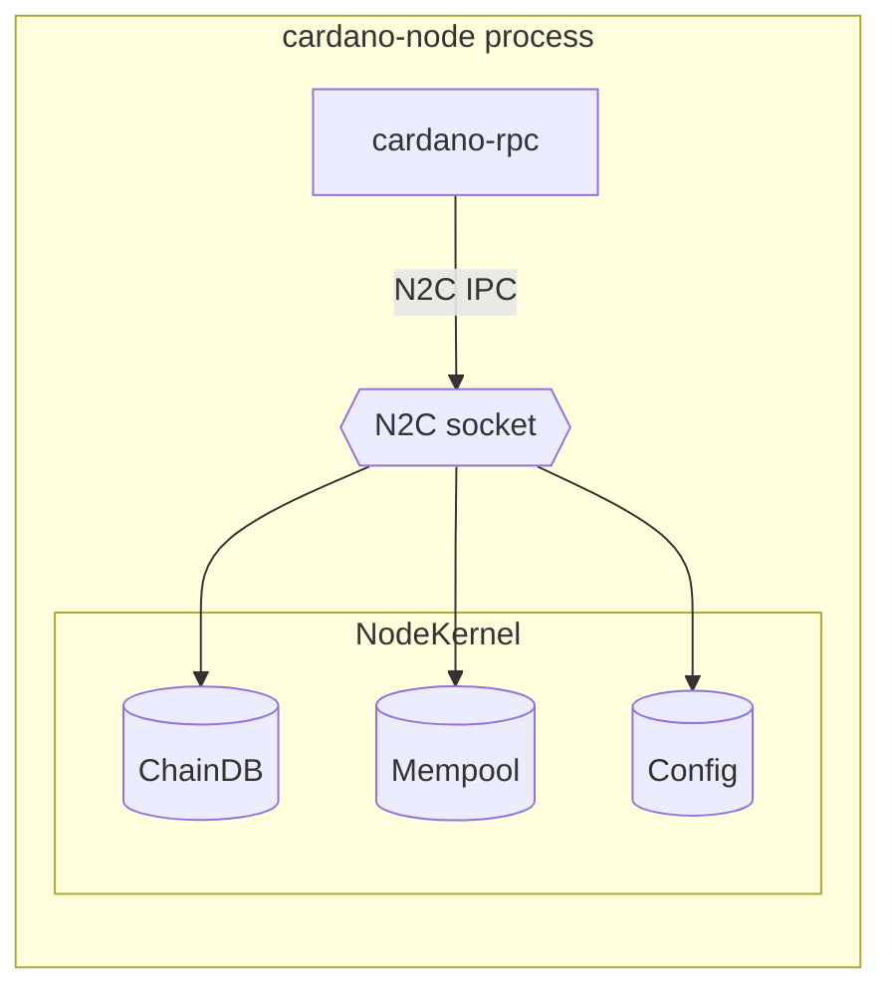
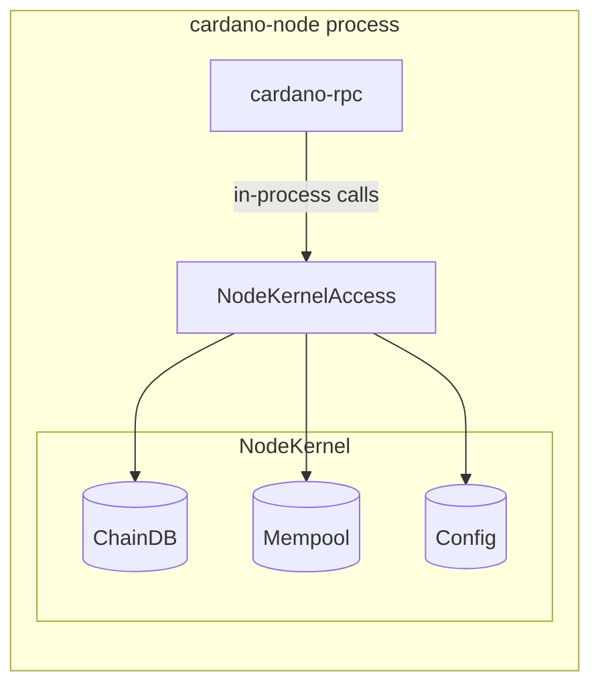

# ADR-019: Node Kernel Access for cardano-rpc

# Status

📜 Proposed 2026-06-03

# Context

cardano-rpc is a gRPC server that runs inside the cardano-node process.
Despite sharing a process, it communicates with the node over a Unix socket using the Node-to-Client (N2C) mini-protocol.
Every RPC request opens a fresh socket connection, negotiates the Ouroboros protocol, serialises queries to CBOR, and deserialises the results back - only to re-serialise them as protobuf for the gRPC response.

This is the architecture inherited from when cardano-rpc was a separate process.
Now that it runs in-process, the IPC overhead is unnecessary.

## Current architecture

Both diagrams share the same source of truth - the `NodeKernel` subsystems.
Only the access path changes: today cardano-rpc reaches them through the N2C socket, after this ADR it calls them in-process.

cardano-rpc acts as an IPC client to its own host process.
Each request pays for connection setup, protocol negotiation, and CBOR round-trips.

## Proposed architecture

cardano-rpc reads node state directly through an in-process interface called `NodeKernelAccess`.
There is no socket, no protocol negotiation, and no serialisation between cardano-rpc and the node internals.

# Decision

Provide cardano-rpc with in-process access to three `NodeKernel` capabilities:

1. **Ledger snapshots** - acquire a consistent, read-only view of the current ledger state and run any number of queries against it.
   All queries within one snapshot see the same chain tip, preserving the consistency that the N2C protocol provides via its acquire/query/release cycle.
2. **Transaction submission** - submit a transaction to the mempool for validation and inclusion.
3. **Block retrieval** - fetch raw block bytes from on-chain storage by slot and hash.

These three capabilities are backed by the subsystems inside `NodeKernel`: ChainDB (ledger state and block storage), Mempool (pending transactions), and TopLevelConfig (genesis and era configuration).

## Startup sequencing

`NodeKernel` only becomes available after consensus initialisation completes.
The gRPC server starts earlier, so `NodeKernelAccess` is held behind a mutable reference that starts empty.
Requests arriving before the kernel is ready receive a gRPC `UNAVAILABLE` status.
The node populates the reference in its [`rnNodeKernelHook`](https://github.com/IntersectMBO/cardano-node/blob/3a7d3d2c6787df6ec98ce368fc77f078feee2f8e/cardano-node/src/Cardano/Node/Run.hs#L581), after which all requests are served.

## Snapshot consistency

The current N2C code runs all queries within a single protocol session, which acquires one ledger snapshot.
Protocol parameters, UTxO results, chain tip, and block number all come from the same state.

A naive replacement with one callback per query type would break this: each call could see a different chain tip.
The snapshot-based design avoids this by letting the caller open a snapshot once and run arbitrarily many queries against it.

## UTxO RPC spec coverage

`NodeKernel` covers 16 of the 18 RPCs defined in the UTxO RPC v1beta specification.
The table below lists those 16 distinct methods, each under the subsystem that primarily backs it.

| Subsystem | Capabilities | RPCs |
|-----------|-------------|------|
| ChainDB | Block retrieval, ledger queries, chain following | FetchBlock, DumpHistory, FollowTip, ReadTip, ReadParams, ReadUtxos, SearchUtxos, ReadEraSummary, ReadState, EvalTx, WatchTx |
| Mempool | Transaction submission, snapshot and lifecycle inspection | SubmitTx, ReadMempool, WatchMempool, WaitForTx |
| TopLevelConfig | Genesis config, era history | ReadGenesis |

The two RPCs that `NodeKernel` cannot serve are **ReadTx** (transaction lookup by hash) and **ReadData** (datum lookup by hash).
Both require indexes that the node does not maintain, typically provided by a block indexer such as db-sync or Kupo.

# Alternatives Considered

We considered keeping the N2C IPC path and optimising it - for example, by reusing connections or caching protocol negotiation.
This would reduce per-request overhead but not eliminate the fundamental cost of serialising to CBOR and back, or the inability to access ChainDB capabilities (random block-by-point lookup) that the N2C protocol does not expose.
N2C provides chain following via LocalChainSync, but it requires a persistent connection with sequential traversal, not random access.

# Consequences

- Eliminates the N2C overhead for all current and future RPC methods.
- Removes the per-request socket connection pattern.
- Existing RPC methods (ReadParams, ReadUtxos, SearchUtxos, SubmitTx, EvalTx) are migrated incrementally - each method is rewritten independently.
- `nodeSocketPath` remains in the configuration because it is used to derive the default gRPC socket path.
- cardano-rpc gains a compile-time dependency on cardano-api query types but not on consensus internals.
- The abstraction layer between cardano-rpc and consensus internals enables testing without a running node.

# References

- [ADR-018: cardano-rpc gRPC server](./ADR-018-cardano-rpc-grpc-server.md) - established cardano-rpc's architecture, acknowledged the N2C serialisation overhead and listed direct ledger state access as a planned improvement.
  This ADR delivers that improvement.
- [UTxO RPC specification](https://utxorpc.org/) - the gRPC service specification that cardano-rpc implements.
- [Inspecting the selection of a node](https://ouroboros-consensus.cardano.intersectmbo.org/docs/howtos/inspecting_the_selection_of_a_node/) - explains chain selection structure (volatile vs immutable portions) and the protocols available to inspect it.

# Authors

- Mateusz Galazyn
