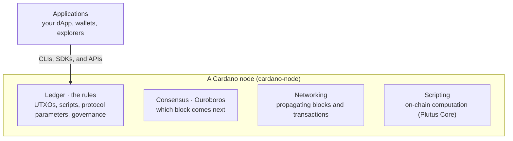

Cardano is a layered, formally specified blockchain. Its architecture is **four layers**, each with one responsibility and a boundary defined in a mathematical specification before any code is written: the **ledger** (the rules), **consensus** (agreeing which block comes next), **networking** (moving blocks and transactions between nodes), and **scripting** (on-chain computation). Those layers are the architecture, defined independently of how anyone builds them, so every Cardano node shares the same four. The reference implementation almost everyone runs is `cardano-node`, and this page uses it to make each layer concrete.

## The four layers

These four layers are the architecture. They are defined in formal specifications independently of any implementation, so every Cardano node has the same four. [`cardano-node`](https://github.com/IntersectMBO/cardano-node) (Haskell) is the reference implementation almost everyone runs: it bundles the layers into one process that keeps a copy of the chain, validates blocks and transactions, takes part in consensus, and talks to other nodes. Relays, block producers, and full-node wallets all run it. You don't drive these layers directly; you reach the chain through CLIs, SDKs, and APIs (see [Production infrastructure](/docs/developers/curriculum/production/infrastructure) for the developer stack).

Each layer is specified and implemented as its own package:

### Ledger layer

The ledger is the rules of the blockchain: what a valid transaction looks like, how UTXOs are created and consumed, how protocol parameters change, how governance actions are ratified. It is derived directly from formal specifications written in a mathematical notation and machine-checked for correctness (reference implementation: [`cardano-ledger`](https://github.com/IntersectMBO/cardano-ledger)).

The ledger does not know about the network or consensus, it is purely a set of state transition rules. Given a current ledger state and a block, it either accepts the block and produces a new state, or rejects it with a specific rule violation.

### Consensus layer

The consensus layer runs the Ouroboros family of proof-of-stake protocols. It decides which chain a node considers valid when competing chains exist, handles chain selection under forks, and manages the Hard Fork Combinator, the mechanism that lets Cardano transition between protocol eras without a disruptive network split (reference implementation: [`ouroboros-consensus`](https://github.com/IntersectMBO/ouroboros-consensus)).

The consensus layer sits between the network and the ledger: it receives block candidates from peers, asks the ledger to validate them, and uses the Ouroboros rules to decide which chain to follow.

### Networking layer

The networking layer is a typed, multiplexed peer-to-peer stack purpose-built for proof-of-stake blockchains (reference implementation: [`ouroboros-network`](https://github.com/IntersectMBO/ouroboros-network)). It handles:

- **Peer discovery and selection**, finding and maintaining connections to peers via P2P topology negotiation
- **Mini-protocols**, typed request/response protocols for chain sync, block fetch, transaction submission, and local queries
- **Pipelining**, requesting multiple blocks ahead of confirmation to maximize throughput
- **Adversarial resistance**, protections against peers that are slow, malicious, or eclipse-attacking

The networking layer handles peer topology and connection management. Both relays and block producers run the same networking code; what distinguishes them is configuration, a relay accepts external connections from any peer, while a block producer's topology is configured to connect only to its own relays (see [Network topology](#network-topology) below).

### Scripting layer

The scripting layer is the smart-contract execution engine embedded in the ledger. At its core it is a typed lambda calculus, a minimal formally-verified computation model; smart contracts compiled from Aiken, Plinth, Plutarch, or any other high-level language ultimately compile down to Untyped Plutus Core (UPLC) for on-chain execution (reference implementation: [Plutus Core](https://github.com/IntersectMBO/plutus)).

Execution happens within the ledger layer during transaction validation. Every script execution is bounded by an execution unit budget (CPU steps and memory units) that must be declared in the transaction. The declared budget is consumed during validation; both per-transaction and per-block execution unit limits are enforced by the protocol parameters, preventing unbounded computation.

## Tooling around the node

[`cardano-cli`](https://github.com/IntersectMBO/cardano-cli) is the command-line interface to a running node. It connects over a local socket to build, sign, and submit transactions, query chain state (UTXOs, protocol parameters, governance state), and manage keys and certificates. It is not a daemon; it runs a command against the node and exits.

A few other components sit *around* the node rather than inside it: **cardano-tracer** collects the node's logs and Prometheus metrics, **[Mithril](/docs/operators/operator-tools/mithril)** lets a fresh node bootstrap to the chain tip in minutes from a stake-certified snapshot, and **[cardano-db-sync](/docs/developers/curriculum/production/infrastructure#chain-indexers)** indexes the whole chain into PostgreSQL for rich SQL queries. These are operational and indexing concerns, documented where you would actually reach for them.

## Network topology

The network is made of two kinds of node. **Relays** are public-facing: they accept connections from any peer and propagate blocks and transactions. **Block producers** forge new blocks and stay isolated behind their own relays, never exposed directly to the network. P2P topology is negotiated automatically, so nodes discover and maintain peers without hand-maintained lists.

Running this topology, hardening a block producer, and managing its keys are operator concerns. See [Network topology](/docs/operators/node/topology) in the operator curriculum for the configuration detail.

## Ouroboros consensus

The consensus layer runs **Ouroboros Praos**, Cardano's proof-of-stake protocol: time is divided into slots and epochs, stake-weighted slot leaders are chosen privately by a VRF, and nodes follow the longest valid chain. [Consensus & Ouroboros](/docs/developers/curriculum/fundamentals/consensus-and-ouroboros) covers the protocol in full, including slot-leader election, chain selection, finality, and the forward-secure KES keys that block producers sign with.

## Cardano eras

Cardano has evolved through multiple ledger eras, each introducing new capabilities via a hard fork:

| Era | Key addition |
|-----|-------------|
| Byron | Initial PoS chain |
| Shelley | Decentralized block production, staking |
| Allegra | Token locking |
| Mary | Native tokens and NFTs |
| Alonzo | Plutus smart contracts |
| Babbage | Reference inputs, inline datums, reference scripts |
| Conway | On-chain governance (CIP-1694), DReps, Constitutional Committee |

For the full history of these era transitions, see [Historical Cardano Hardforks](https://cardano.org/hardforks/).

Since the Conway Era each era transition is triggered by a hard fork initiation governance action, a process that requires SPO, DRep, and Constitutional Committee votes to ratify. The Hard Fork Combinator in the consensus layer handles the transition transparently, without requiring a separate node binary per era.

## Formal specifications

What distinguishes Cardano's engineering approach is that each layer is specified formally before implementation. The ledger rules are defined in a mathematical notation (Agda and LaTeX), and the consensus protocol has a formal proof of security. This means:

- Rule changes are proposed as spec changes first, then implemented
- The implementation can be checked against the spec for conformance
- Security properties are proved, not just tested

The formal specs are public:
- [Cardano Ledger Specifications](https://github.com/IntersectMBO/cardano-ledger#cardano-ledger)
- [Ouroboros papers](https://cardano.org/research/), the academic papers underpinning the consensus protocol

## Further reading

- [Consensus & Ouroboros](/docs/developers/curriculum/fundamentals/consensus-and-ouroboros): how the consensus layer chooses blocks, in depth
- [eUTXO model](/docs/developers/curriculum/fundamentals/core-concepts/eutxo): how the ledger layer tracks ownership
- [Production infrastructure](/docs/developers/curriculum/production/infrastructure): the developer stack you reach the chain through
- [Run your own node](/docs/developers/curriculum/production/run-your-own-node): install and run cardano-node yourself
