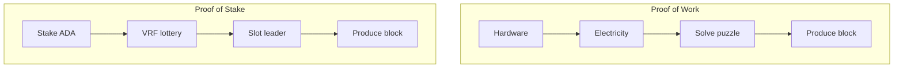

A consensus mechanism is the protocol-level rule set that lets thousands of independent nodes agree on a single canonical chain without any central coordinator. We have established that a blockchain is a distributed ledger and that [cryptographic primitives](/docs/developers/curriculum/fundamentals/cryptographic-primitives) secure individual transactions and blocks. This page answers the remaining question: when multiple nodes each propose a different block at the same time, how does the network decide which one becomes part of the chain?

If you have used Raft or Paxos, the shape is familiar: a leader is elected to sequence writes, which maps to slot-leader selection, log entries to blocks, the term to an epoch, and heartbeats to block propagation. The critical difference is the threat model: Raft assumes honest nodes and only tolerates crashes, while Ouroboros assumes some nodes are malicious (Byzantine fault tolerance), which is why it needs VRFs, stake-weighted election, and a formal security proof.

## Why is consensus hard in distributed systems?

Consensus is hard because distributed nodes have different views of pending transactions, face network latency, may go offline, and some may act maliciously, yet they must all agree on a single truth without a central coordinator.

```
Node A (Tokyo)    sees [T1, T2, T3]
Node B (New York) sees [T2, T4, T5]
Node C (Berlin)   sees [T1, T4, T6]

Which transactions go in the next block? Who decides?
What if Node B is malicious and fabricates T5?
```

The network must agree on **who** produces the next block, **what** goes in it, and **when** it is final, despite latency, node failures, malicious actors, and no central coordinator.

## How does Proof of Work achieve consensus?

Proof of Work requires block producers to solve a computationally expensive puzzle before adding a block; the first to find a valid solution wins, and the cost makes attacks economically irrational.

```
Find nonce such that hash(block_header + nonce) < target
```

This is **mining**: enormous effort to find, instant to verify. Strengths and weaknesses:

- **Security**: attacking needs more compute than the rest of the network (a "51% attack"), which is prohibitively expensive for established chains.
- **Energy**: PoW is intentionally wasteful; the security budget is the electricity consumed.
- **Hardware centralization**: ASIC rewards concentrate mining near cheap electricity.
- **Finality**: probabilistic; a transaction becomes exponentially unlikely to reverse as blocks pile on (Bitcoin convention: 6 confirmations).

## How does Proof of Stake differ?

Proof of Stake replaces computational work with economic commitment: the right to produce a block is proportional to how much of the native currency you stake.



If you hold 1% of staked tokens, you produce about 1% of blocks. The security model shifts from "attacking costs electricity" to "attacking costs money": acquiring a majority of stake drives the price up, and attacking collapses the value of what you hold. Attacking PoS is economically self-destructive.

| Property | Proof of Work | Proof of Stake (Cardano) |
|---|---|---|
| Block producer selection | First to solve the puzzle | Protocol probabilistically selects by stake |
| Energy efficiency | Low | High |
| Hardware | Specialized ASICs | Standard servers |
| Attack cost | 51% of hash power | 51% of staked ADA |

## What is Cardano's Ouroboros protocol?

Ouroboros is Cardano's consensus protocol and the first Proof of Stake protocol with a rigorous, peer-reviewed security proof (Kiayias, Russell, David, Oliynykov, CRYPTO 2017). It divides time into epochs and slots, uses VRFs for private slot-leader election, and is provably secure as long as honest participants control the majority of staked ADA.

### How do epochs and slots structure time?

**Slots** are 1 second each; **epochs** are 432,000 slots (exactly 5 days). A slot may or may not contain a block (target: roughly one block every 20 seconds). Epochs are the administrative boundary for stake snapshots, reward distribution, protocol-parameter changes, and pool registrations.

### How does slot leader election work?

For each slot, each pool evaluates a VRF locally; the result is private until it publishes a block with the proof.

```
For slot S in epoch E:
  (vrf_output, vrf_proof) = VRF_eval(pool_vrf_key, epoch_nonce + slot_number)
  threshold = calculate_threshold(pool_stake / total_stake)
  if vrf_output < threshold:  this pool IS the slot leader for slot S
```

The election is **private** (prevents targeted attacks on upcoming leaders), **proportional** (1% of stake wins ~1% of slots), **verifiable** (the VRF proof lets anyone confirm legitimacy), and allows **zero or multiple leaders** per slot (handled by chain selection).

### How does the stake snapshot work?

The stake used for election is a **snapshot from two epochs ago**. This delay stops an attacker from rapidly acquiring stake and immediately using it. For delegators it means your delegation becomes active for rewards after a ~15-20 day ramp.

### How does chain selection handle forks?

When multiple valid chains exist, nodes follow the **longest chain rule** (with recent chain density as a tiebreaker in Praos). Blocks on abandoned forks are discarded and their transactions return to the mempool, which is why transactions need a few confirmations before they are settled.

### Block diffusion and the security parameter k

When a leader produces a block it must reach other nodes fast (Cardano targets diffusion within ~5 seconds) or risk being orphaned. The parameter **k** (currently 2160) defines settlement: a block is considered settled once k blocks follow it, roughly 12 hours at ~20s/block. In practice most applications treat a few minutes (10-20 blocks) as very safe; k is the absolute mathematical bound.

### How do rewards and incentives drive decentralization?

Each epoch the protocol distributes rewards (from fees and monetary expansion) to operators (a fixed cost plus margin) and delegators (the remainder, proportional to stake). The reward formula caps oversized pools:

```
Desirable pool size ~ 1 / k0   (k0 = target number of pools, currently 500)
Beyond it: rewards are CAPPED, excess stake earns nothing,
delegators are incentivized to move to smaller pools.
```

Decentralization is not enforced by a rule; it emerges from economic incentives (a Nash equilibrium toward ~500 evenly-sized pools). Operators can also **pledge** their own ADA, which slightly raises rewards and resists Sybil attacks (many tiny pools are less profitable than one well-pledged pool).

## How does finality work?

Cardano provides **probabilistic finality**: the chance of reversal decreases exponentially with each block added. Practical finality is reached in 5-10 minutes; the mathematical bound is k = 2160 (~12 hours).

| Network | Typical finality | Mechanism |
|---|---|---|
| Bitcoin (PoW) | ~60 min (6 blocks) | Probabilistic |
| Ethereum (PoS) | ~15 min | Deterministic after finalization |
| Cardano (Praos) | ~5-10 min practical, ~12h bound | Probabilistic, stake-based |

## What happens during a complete epoch?

```
Epoch N-2: stake snapshot taken (active stake for Epoch N)
Epoch N-1: VRF outputs contribute to the epoch nonce used for Epoch N
Epoch N:   per slot, each pool checks its VRF; if elected it selects txs,
           builds a block, signs with its KES key, and publishes with the VRF proof;
           other nodes verify the VRF proof, KES signature, and all transactions
Epoch N boundary: calculate and distribute rewards, take a new snapshot,
           apply queued parameter changes, process pool registrations/retirements
```

### What are KES keys?

**Key-Evolving Signature (KES)** keys are a forward-security mechanism: the key evolves at regular intervals and old key material is deleted. If a pool's KES key is compromised, an attacker can only forge blocks from that point forward, not retroactively, and the operator can rotate to a new key from their cold keys. Analogous to short-lived, auto-rotating TLS certificates, applied to block production. (For how VRF, KES, and cold keys are generated and stored, see the [stake pool key reference](/docs/operators/basics/cardano-key-pairs).)

## Common attacks and defenses

- **51% attack**: acquire majority stake. Defense: enormous cost, and success destroys the attacker's holdings.
- **Nothing-at-stake**: produce blocks on many forks for free. Defense: Ouroboros's VRF election and formal proof make it unprofitable.
- **Long-range attack**: build an alternative chain from far in the past. Defense: the 2-epoch snapshot delay limits it; Ouroboros Genesis solves it fully.
- **Grinding**: manipulate the election randomness. Defense: the epoch nonce derives from many VRF outputs.

## Key takeaways

- **Consensus** is how distributed nodes agree on one chain without a central authority, resilient to delays, failures, and malice.
- **Proof of Work** secures via computational cost (energy-intensive, centralizing); **Proof of Stake** secures via economic stake.
- **Ouroboros Praos** is the first PoS protocol with a formal security proof, selecting slot leaders via VRFs proportional to stake.
- Time is **epochs (5 days) and slots (1 second)**; snapshots, nonces, and rewards happen at epoch boundaries.
- Cardano's incentive design makes **decentralization an emergent economic equilibrium**, not an enforced rule.

## Next steps
Now that you know how blocks are produced and the network agrees, the next step is what is actually inside those blocks: Cardano's Extended UTXO model. See [the eUTXO model](/docs/developers/curriculum/fundamentals/core-concepts/eutxo).
