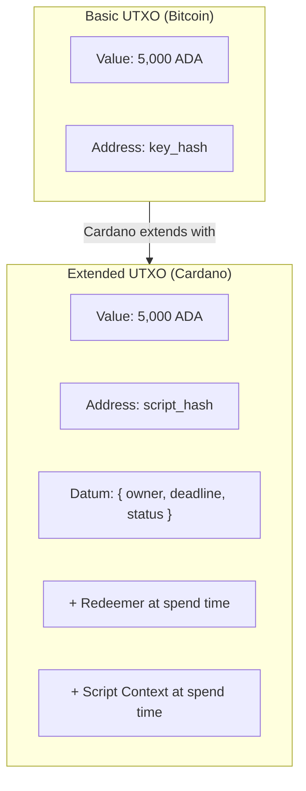

The Extended UTXO (eUTXO) model is how Cardano tracks who owns what. It records value as discrete, immutable "coins" (unspent transaction outputs) rather than mutable account balances, and it extends that idea with datums, redeemers, and script context so smart contracts can run while transactions stay deterministic and parallelizable.

If you have used event sourcing or CQRS, eUTXO will feel natural: state is derived from an immutable log, you never modify past events, and new state is created by appending. Here, state is the set of unspent outputs, you never modify a UTXO, and new state comes from consuming and producing outputs. (It is no coincidence that Cardano's contract languages are functional: transactions behave like pure functions, same inputs, same outputs.) The one piece without a clean web2 parallel is change: you spend a UTXO whole and receive the remainder as a new output, the way you hand over a 50 and get 20 back, rather than decrementing a balance.

:::note Quick summary
Cardano tracks value as discrete UTXOs, not account balances. Each transaction consumes existing UTXOs and creates new ones. Smart contracts validate whether a UTXO can be spent; they never act on their own. The payoff is determinism: you know exactly what a transaction will do before you submit it.
:::

Every blockchain needs a way to track ownership, and there are two fundamentally different approaches: the **account model** (Ethereum) and the **UTXO model** (Bitcoin, and in extended form, Cardano). This is not a minor implementation detail. It shapes how you think about transactions, how you design smart contracts, and what guarantees the protocol can give you.

## How does the account model work?

The account model works like a bank account: each address has a mutable balance, and transactions update balances in place by debiting the sender and crediting the receiver. If you have worked with databases or Ethereum, you already understand it.

```
Account state (like a database row):

| Address      | Balance   |
|--------------|-----------|
| addr_alice   | 5,000 ADA |
| addr_bob     | 3,000 ADA |

Transaction: Alice sends 1,000 ADA to Bob

UPDATE accounts SET balance = balance - 1000 WHERE address = 'addr_alice';
UPDATE accounts SET balance = balance + 1000 WHERE address = 'addr_bob';
```

This is familiar, but the simplicity comes with costs in a decentralized setting. Transactions are **stateful**: they depend on and modify shared global state, so a transaction's validity can change based on what executed before it, creating unpredictability between the moment you build a transaction and the moment it runs.


*Cardano represents assets as a directed graph of unspent outputs; account-based chains keep a database of balances that update with each state transition.*

## How does the UTXO model track ownership?

The UTXO model tracks ownership through discrete, immutable "coins" (unspent outputs from previous transactions) instead of mutable balances. When you spend, you consume whole UTXOs as inputs and create new UTXOs as outputs, receiving change back to yourself, exactly like paying with physical cash.

When you have 50 dollars, you do not hold an abstract "balance of 50." You hold specific bills (a 20, a 20, a 10). Buy something for 25 and you hand over 30 and get 5 back.

```
Alice's UTXOs (her "wallet"):
  UTXO_1: 3,000 ADA  (from tx_abc, output #0)
  UTXO_2: 2,000 ADA  (from tx_def, output #1)

Alice sends 4,500 ADA to Bob:

  INPUTS:                    OUTPUTS:
  UTXO_1  3,000 ADA          To Bob    4,500 ADA   (new UTXO)
  UTXO_2  2,000 ADA          To Alice    300 ADA   (change, new UTXO)
  Total in: 5,000 ADA        Fee         200 ADA
                             Total out: 5,000 ADA

After:
  UTXO_1, UTXO_2: SPENT (destroyed)
  New UTXO: 4,500 ADA to Bob
  New UTXO:   300 ADA to Alice (change)
```


*A transaction consumes existing UTXOs and creates new ones. Consumed UTXOs leave the UTXO set; new outputs become available for future transactions.*

Four properties fall out of this:

1. **UTXOs are consumed entirely.** You cannot partially spend one. Spending 1,000 from a 3,000 UTXO means consuming all 3,000 and creating a 1,000 output plus 2,000 of change.
2. **Inputs equal outputs plus fees.** Every transaction balances exactly. The protocol enforces it.
3. **UTXOs are immutable.** Once created, a UTXO never changes. There is no UPDATE, only CREATE (as an output) and CONSUME (as an input).
4. **Each UTXO is spent once.** This is how double-spending is prevented. Once consumed by a confirmed transaction, a UTXO can never be used again.

### What is the UTXO set?

The **UTXO set** is the complete collection of all unspent outputs at a point in time. It is the current state of the chain.

```
| TxId:Index | Address      | Value     |
|------------|--------------|-----------|
| tx_01:#0   | addr_alice   | 300 ADA   |
| tx_02:#0   | addr_bob     | 4,500 ADA |
| tx_03:#1   | addr_dave    | 750 ADA   |
```

Each UTXO is uniquely identified by the transaction ID that created it plus its output index. That `(TxId, Index)` pair is a **transaction output reference** (TxOutRef). On mainnet the set holds millions of entries, and every node keeps it for fast validation.

## What does "Extended" add?

The Extended UTXO model adds three things to Bitcoin's original UTXO concept: **datums** (data attached to a UTXO), **redeemers** (arguments provided when spending), and **script context** (a view of the whole transaction). Together they enable smart contracts while preserving UTXO determinism and parallelism.



**Datum** is data attached to an output: state that lives inside a specific UTXO. In the account model, contract state sits in mutable storage; in eUTXO, state lives in UTXOs, and you update it by consuming a UTXO and creating a new one with new data. Cardano supports two modes: a **datum hash** (only the hash is on-chain, the full datum is supplied at spend time) and an **inline datum** (the full datum is stored in the UTXO so others can read it without off-chain coordination).

**Redeemer** is the argument you provide when spending a script-locked UTXO. The validator uses it to decide whether spending is allowed.

**Script context** is the comprehensive view the validator receives: all inputs, all outputs, the fee, the validity range, signatories, and more. This is what makes conditions like these possible:

- "This UTXO can only be spent if the transaction also sends 100 ADA to address X."
- "This UTXO can only be spent after slot 50,000,000."
- "This UTXO can only be spent if the transaction recreates this same script address with an updated datum." (This last pattern is the foundation of stateful contracts in eUTXO: the script enforces that its own state propagates correctly.)

The full mechanics of writing validators against datum, redeemer, and context are covered in [Smart Contracts](/docs/developers/curriculum/smart-contracts/overview); here we only need the model.

### What can a validator actually see? Bitcoin vs Ethereum vs Cardano

The scope of information available to a script is the key difference between the three models:

- **Bitcoin (UTXO):** scripts see only the redeemer (the unlocking data). Simple and secure, but it limits contracts to "dumb" logic.
- **Ethereum (account):** scripts can read and modify the entire global state. Powerful, but it introduces unpredictability and a large security surface.
- **Cardano (eUTXO):** scripts see all inputs and outputs of the specific transaction plus its context, but not arbitrary global state. This middle ground was mathematically researched to provide expressive power comparable to the account model while keeping stronger security guarantees.

Smart contract validators (written in Plutus or Aiken) are **pure functions**: given the same datum, redeemer, and context, they always return the same result. That purity buys you:

- **Tractable security analysis.** You can reason about a script from the transaction alone, not the entire unpredictable chain state.
- **Fail-fast validation.** You can run the exact validation locally before submitting. If an input is already spent, it fails off-chain and costs you nothing.
- **No partial failures.** Either all conditions are met and the transaction succeeds, or it fails atomically. There is no "ran out of gas halfway through" state.

## What does a complete eUTXO transaction look like?

A script interaction consumes script-locked UTXOs with a redeemer, the validator checks the datum, redeemer, and context, and if validation passes the transaction produces new UTXOs with updated state.

```
Scenario: Alice locked 1,000 ADA in a vesting contract that releases after a slot.

BEFORE:
  Script UTXO (vesting_script_addr):
    Value: 1,000 ADA
    Datum: { beneficiary: addr_alice, release_slot: 50000000 }
  Alice's UTXO: 10 ADA (for fees)

TRANSACTION:
  Inputs:
    [1] Script UTXO   Redeemer: { action: "withdraw" }
    [2] Alice's fee UTXO
  Outputs:
    [1] 1,000 ADA -> addr_alice   (the vested funds)
    [2] 8 ADA     -> addr_alice   (change)
  Fee: 2 ADA
  Validity interval: [50000000, infinity)   <- valid only after release slot

SCRIPT VALIDATION (the vesting validator checks):
  1. Is current slot >= datum.release_slot?     YES (enforced by validity interval)
  2. Does the tx pay to datum.beneficiary?      YES (output #1)
  3. Is the tx signed by datum.beneficiary?     YES
  -> TRUE, transaction is valid
```

## Why is deterministic validation such a big deal?

Deterministic validation means you can predict exactly what a transaction will do before you submit it, because eUTXO transactions reference specific UTXOs by ID instead of reading mutable global state.

In the account model, outcomes depend on state that can change between construction and execution:

```
Account model (Ethereum):
  1. Alice builds a tx calling a DEX; price is 100 TOKEN per ETH
  2. Bob's tx lands first and moves the price to 200
  3. Alice's tx executes at the worse price (or fails, and she still pays gas)
  -> unpredictable at build time
```

In eUTXO, the transaction names its exact inputs:

```
eUTXO model (Cardano):
  1. Alice builds a tx consuming UTXO_A and UTXO_B
  2. If either is already spent when it reaches a validator, the tx simply fails
  3. Otherwise it executes with exactly the state Alice saw
  -> the outcome is predictable; either the expected result or nothing
```

## How does concurrency work in eUTXO?

Concurrency in eUTXO is explicit, because two transactions cannot consume the same UTXO at once; only one wins and the other fails.

```
Script UTXO at a DEX: { price: 100, liquidity: 10000 }
  Alice's tx: consume DEX UTXO, buy 100 tokens
  Bob's tx:   consume DEX UTXO, buy 50 tokens
  -> only ONE can succeed; the other references a spent UTXO
```

There are a few patterns to handle concurrency:

1. **UTXO fan-out.** Split state across many UTXOs instead of one, so many users transact in parallel against different UTXOs.
2. **Batching (order-book pattern).** Users submit orders as their own UTXOs; a batcher consumes many orders plus the protocol's state UTXO in a single transaction.
3. **Reference inputs.** A transaction can read a UTXO without consuming it, so many transactions can read the same oracle or config UTXO simultaneously with no contention.
4. **Reference scripts.** Script code can live in a UTXO and be referenced instead of included in every transaction, cutting size and cost.

Reference inputs and reference scripts are transaction-level features; for the full mechanics see [Transactions](/docs/developers/curriculum/fundamentals/core-concepts/transactions#reference-inputs-and-reference-scripts).

## How do native tokens fit in?

On Cardano, custom tokens are **native**: they live inside UTXOs alongside ADA at the protocol level, not inside smart contracts, so they inherit ADA's security without script execution for basic transfers.

```
A single UTXO can carry multiple assets:
  Address: addr_alice
  Value:
    5 ADA (5,000,000 lovelace)
    PolicyID_abc.TokenA: 1,000
    PolicyID_def.MyNFT:  1
```

ADA itself is denominated in **lovelace** (1 ADA = 1,000,000 lovelace), named after Ada Lovelace, just as Ethereum has wei. For how tokens are identified, minted, and why every token-bearing UTXO carries a minimum amount of ADA, see [What are native tokens](/docs/developers/curriculum/native-tokens/overview).

## How do the two models compare?

Neither model is objectively better; they make different trade-offs.

| Aspect | Account model (Ethereum) | eUTXO model (Cardano) |
|---|---|---|
| State representation | Mutable balances | Immutable UTXOs, consumed and created |
| Smart contract state | Mutable storage slots | Datum attached to UTXOs |
| Parallelism | Limited by shared state | Natural (different UTXOs) |
| Determinism | State may change before execution | Inputs are specific UTXOs |
| Wallet complexity | Simple (read balance) | Manage a UTXO set |
| Fee predictability | Approximate (gas estimation) | Exact |
| Native tokens | ERC-20 contracts | Protocol-level, no contract needed |

## How should you think in eUTXO?

A framework for developers coming from account-based or web2 backgrounds:

1. **State lives in UTXOs, not variables.** Instead of a mutable `balance`, you have discrete value containers.
2. **State transitions consume and create UTXOs.** Instead of `balance -= 100`, you consume a UTXO and create new ones. Every change is a create-destroy cycle.
3. **Transactions are atomic functions.** Inputs in, outputs out, no side effects. If any part fails, none of it applies.
4. **Concurrency is UTXO selection, not locking.** If someone already spent the UTXO you wanted, you retry with different inputs.
5. **Scripts validate, they do not execute.** A validator checks that a proposed transition is legal; the builder constructs the transition.

<iframe width="100%" height="325" src="https://www.youtube-nocookie.com/embed/bfofA4MM0QE" frameborder="0" allow="accelerometer; autoplay; clipboard-write; encrypted-media; gyroscope; picture-in-picture fullscreen"></iframe>

:::info Going deeper
Read the [eUTXO handbook (PDF)](https://ucarecdn.com/3da33f2f-73ac-4c9b-844b-f215dcce0628/EUTXOhandbook_for_EC.pdf) for the formal treatment.
:::

### Is high TPS the right way to compare chains?

<iframe width="100%" height="325" src="https://www.youtube-nocookie.com/embed/wDmLVMmevNQ" frameborder="0" allow="accelerometer; autoplay; clipboard-write; encrypted-media; gyroscope; picture-in-picture fullscreen"></iframe>

## Key takeaways

- **The UTXO model tracks discrete coins**, consumed entirely and recreated as change, like physical cash, rather than mutable balances.
- **eUTXO extends it** with datums (state), redeemers (action arguments), and script context (transaction awareness), enabling smart contracts without losing UTXO benefits.
- **Determinism is the superpower.** Outcomes are predictable before submission, which kills front-running and enables exact fees and off-chain validation.
- **Concurrency is explicit.** Fan-out, batching, and reference inputs are the standard ways mature protocols handle contention.
- **Native tokens live in UTXOs alongside ADA**, inheriting protocol-level security without contracts for basic transfers.

## Next steps

- [Addresses](/docs/developers/curriculum/fundamentals/core-concepts/addresses): where value lives and the credentials that guard it
- [Transactions](/docs/developers/curriculum/fundamentals/core-concepts/transactions): how inputs and outputs are assembled, signed, and confirmed
- [Transaction Fees](/docs/developers/curriculum/fundamentals/core-concepts/fees): the deterministic fee formula and collateral
- Ready to build? [Smart Contracts Overview](/docs/developers/curriculum/smart-contracts/overview)
