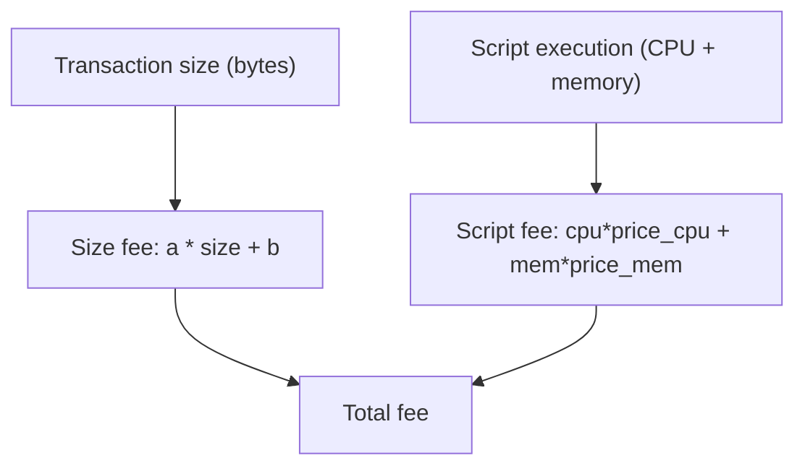

Transaction fees on Cardano are deterministic and predictable. They are calculated from a simple linear formula based on transaction size (plus script execution cost), so you can compute the exact fee before submitting, with no auctions and no gas-price spikes.

If you have used a metered cloud API, fees will feel familiar: just as an API charges per request and throttles abuse, Cardano charges per transaction by size and complexity, pricing both bandwidth (size) and compute (ExUnits). Collateral works like a pre-authorized hold or security deposit: if your script crashes and consumes node resources, the deposit covers it; if everything succeeds, you keep it.

<iframe width="100%" height="325" src="https://www.youtube-nocookie.com/embed/lpSIpPWp7H8" frameborder="0" allow="accelerometer; autoplay; clipboard-write; encrypted-media; gyroscope; picture-in-picture fullscreen"></iframe>

## Why fees exist

1. **Prevent spam.** Without a cost, an attacker could flood the network with meaningless transactions.
2. **Compensate stake pool operators.** Fees are part of the reward that incentivizes block production.
3. **Keep the network sustainable.** Fees cover both processing and long-term storage of the data each transaction adds.

## The fee formula

```
fee = a * size(tx) + b
```

- **`a`**: cost per byte of transaction data (currently 44 lovelace/byte).
- **`b`**: fixed base fee on every transaction (currently 155,381 lovelace).
- **`size(tx)`**: serialized transaction size in bytes.

A typical simple transfer costs roughly **0.17-0.20 ADA**. Transactions with native tokens, metadata, or many outputs are larger and cost more; smart-contract transactions add execution fees on top.

Both parameters serve a purpose: `a` covers the resource cost of processing and storing larger transactions, while `b` is a base security layer, a minimum cost regardless of size that makes flooding the network with tiny transactions prohibitively expensive.

:::note Parameters change through governance
Query current values with `cardano-cli query protocol-parameters` or via your API provider. They are set on-chain and can change through governance.
:::

## Fee distribution

Unlike chains where fees go straight to the block producer, Cardano pools them: fees collected in an epoch are distributed across all stake pools that produced blocks that epoch, regardless of which pool processed a given transaction. This promotes stability and fair rewards.

## Script execution fees

When a transaction runs Plutus scripts (spending from a script address, minting with a smart-contract policy, validating certificates), an additional fee applies based on computational resources.



Script costs are measured in **execution units (ExUnits)**: memory units (peak memory) and CPU steps (CPU budget). The script fee is `mem_price * memory_units + step_price * cpu_steps`, added to the size fee. Transaction-building libraries simulate execution to compute ExUnits automatically before submission, see the Evolution SDK's [script evaluation](https://github.com/IntersectMBO/evolution-sdk) for how this works under the hood.

## Collateral

Transactions that execute scripts must provide **collateral**: ADA-only UTXOs that are forfeited only if a script fails during phase-2 validation.

**Why it exists:** nodes spend real compute evaluating scripts. If a script fails after that work, collateral compensates for it and discourages submitting transactions that will fail.

Rules:

- Must contain **only ADA** (no native tokens).
- Must cover the potential script cost (typically 150-200% of expected fees).
- **Returned untouched** if the transaction succeeds.
- **Consumed only** if phase-2 validation fails.
- **Collateral return (CIP-40):** since Vasil, a transaction can specify a collateral return address so only the required amount is taken, not the entire UTXO.

This is the canonical reference for collateral; the [transaction lifecycle](/docs/developers/curriculum/fundamentals/core-concepts/transactions#deterministic-outcomes) and [Smart Contracts](/docs/developers/curriculum/smart-contracts/overview) link here.

## UTXO fragmentation and fees

Because fees scale with transaction size, **how your wallet's value is spread across UTXOs affects what you pay**. A wallet holding one large UTXO spends cheaply (one input); the same balance split across many tiny UTXOs needs many inputs to cover the same amount: a larger transaction, and a larger fee. This is **fragmentation**.

It's a real tuning axis, not just theory:

- **Consolidation**: periodically combining many small UTXOs into one (a self-payment) lowers the cost of future transactions. The tradeoff is spending flexibility and parallelism: separate UTXOs let you build independent transactions at the same time without contention.
- **Native tokens amplify it**: token-bearing UTXOs are larger and each carries [min-ADA](/docs/developers/curriculum/native-tokens/overview#the-minimum-ada-requirement), so a fragmented token wallet is both bigger and ties up more ADA.
- **Coin selection** decides which UTXOs to spend; SDKs default to largest-first to minimize input count. See [transaction building](/docs/developers/curriculum/start-building/transaction-building#coin-selection).

## Key takeaways

- Fees are deterministic: `fee = a * size + b`, knowable exactly before submission.
- Script transactions add an ExUnits-based execution fee on top of the size fee; builders compute it automatically.
- Collateral (ADA-only) is forfeited only on phase-2 script failure; CIP-40 returns the excess.
- Fees are pooled and distributed across block-producing stake pools each epoch.

## Next steps

- [Transactions](/docs/developers/curriculum/fundamentals/core-concepts/transactions): how fees fit into building and submitting
- [What are native tokens](/docs/developers/curriculum/native-tokens/overview): why token outputs cost more (min-ADA)
