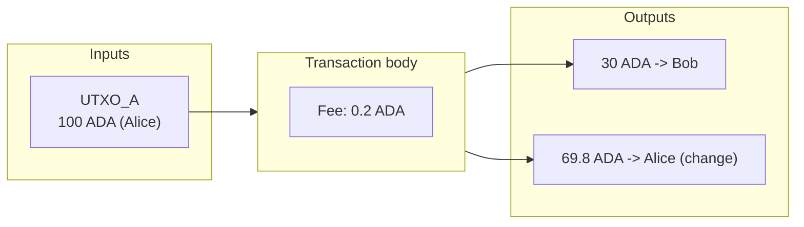
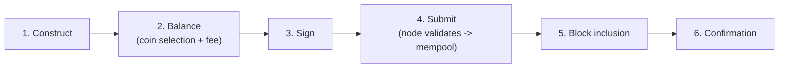

import Tabs from '@theme/Tabs';
import TabItem from '@theme/TabItem';

A transaction is a signed data structure that consumes existing UTXOs as inputs and produces new UTXOs as outputs. Every transfer of value, every mint, and every smart-contract interaction begins and ends with one. Cardano transactions are explicit and deterministic: they list exactly what goes in and what comes out, so you know the outcome before you submit.

If you have made HTTP requests, the lifecycle is familiar: you construct a transaction, authenticate it by signing, submit it, and await confirmation, all asynchronously. The difference that matters is atomicity: a transaction's inputs and outputs apply with database-style ACID guarantees, so the whole thing succeeds or none of it does, with no partial state left behind.

## Anatomy of a transaction

Every transaction consists of inputs, outputs, a fee, and witnesses; it can optionally include metadata, validity intervals, minting, and certificates.



- **Inputs** are pointers to existing UTXOs, each identified by `tx_hash#index`. Including one declares "I want to consume this specific UTXO." The protocol checks it exists, is unspent, and is properly authorized (a signature or a passing script).
- **Outputs** each create a new UTXO with an address, a value (ADA and/or native tokens), and an optional datum.
- **Witnesses** are the signatures (and scripts) that authorize the inputs.

### The balancing equation

```
Sum(Inputs) = Sum(Outputs) + Fee
```

This must hold *exactly*, not approximately. ADA cannot be created or destroyed in a normal transaction (minting is a separate, policy-controlled mechanism). This explicitness is the opposite of account-based systems where you just say "send X from A to B" and the protocol does the arithmetic.

## Deterministic outcomes

Because a transaction names its exact inputs and fixes all script arguments, its result is predictable before submission. Scripts are pure and always terminate; signatures prevent tampering; the [eUTXO model](/docs/developers/curriculum/fundamentals/core-concepts/eutxo) guarantees deterministic ledger updates. Either the expected result happens, or the transaction fails with no effect. (Phase-1 structural failures cost nothing; only phase-2 script failures consume [collateral](/docs/developers/curriculum/fundamentals/core-concepts/fees#collateral).)

## Validity intervals and time

Smart-contract execution is fully deterministic, which raises a question: how do you handle time without breaking determinism? Cardano uses **validity intervals**, a slot range during which a transaction may be included in a block.

```
validity_interval = { invalid_before: slot_500, invalid_hereafter: slot_1000 }
```

- **Lower bound** (`invalid_before`): valid only after this slot.
- **Upper bound** (`invalid_hereafter` / TTL): expires after this slot.

These are checked in phase-1, before scripts run, so a validator can safely assume the transaction is within the window, enabling deterministic time logic (deadlines, time-locks). Most simple transfers omit the lower bound and set a generous upper bound so a stuck transaction expires instead of lingering. Each slot maps to wall-clock time (one second on mainnet), so contracts reason about time without an oracle.

### Setting validity in code

In the SDKs you give a wall-clock window and the builder converts it to the on-chain slot range:

<Tabs groupId="sdk">
<TabItem value="evolution" label="Evolution" default>

```typescript
import { Time, SlotConfig } from "@evolution-sdk/evolution"

const now = BigInt(Date.now())

const tx = await client
  .newTx()
  .payToAddress({ address: recipient, assets: Assets.fromLovelace(2_000_000n) })
  .setValidity({ from: now, to: now + 300_000n })   // valid for the next 5 minutes; both bounds optional
  .build()

// Convert between wall-clock time and slots when a contract works in slots:
const slot = Time.unixTimeToSlot(now, SlotConfig.SLOT_CONFIG_NETWORK.Preprod)
const time = Time.slotToUnixTime(50_000_000n, SlotConfig.SLOT_CONFIG_NETWORK.Mainnet)
```

</TabItem>
<TabItem value="mesh" label="Mesh">

```typescript
import { resolveSlotNo } from "@meshsdk/core"

// Convert a wall-clock window to on-chain slots for the network
const lowerSlot = resolveSlotNo("preprod", Date.now())                  // valid from now
const upperSlot = resolveSlotNo("preprod", Date.now() + 300_000)        // expires in 5 minutes

const unsignedTx = await txBuilder
  .txOut(recipient, [{ unit: "lovelace", quantity: "2000000" }])
  .invalidBefore(Number(lowerSlot))      // lower bound; optional
  .invalidHereafter(Number(upperSlot))   // upper bound (TTL); optional
  .changeAddress(changeAddress)
  .selectUtxosFrom(utxos)
  .complete()
```

</TabItem>
</Tabs>

Each network has a fixed slot length (1s on mainnet/preprod/preview; configurable on a [local devnet](/docs/developers/curriculum/production/development-networks)) and a genesis `zeroTime`/`zeroSlot`. The SDK's `SlotConfig.SLOT_CONFIG_NETWORK` presets carry these so conversions are correct per network.

## Reference inputs and reference scripts

Two Vasil-era features let transactions share data without contention:

- **Reference inputs (CIP-31):** read a UTXO without consuming it. Many transactions can reference the same oracle or config UTXO in the same block. This is the canonical fix for read-only contention.
- **Reference scripts (CIP-33):** store a script in a UTXO and reference it, instead of embedding the full script in every transaction, cutting size and fees.

```
Inputs (consumed):       UTXO_A (Alice's payment)
Reference inputs (read): UTXO_Oracle (price feed), UTXO_Script (reference script)
Outputs:                 result computed from the oracle data
```

## The transaction lifecycle



1. **Construct** the body: select inputs, define outputs, set validity, attach metadata.
2. **Balance**: pick UTXOs to cover outputs + fee, add a change output, iterate until it balances (**coin selection**).
3. **Sign**: hash the body and sign with the relevant private keys; the signatures become witnesses.
4. **Submit** to a node (directly or via a provider like Blockfrost/Koios). It validates: inputs unspent? witnesses match? fee sufficient? validity satisfied? outputs meet min-UTXO? scripts pass? If so, it enters the **mempool**.
5. **Block inclusion**: a slot leader includes it in a block and propagates it.
6. **Confirmation**: confidence grows with each subsequent block.

:::note No reverted transactions
Once a transaction passes submission validation and enters the mempool, it is guaranteed to be included (until its validity interval passes). There is no Ethereum-style "reverted but you still paid" for phase-1 failures, if it was valid when submitted, it is valid when included.
:::

### Latency vs finality

- **Latency**: time to appear in a block (~20s average block time).
- **Finality**: time to become practically irreversible. Depends on network conditions and your risk tolerance; most applications treat 6-20 confirmations as strong finality, high-value transfers wait longer.

## Serialization (CBOR)

At the lowest level, transactions are binary data encoded with **CBOR** (Concise Binary Object Representation, like a binary JSON). Cardano defines the exact structure with **CDDL** per era; any deviation is rejected. CBOR is compact (smaller transactions, lower fees) and has canonical encoding rules so the same logical transaction always hashes the same way. The transaction hash (its unique ID) is the Blake2b-256 hash of the serialized **body** (not the witnesses), so you can compute the ID before signing.

You rarely touch raw CBOR, libraries (Evolution, Mesh, cardano-cli) handle it, but understanding it helps when debugging, since explorers show processed data rather than the bytes nodes validate.

<details>
<summary>Advanced: transaction body field numbers</summary>

```
transaction = [ transaction_body, transaction_witness_set, is_valid, auxiliary_data ]

transaction_body:
  0  inputs          1  outputs        2  fee
  3  ttl (invalid_hereafter)           11 script_data_hash
  13 collateral      14 required_signers   ...

transaction_witness_set:
  0  vkey signatures  3  Plutus scripts  4  Plutus data (datums)  5  redeemers
```

Inputs are sorted lexicographically by `(tx_id, index)`, not the order you specify, which affects redeemer indexing. Any change to redeemers/datums/parameters requires recomputing the script data hash; libraries do this automatically. For deep CBOR debugging see [Debugging CBOR](/docs/developers/curriculum/smart-contracts/advanced/debug-cbor).

</details>

## What else can a transaction carry?

- **Fees** scale with size (and script execution). See [Transaction Fees](/docs/developers/curriculum/fundamentals/core-concepts/fees).
- **Metadata**: arbitrary off-chain-readable data (e.g. CIP-20 messages under label 674, CIP-25 NFT metadata under 721). Not visible to scripts. See [Token metadata & registry](/docs/developers/curriculum/native-tokens/metadata-registry).
- **Minting**: create or burn native tokens via the `mint` field. See [What are native tokens](/docs/developers/curriculum/native-tokens/overview).
- **Min-UTXO**: every output must carry a minimum amount of ADA. See [the min-ADA requirement](/docs/developers/curriculum/native-tokens/overview#the-minimum-ada-requirement).
- **Datums** for smart-contract outputs. See [Smart Contracts](/docs/developers/curriculum/smart-contracts/overview).

## Key takeaways

- A transaction consumes UTXOs and creates UTXOs; inputs must equal outputs plus the fee, exactly.
- Outcomes are deterministic: you can validate locally and know the result before submitting.
- Validity intervals give time control without breaking determinism; reference inputs/scripts share data without contention.
- The lifecycle is construct, balance, sign, submit, include, confirm; there is no "reverted" transaction once it is valid and in the mempool.
- CBOR is the underlying encoding; the transaction ID is the Blake2b-256 hash of the body.

## Next steps

- [Transaction Fees](/docs/developers/curriculum/fundamentals/core-concepts/fees): the deterministic fee formula and collateral
- [What are native tokens](/docs/developers/curriculum/native-tokens/overview): minting and multi-asset values
- Ready to build one? [Smart Contracts](/docs/developers/curriculum/smart-contracts/overview)
