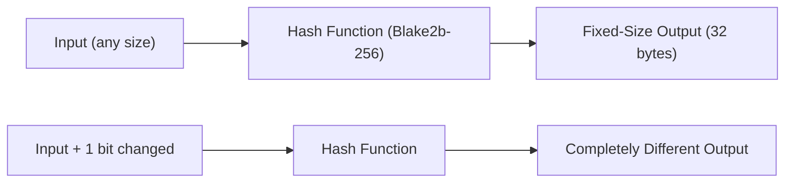
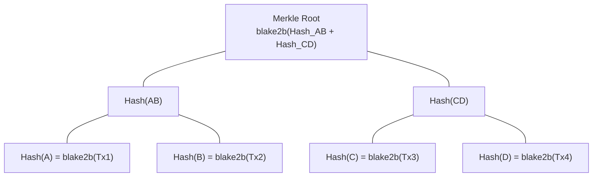

Cryptographic primitives are mathematical functions with special properties that make it computationally infeasible to cheat, and they form the security foundation of every blockchain transaction. [Earlier](/docs/developers/curriculum/fundamentals/what-is-a-blockchain) we described blockchain properties like immutability and tamper-evidence; this page reveals the concrete tools that enforce them: hash functions, Merkle trees, and digital signatures. You will understand not just what these primitives do, but why Cardano chose specific algorithms (Blake2b, Ed25519).

If you have worked with JWTs, the model will feel familiar: a JWT signs a payload with a private key, anyone with the public key verifies it, and modifying the payload invalidates the signature. A Cardano transaction works the same way, except verification happens on thousands of independent nodes rather than one server. Two related ideas carry over: a transaction ID is a content hash, so the content determines its identity the way a Git commit SHA does; and a VRF is a random value anyone can verify, which a server-side `Math.random()` can never be.

## What is a cryptographic hash function?

A cryptographic hash function takes an input of any size and produces a fixed-size output (the "hash" or "digest") such that the same input always produces the same output, but even a tiny change in input produces a completely different hash. It is the most fundamental building block in blockchain security.



A cryptographic hash function must satisfy:

1. **Deterministic**: the same input always produces the same output.
2. **Fixed output size**: regardless of input size, output length is constant.
3. **Pre-image resistance**: given a hash, it is infeasible to find the original input (you cannot "reverse" a hash; ~2^256 guesses).
4. **Second pre-image resistance**: given an input and its hash, it is infeasible to find a different input with the same hash.
5. **Collision resistance**: it is infeasible to find any two different inputs with the same hash (~2^128 operations, the birthday bound).
6. **Avalanche effect**: a small input change produces a drastically different output.

### Why does Cardano use Blake2b instead of SHA-256?

SHA-256 is what Bitcoin uses. **Blake2b** (by Aumasson and colleagues, based on a SHA-3 finalist) is what Cardano uses extensively: Blake2b-256 for most hashing and Blake2b-224 for address generation.

| Property | SHA-256 | Blake2b-256 |
|---|---|---|
| Speed | Slower in software | 2-3x faster in software |
| Security margin | Well-established | Comparable, based on ChaCha |
| Parallelism | Sequential | Designed for parallelism |
| Flexibility | Fixed | Configurable output, keyed hashing |
| Hardware | Efficient in ASICs | Efficient in general-purpose CPUs |

Speed matters because hashing happens constantly (validating blocks, verifying transactions, computing addresses). Faster hashing means higher throughput.

### Where does Cardano use hashing?

1. **Block header hashing**: each header is hashed and included in the next block, forming the chain.
2. **Transaction IDs**: every transaction is identified by a Blake2b-256 hash of its serialized content.
3. **Address generation**: addresses derive from public keys hashed with Blake2b-224.
4. **Script hashing**: a Plutus validator's compiled code is hashed; that hash is its script address.
5. **Datum hashing**: data attached to UTXOs can be stored as hashes to save space.
6. **Policy IDs**: native-token minting policies are identified by the hash of the policy script.

## How do Merkle trees enable efficient verification?

A Merkle tree organizes transaction hashes into a binary tree where each leaf is a transaction hash, each internal node is the hash of its two children, and the root (stored in the block header) is a single 32-byte fingerprint of all transactions. This enables logarithmic-time membership proofs.



To prove Tx3 is in a block you do not download all transactions; you need only the sibling hashes along the path (a **Merkle proof**). For a block of N transactions, membership needs only about log2(N) hashes. If any transaction is modified, its hash changes and propagates up to the root, which no longer matches the header, immediately revealing tampering. This also enables **light clients** that verify inclusion without storing the full chain.

Cardano uses Merkle structures for transaction verification, stake-distribution snapshots at epoch boundaries, and committing to large datasets while storing only the root on-chain.

## How do digital signatures prove identity?

A digital signature scheme lets someone sign a message with a private key so anyone can verify it with the corresponding public key. It provides authentication (the signer held the private key), integrity (any modification invalidates the signature), and non-repudiation (the signer cannot deny it).

```
Key Generation: (private_key, public_key) = generate_keypair()
Signing:        signature = sign(message, private_key)
Verification:   is_valid = verify(message, signature, public_key)
```

Only the private key can produce a valid signature; the public key verifies it without revealing the private key; and the signature is bound to the specific message.

### Why does Cardano use Ed25519?

Cardano uses **Ed25519** (EdDSA over Curve25519, by Bernstein and colleagues).

| Property | Ed25519 | ECDSA (Bitcoin/Ethereum) |
|---|---|---|
| Signature size | 64 bytes | ~72 bytes (DER) |
| Speed | Very fast | Slower |
| Deterministic | Yes | Needs a random nonce (a frequent source of bugs) |
| Side-channel resistance | Designed in | Vulnerable if implemented carelessly |
| Batch verification | Efficient | Not native |

Ed25519's deterministic signing is a major security advantage: ECDSA requires a random nonce, and a flawed RNG can leak the private key (this has caused real-world compromises). Ed25519 derives the nonce deterministically, eliminating that class of bug.

### How do signatures work in Cardano transactions?

What gets signed is the **hash of the transaction body**, not the raw transaction:

```
1. Build the body (inputs, outputs, fee)
2. tx_body_hash = blake2b_256(serialize(body))
3. signature = ed25519_sign(tx_body_hash, private_key)
4. Assemble: body + witnesses [(public_key, signature), ...]
5. Each node verifies ed25519_verify(tx_body_hash, signature, public_key)
   AND that the public key matches the address controlling the input
```

Signing a 32-byte hash is fast, and the hash's collision resistance ensures the signature covers all transaction data. Cardano supports **multi-signature** at the protocol level (multiple witness entries), no smart contract required for basic multisig.

## How do these primitives combine for security?

```
1. A user signs a transaction:    sig = ed25519_sign(blake2b_256(tx_body), key)
   -> authenticity + integrity of the transaction
2. The block producer builds a block: tx hashes form a Merkle tree; root goes in the header
   -> efficient verification + tamper detection
3. The block is chained:           next block references blake2b_256(header)
   -> immutability across the chain
4. The chain grows:                altering history would require re-signing, recomputing
   every Merkle root and every subsequent block hash, faster than the whole network
   -> practical immutability
```

No single primitive does the job alone: hashes provide integrity and binding, Merkle trees provide efficient structure, signatures provide authorization. Together the cost of cheating exceeds any benefit.

## What are Verifiable Random Functions (VRFs)?

A VRF combines a signature with a random number generator: given a private key and an input, it produces a random output that is unpredictable without the private key, plus a proof anyone can verify with the public key. In Cardano's Ouroboros protocol, the slot number is the input and a pool's VRF key decides whether it "wins" the right to produce a block, making block-producer selection both random and verifiable. This is covered in depth in [Consensus & Ouroboros](/docs/developers/curriculum/fundamentals/consensus-and-ouroboros).

## How does hashing secure off-chain data?

A common pattern stores the hash of large data on-chain while keeping the full data off-chain, giving verifiability without bloating the chain:

```
Off-chain: large file on IPFS    On-chain: { document_hash: "7f2d...", ipfs_cid: "Qm..." }
Anyone verifies: blake2b_256(downloaded_file) == on_chain_hash
```

Used for NFT metadata (CIP-25 / CIP-68), governance proposals, and audit trails.

## Key takeaways

- **Hash functions** (Blake2b) produce unique fixed-size fingerprints; they underpin integrity, transaction IDs, addresses, and the chain itself.
- **Merkle trees** enable logarithmic-time verification of a transaction within a block and make light clients possible.
- **Digital signatures** (Ed25519) prove a transaction was authorized by the private-key holder; deterministic signing removes a whole class of bugs.
- **Together** they create layered security: signatures authorize, Merkle trees organize, hash chains make history immutable.

## Next steps
You now understand the security of individual blocks and transactions. But who decides which block comes next, and how do thousands of nodes agree? See [Consensus & Ouroboros](/docs/developers/curriculum/fundamentals/consensus-and-ouroboros).
