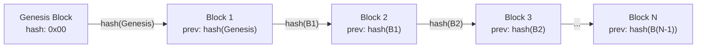
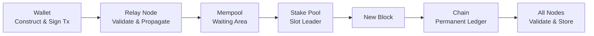

A blockchain is a distributed, append-only data structure that lets multiple participants agree on shared state without a central authority. It chains together cryptographically linked blocks of transactions, producing an immutable ledger that no single party controls. This page builds a precise mental model of what a blockchain actually is, why it was invented, and how Cardano's design choices matter to you as a developer.

If you have used Git, the shape is familiar: every commit references its parent, history is append-only (no force-push, no rebase), every developer keeps a full clone, and merging happens by protocol (consensus) rather than human decision. The difference that matters is that no participant can rewrite history at all, because thousands of independent nodes enforce the rules instead of one trusted server.

## What problem do blockchains solve?

Blockchains solve the trust problem: they let participants who do not trust each other agree on a shared ledger of truth without any single party in control. Traditional systems centralize trust in one entity (a bank, a platform, a server operator), and that centralization introduces vulnerabilities.

In traditional web development, trust is centralized. When a user sends money through a banking app, both parties trust the bank to update balances honestly. When you store data in PostgreSQL, your application trusts that the database has not been tampered with. When two services talk over REST, they trust the auth layer (OAuth, JWT) to verify identities.

This works well until it does not. Centralized trust introduces:

- **Single point of failure**: if the server goes down, nothing happens; if the database is corrupted, data is lost.
- **Single point of control**: the managing entity can unilaterally change the rules, freeze an account, or delete data.
- **Single point of trust**: users must believe the central authority is honest and competent, indefinitely.

The fundamental question is: **can a group of participants who do not trust each other agree on a shared ledger of truth, without any single party having control?** This is not new. Distributed systems researchers studied it for decades as the "Byzantine Generals Problem." What Bitcoin (and later Cardano) achieved was the first practical, large-scale solution.

## What is a ledger?

A ledger is an ordered list of records tracking events in sequence, so all parties see the same consistent, durable information. Your bank statement is a ledger. The key properties:

1. **Ordered**: events are recorded in sequence. A happened before B.
2. **Consistent**: everyone sees the same information.
3. **Durable**: once recorded, entries are not lost.

In web2, a ledger is a database table maintained by one server (or a primary-replica cluster). The organization running it is the source of truth. A **distributed ledger** is maintained by many independent participants, none with unilateral control; every participant holds a complete copy and follows a protocol to agree on what gets added.

## How do blocks batch transactions?

Blocks batch transactions into discrete, cryptographically sealed units so the network can process them efficiently. Each block has a header (metadata plus a hash linking it to the previous block) and a body (the transactions).

```
Block {
  header: {
    block_number: 9821453
    previous_block_hash: "a4f2c8..."
    merkle_root: "7b3d1e..."      // fingerprint of all transactions
    block_producer: "pool1abc..."  // the stake pool that created this block
  }
  body: { transactions: [tx1, tx2, ... tx_n] }
}
```

Each block references the **hash of the previous block**. This is the "chain" in blockchain. Alter a transaction in block 100 and its hash changes, so the reference in block 101 no longer matches, which invalidates 101, and so on. Tampering with any historical block breaks the entire chain from that point forward. That is the source of **immutability**: not that altering data is physically impossible, but that it is immediately detectable and would require re-creating every subsequent block, which is economically infeasible.



The **genesis block** is the very first block; it has no predecessor. On Cardano it was created in September 2017 (the Byron era). Every block since links back to it through an unbroken chain of hash references. On mainnet a new block is produced roughly every 20 seconds.

## Who runs a blockchain network?

A decentralized network of independent node operators runs a blockchain. On Cardano, anyone can run a node with the `cardano-node` software; there is no registration and no central authority deciding who participates. Nodes serve two roles:

1. **Relay nodes** propagate blocks and transactions across the network.
2. **Block-producing nodes (stake pools)** create new blocks according to the consensus protocol ([Ouroboros](/docs/developers/curriculum/fundamentals/consensus-and-ouroboros)).

As of 2026, Cardano has roughly 3,000 active stake pools run by independent operators worldwide. No single entity, not even IOG (which built Cardano), controls the network. Decentralization is a spectrum, not a binary, and Cardano's reward design specifically incentivizes spreading stake across many pools.

### Why does decentralization matter for developers?

- **Censorship resistance**: no single entity can block a valid transaction.
- **Permissionless deployment**: you can deploy a contract without anyone's approval.
- **Guaranteed execution**: once deployed, a contract runs exactly as written; no one can alter it.
- **Transparent state**: every participant can verify the entire history.

## What makes blockchain data immutable?

Three mechanisms work together: cryptographic hashing (each block contains the previous block's hash), distributed replication (every node holds a complete copy), and the consensus protocol (which makes rewriting history economically irrational). The cryptographic machinery behind this is covered in [Cryptographic Primitives](/docs/developers/curriculum/fundamentals/cryptographic-primitives).

For developers this is a mental shift: in web2 you routinely UPDATE and DELETE; in blockchain you only INSERT. Corrections are made by adding new transactions that supersede old ones, never by modifying history.

## What is Byzantine Fault Tolerance?

Byzantine Fault Tolerance (BFT) is the ability of a distributed system to function correctly even when some participants are actively malicious, not just offline but deliberately lying. The concept comes from the Byzantine Generals Problem (Lamport, Shostak, Pease, 1982).

In blockchain terms: generals are nodes, the battle plan is the next block, and traitors are malicious nodes. Cardano's Ouroboros protocol provides BFT as long as the majority of stake (in ADA) is controlled by honest participants. This is a stronger guarantee than most web2 systems: traditional distributed databases (Raft, Paxos) tolerate crash failures but assume all nodes are honest; blockchains assume some nodes are adversarial.

## What makes Cardano distinct?

A few design choices set Cardano apart and directly affect how you build:

- **Extended UTXO model**: Cardano tracks individual "coins" (unspent transaction outputs) rather than account balances. This shapes how you design applications. See [the eUTXO model](/docs/developers/curriculum/fundamentals/core-concepts/eutxo).
- **Native tokens**: custom tokens live at the ledger level alongside ADA, not inside smart contracts, so they inherit ADA's security without contract execution for basic transfers.
- **On-chain governance**: ADA holders vote on protocol changes (the Voltaire era), a level of decentralized decision-making with no web2 parallel.

## How does data flow through the network?

When you submit a transaction, it travels from your wallet through relay nodes, enters a mempool, gets selected by a stake pool for a block, and then propagates to all nodes for validation and permanent storage. The whole process typically takes 20 to 60 seconds.



After a few more blocks are added on top, the transaction is considered final with extremely high confidence. (How a pool gets selected to produce that block is the subject of [Consensus & Ouroboros](/docs/developers/curriculum/fundamentals/consensus-and-ouroboros).)

## Common misconceptions

**"Blockchain is just a database."** It is a specific data structure with properties (decentralization, immutability, permissionless access) that databases deliberately avoid because they add overhead. Use a database when you trust the operator; use a blockchain when you need trustless coordination.

**"Everything should be on the blockchain."** On-chain storage is expensive and slow. Store only what needs to be verifiable and immutable on-chain; use off-chain storage (IPFS, databases) for the rest, with on-chain hashes as anchors.

**"Blockchains are anonymous."** Cardano is **pseudonymous**, not anonymous. Transactions and addresses are public; usage patterns can be analyzed. Never assume transactions are private.

## Key takeaways

- A blockchain is a distributed, append-only ledger maintained by independent nodes following a shared protocol.
- The "chain" comes from cryptographic hash-linking: each block contains the previous block's hash, making tampering detectable.
- Decentralization removes single points of failure and control, enabling censorship-resistant, permissionless applications.
- Immutability is a feature: auditability and trust without a trusted intermediary. You INSERT, you never UPDATE.
- Cardano's eUTXO model, native tokens, and on-chain governance are the design choices that most affect how you build.

## Next steps
Now that you know what a blockchain is, the next page explores the cryptographic building blocks that make it work: hash functions, Merkle trees, and digital signatures. See [Cryptographic Primitives](/docs/developers/curriculum/fundamentals/cryptographic-primitives).
