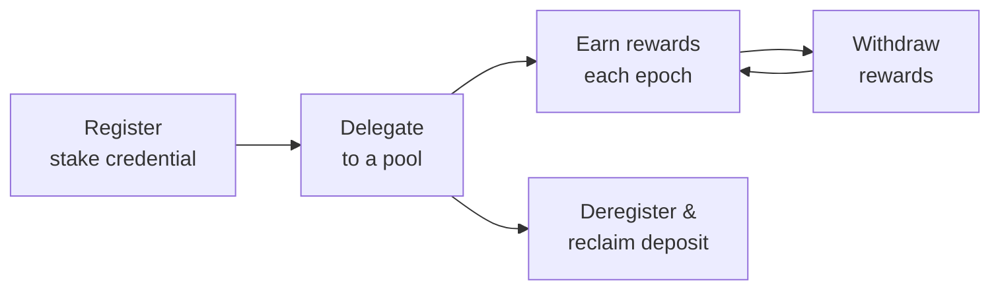

import Tabs from '@theme/Tabs';
import TabItem from '@theme/TabItem';

Staking is how ADA holders earn rewards by backing the network's security: they delegate their stake to a pool, and the pool produces blocks proportional to the stake delegated to it. From a developer's point of view, this is something your wallet or dApp can offer with a few certificate types on top of an ordinary transaction.

This page is about **delegating to pools and managing rewards from an application**, and, for tooling builders, registering pools programmatically. Running a pool as infrastructure (relays, block producers, KES keys, monitoring) is a separate discipline with its own section: [Operate a Stake Pool](/docs/operators/).

## What makes Cardano staking different

Cardano's delegation is **non-custodial**, which is a strong selling point to surface in your UI:

- **Your ADA never leaves your wallet.** You issue an on-chain certificate that counts your stake toward a pool; you keep full spending control.
- **No lock-up.** Your ADA stays liquid, spendable at any time.
- **No minimum to delegate.** Any amount counts toward the pool. Registering your stake key the first time costs a refundable 2 ADA deposit, returned when you deregister.
- **No slashing.** Delegated ADA is never at risk. If a pool underperforms, you simply miss rewards for that epoch. You never lose principal. (Contrast Ethereum, where validators can be slashed.)
- **Automatic re-delegation.** Add more ADA to the wallet and it's included from the next snapshot.

The stake credential is separate from the payment credential. Delegating doesn't move funds, it just assigns the staking rights attached to your address. See [Addresses](/docs/developers/curriculum/fundamentals/core-concepts/addresses) for how payment and delegation credentials combine.

## How rewards and timing work

Rewards don't arrive instantly. Because of how Ouroboros calculates slot leadership from a stake snapshot, there's a built-in delay before a fresh delegation starts earning:

```text
Epoch N      you delegate
Epoch N+1    snapshot taken at the epoch boundary
Epoch N+2    the pool produces blocks using your stake
Epoch N+3    rewards calculated
Epoch N+4    rewards distributed to your reward address
```

After this initial delay (~15 to 20 days), rewards arrive every epoch (~5 days) as long as the pool produces blocks. Two things worth showing users:

- **Saturation.** Each pool has a saturation point (total stake ÷ the `k` protocol parameter). Past it, rewards *per ADA* drop, a built-in nudge toward smaller pools and decentralization.
- **Performance.** A pool that misses assigned blocks earns fewer rewards, which flows through to delegators.

The deeper consensus mechanics (epochs, slots, VRF leader selection, the reward formula) are in [Consensus & Ouroboros](/docs/developers/curriculum/fundamentals/consensus-and-ouroboros).

## The staking lifecycle

Every staking integration is some subset of the same five steps:



1. **Register**: create the stake credential on-chain (a small refundable deposit).
2. **Delegate**: assign the stake to a pool (and, separately, [a DRep for voting](/docs/developers/curriculum/staking-governance/governance#delegate-your-vote)).
3. **Earn**: rewards accrue to the reward address each epoch.
4. **Withdraw**: claim accumulated rewards into the wallet.
5. **Deregister**: optional; remove the credential and reclaim the deposit.

## Before you start

The snippets below set up a provider and a wallet once and reuse them; each transaction uses a fresh builder.

<Tabs groupId="sdk">
<TabItem value="evolution" label="Evolution" default>

```typescript
import { preprod, Client } from "@evolution-sdk/evolution"

const client = Client.make(preprod)
  .withBlockfrost({
    baseUrl: "https://cardano-preprod.blockfrost.io/api/v0",
    projectId: process.env.BLOCKFROST_API_KEY!
  })
  .withSeed({ mnemonic: process.env.WALLET_MNEMONIC!, accountIndex: 0 })

const address = await client.address()
const stakeCredential = address.stakingCredential!   // staking certificates act on this
```

</TabItem>
<TabItem value="mesh" label="Mesh">

```typescript
import { BlockfrostProvider, MeshTxBuilder } from "@meshsdk/core"
import { MeshCardanoHeadlessWallet, AddressType } from "@meshsdk/wallet"

const provider = new BlockfrostProvider(process.env.BLOCKFROST_API_KEY!)
const wallet = await MeshCardanoHeadlessWallet.fromMnemonic({
  networkId: 0,                          // 0 = preprod/preview testnet
  walletAddressType: AddressType.Base,
  fetcher: provider,
  submitter: provider,
  mnemonic: process.env.WALLET_MNEMONIC!.split(" "),
})
// staking certificates act on the wallet's reward address;
// each operation builds with a fresh new MeshTxBuilder({ fetcher: provider })
```

</TabItem>
<TabItem value="cli" label="cardano-cli">

You need `payment.skey` / `payment.addr` plus a registered stake key pair (`stake.vkey` / `stake.skey`). Operations that touch the stake credential are signed by both keys.

</TabItem>
</Tabs>

## Register and delegate

Delegating for the first time means two things: registering the stake credential (a small refundable deposit) and delegating it to a pool. The Conway era added a combined certificate that does both in one step and saves a certificate fee, so either way it's a single transaction.

<Tabs groupId="sdk">
<TabItem value="evolution" label="Evolution" default>

```typescript
import { Credential } from "@evolution-sdk/evolution"

declare const stakeCredential: Credential.Credential
declare const poolKeyHash: any

const tx = await client
  .newTx()
  .registerAndDelegateTo({ stakeCredential, poolKeyHash })
  .build()

const signed = await tx.sign()
await signed.submit()
```

You can also chain the two certificates explicitly, which is what you'd do with legacy (pre-Conway, no-deposit) registration:

```typescript
// Conway certificates
const tx = await client
  .newTx()
  .registerStake({ stakeCredential })
  .delegateToPool({ stakeCredential, poolKeyHash })
  .build()

// Legacy certificates (no deposit), use registerStakeLegacy() instead
const legacyTx = await client
  .newTx()
  .registerStakeLegacy({ stakeCredential })
  .delegateToPool({ stakeCredential, poolKeyHash })
  .build()
```

The deposit (currently 2 ADA) is fetched from protocol parameters automatically. Already registered? Drop the registration call and just `delegateToPool({ stakeCredential, poolKeyHash })`.

</TabItem>
<TabItem value="mesh" label="Mesh">

```typescript
import { MeshTxBuilder, deserializePoolId } from "@meshsdk/core"

const utxos = await wallet.getUtxosMesh()
const changeAddress = await wallet.getChangeAddressBech32()
const rewardAddress = (await wallet.getRewardAddresses())[0]
const poolIdHash = deserializePoolId("pool1...")

const txBuilder = new MeshTxBuilder({ fetcher: provider })
const unsignedTx = await txBuilder
  .registerStakeCertificate(rewardAddress)
  .delegateStakeCertificate(rewardAddress, poolIdHash)
  .selectUtxosFrom(utxos)
  .changeAddress(changeAddress)
  .complete()

const signedTx = await wallet.signTx(unsignedTx)
await wallet.submitTx(signedTx)
```

`deserializePoolId` turns a bech32 `pool1...` ID into the hash the builder needs. Already registered? Use only `delegateStakeCertificate(rewardAddress, poolIdHash)`.

</TabItem>
<TabItem value="cli" label="cardano-cli">

Generate a registration certificate (the deposit comes from the `stakeAddressDeposit` protocol parameter) and a delegation certificate, then submit both in one transaction:

```shell
# 1. Registration certificate
cardano-cli latest stake-address registration-certificate \
  --stake-verification-key-file stake.vkey \
  --key-reg-deposit-amt 2000000 \
  --out-file registration.cert

# 2. Delegation certificate (needs the target pool ID)
cardano-cli latest stake-address stake-delegation-certificate \
  --stake-verification-key-file stake.vkey \
  --stake-pool-id pool17navl486tuwjg4t95vwtlqslx9225x5lguwuy6ahc58x5dnm9ma \
  --out-file delegation.cert

# 3. Build, including both certificates (build handles fee + deposit)
cardano-cli latest transaction build \
  --tx-in $(cardano-cli query utxo --address $(< payment.addr) --output-json | jq -r 'keys[0]') \
  --change-address $(< payment.addr) \
  --certificate-file registration.cert \
  --certificate-file delegation.cert \
  --witness-override 2 \
  --out-file tx.raw

# 4. Sign with both payment and stake keys, then submit
cardano-cli latest transaction sign \
  --tx-body-file tx.raw \
  --signing-key-file payment.skey \
  --signing-key-file stake.skey \
  --out-file tx.signed

cardano-cli latest transaction submit --tx-file tx.signed
```

The `--witness-override 2` flag tells `build` to budget for two signatures (payment + stake) so the fee is accurate. Already registered? Skip the registration certificate and build with just `delegation.cert`.

</TabItem>
</Tabs>

## Withdraw rewards

Rewards accumulate to the reward address each epoch and must be **explicitly withdrawn**. You always withdraw the entire balance. Partial withdrawals aren't allowed.

<Tabs groupId="sdk">
<TabItem value="evolution" label="Evolution" default>

```typescript
const delegation = await client.getWalletDelegation()
console.log("Available rewards:", delegation.rewards, "lovelace")

const tx = await client
  .newTx()
  .withdraw({ stakeCredential, amount: delegation.rewards })
  .build()

const signed = await tx.sign()
await signed.submit()
```

</TabItem>
<TabItem value="mesh" label="Mesh">

```typescript
import { MeshTxBuilder } from "@meshsdk/core"

const utxos = await wallet.getUtxosMesh()
const changeAddress = await wallet.getChangeAddressBech32()
const rewardAddress = (await wallet.getRewardAddresses())[0]

// The full reward balance, from the provider
const { rewards } = await provider.fetchAccountInfo(rewardAddress)

const txBuilder = new MeshTxBuilder({ fetcher: provider })
const unsignedTx = await txBuilder
  .withdrawal(rewardAddress, rewards)
  .selectUtxosFrom(utxos)
  .changeAddress(changeAddress)
  .complete()

const signedTx = await wallet.signTx(unsignedTx)
await wallet.submitTx(signedTx)
```

`withdrawal` takes the lovelace amount as a string; pass the whole `rewards` balance.

</TabItem>
<TabItem value="cli" label="cardano-cli">

```shell
# Read the current reward balance
rewards="$(cardano-cli query stake-address-info --address $(< stake.addr) | jq .[].rewardAccountBalance)"

# Withdraw the full balance with the stakeAddress+lovelace syntax
cardano-cli latest transaction build \
  --tx-in $(cardano-cli query utxo --address $(< payment.addr) --output-json | jq -r 'keys[0]') \
  --withdrawal "$(< stake.addr)+$rewards" \
  --change-address $(< payment.addr) \
  --witness-override 2 \
  --out-file tx.raw

cardano-cli latest transaction sign \
  --tx-body-file tx.raw \
  --signing-key-file payment.skey \
  --signing-key-file stake.skey \
  --out-file tx.signed

cardano-cli latest transaction submit --tx-file tx.signed
```

</TabItem>
</Tabs>

## Query delegation and rewards

Read which pool a stake credential is delegated to and how many rewards have accrued, to show status in a UI, or to decide how much to withdraw.

<Tabs groupId="sdk">
<TabItem value="evolution" label="Evolution" default>

```typescript
const delegation = await client.getWalletDelegation()

console.log("Pool:", delegation.poolId)     // null if not delegated
console.log("Rewards:", delegation.rewards) // lovelace
```

To query an arbitrary reward address instead of the wallet's, use `client.getDelegation(rewardAddress)`. Both return `{ poolId, rewards }`.

</TabItem>
<TabItem value="mesh" label="Mesh">

```typescript
const rewardAddress = (await wallet.getRewardAddresses())[0]

const info = await provider.fetchAccountInfo(rewardAddress)

console.log("Registered:", info.active)  // false if not registered
console.log("Pool:", info.poolId)        // delegated pool
console.log("Rewards:", info.rewards)    // lovelace, available to withdraw
console.log("Balance:", info.balance)    // total controlled stake
```

`fetchAccountInfo` returns `{ active, poolId, balance, rewards, withdrawals }`.

</TabItem>
<TabItem value="cli" label="cardano-cli">

```shell
cardano-cli query stake-address-info --address $(< stake.addr)
```

```json
[
  {
    "address": "stake_test1ur453z5nxrgvvu9wfyuxut8ss0mrvca4n8ly44tcu8camlqaz98mh",
    "delegationDeposit": 2000000,
    "rewardAccountBalance": 10534638802,
    "stakeDelegation": "pool17xgtj7ayvsaju4clums0mfusla4pmtfm6t4fj6guqqlsvne2mwm",
    "voteDelegation": "scriptHash-59aa3f091b3bcef254abfb89aea64973a61b78fdb2ac44839c7ccba8"
  }
]
```

An empty array (`[]`) means the stake address isn't registered.

</TabItem>
</Tabs>

## Deregister and reclaim the deposit

Deregistering removes the stake credential and refunds the registration deposit. **Withdraw rewards first**. Rewards are lost after deregistration. The best practice is to do both in the same transaction.

<Tabs groupId="sdk">
<TabItem value="evolution" label="Evolution" default>

```typescript
const delegation = await client.getWalletDelegation()

const tx = await client
  .newTx()
  .withdraw({ stakeCredential, amount: delegation.rewards })
  .deregisterStake({ stakeCredential })
  .build()

const signed = await tx.sign()
await signed.submit()
```

Use `deregisterStakeLegacy({ stakeCredential })` if you registered with the legacy certificate.

</TabItem>
<TabItem value="mesh" label="Mesh">

```typescript
import { MeshTxBuilder } from "@meshsdk/core"

const utxos = await wallet.getUtxosMesh()
const changeAddress = await wallet.getChangeAddressBech32()
const rewardAddress = (await wallet.getRewardAddresses())[0]

// Withdraw the last rewards and deregister in one transaction
const { rewards } = await provider.fetchAccountInfo(rewardAddress)

const txBuilder = new MeshTxBuilder({ fetcher: provider })
const unsignedTx = await txBuilder
  .withdrawal(rewardAddress, rewards)
  .deregisterStakeCertificate(rewardAddress)
  .selectUtxosFrom(utxos)
  .changeAddress(changeAddress)
  .complete()

const signedTx = await wallet.signTx(unsignedTx)
await wallet.submitTx(signedTx)
```

`deregisterStakeCertificate` reclaims the deposit; pairing it with `withdrawal` in the same transaction avoids losing accrued rewards.

</TabItem>
<TabItem value="cli" label="cardano-cli">

```shell
# Deregistration certificate
cardano-cli latest stake-address deregistration-certificate \
  --stake-verification-key-file stake.vkey \
  --out-file dereg.cert

# Withdraw the last rewards and deregister in one transaction
cardano-cli latest transaction build \
  --tx-in $(cardano-cli query utxo --address $(< payment.addr) --output-json | jq -r 'keys[0]') \
  --change-address $(< payment.addr) \
  --withdrawal "$(< stake.addr)+$(cardano-cli query stake-address-info --address $(< stake.addr) | jq -r .[].rewardAccountBalance)" \
  --certificate-file dereg.cert \
  --witness-override 2 \
  --out-file tx.raw

cardano-cli latest transaction sign \
  --tx-body-file tx.raw \
  --signing-key-file payment.skey \
  --signing-key-file stake.skey \
  --out-file tx.signed

cardano-cli latest transaction submit --tx-file tx.signed
```

</TabItem>
</Tabs>

## Delegate stake and vote together

Conway-era Cardano has a second, **independent** delegation: governance voting power. You can delegate stake to one pool and your vote to a different DRep, and change either without affecting the other. The full DRep flow lives in [Governance](/docs/developers/curriculum/staking-governance/governance#delegate-your-vote), but because both are stake-credential certificates, you can combine them in a single transaction:

<Tabs groupId="sdk">
<TabItem value="evolution" label="Evolution" default>

```typescript
import { Credential, DRep } from "@evolution-sdk/evolution"

declare const stakeCredential: Credential.Credential
declare const poolKeyHash: any
declare const drepKeyHash: any

// Register + delegate stake + delegate vote, all at once
const tx = await client
  .newTx()
  .registerAndDelegateTo({
    stakeCredential,
    poolKeyHash,
    drep: DRep.fromKeyHash(drepKeyHash)
  })
  .build()
```

</TabItem>
<TabItem value="mesh" label="Mesh">

```typescript
import { MeshTxBuilder, deserializePoolId } from "@meshsdk/core"

const rewardAddress = (await wallet.getRewardAddresses())[0]
const poolIdHash = deserializePoolId("pool1...")
const dRepId = "drep1..."   // or { type: "AlwaysAbstain" } / { type: "AlwaysNoConfidence" }

// Register + delegate stake + delegate vote, chained in one transaction
const txBuilder = new MeshTxBuilder({ fetcher: provider })
const unsignedTx = await txBuilder
  .registerStakeCertificate(rewardAddress)               // first time only
  .delegateStakeCertificate(rewardAddress, poolIdHash)   // stake -> pool
  .voteDelegationCertificate({ dRepId }, rewardAddress)  // vote -> DRep
  .selectUtxosFrom(await wallet.getUtxosMesh())
  .changeAddress(await wallet.getChangeAddressBech32())
  .complete()

const signedTx = await wallet.signTx(unsignedTx)
await wallet.submitTx(signedTx)
```

</TabItem>
<TabItem value="cli" label="cardano-cli">

```bash
# stake -> pool
cardano-cli latest stake-address stake-delegation-certificate \
  --stake-verification-key-file stake.vkey \
  --stake-pool-id pool1... \
  --out-file deleg.cert

# vote -> DRep
cardano-cli latest stake-address vote-delegation-certificate \
  --stake-verification-key-file stake.vkey \
  --drep-key-hash $(< drep.id) \
  --out-file vote-deleg.cert

# build both certificates into one transaction
cardano-cli latest transaction build \
  --tx-in $(cardano-cli query utxo --address $(< payment.addr) --output-json | jq -r 'keys[0]') \
  --change-address $(< payment.addr) \
  --certificate-file deleg.cert \
  --certificate-file vote-deleg.cert \
  --witness-override 2 \
  --out-file tx.raw
# sign with payment.skey + stake.skey, then submit
```

</TabItem>
</Tabs>

Already registered? Drop the registration step: Evolution `delegateToPoolAndDRep({ stakeCredential, poolKeyHash, drep })`, Mesh just the two delegation certificates. The DRep can also be an abstain or no-confidence option (`DRep.alwaysAbstain()` / `DRep.alwaysNoConfidence()` in Evolution).

## Script-controlled stake and the coordinator pattern

A stake credential can be controlled by a Plutus script instead of a key. In Evolution every staking operation accepts a `redeemer` and an attached script for this case:

```typescript
import { Credential, Data } from "@evolution-sdk/evolution"

declare const scriptStakeCredential: Credential.Credential
declare const stakeScript: any

const tx = await client
  .newTx()
  .delegateToPool({
    stakeCredential: scriptStakeCredential,
    poolKeyHash,
    redeemer: Data.constr(0n, []),
    label: "delegate-script-stake"
  })
  .attachScript({ script: stakeScript })
  .build()
```

Mesh's builder takes a redeemer on a script **withdrawal** (the coordinator trigger below) but not on a stake **delegation** certificate, so script-controlled delegation is Evolution or cardano-cli only.

The most important use isn't earning rewards. It's the **withdraw-zero coordinator pattern**, the smart-contract principle of [avoiding redundant validation](/docs/developers/curriculum/smart-contracts/advanced/design-patterns/overview#avoid-redundant-validation) applied through staking. A zero-amount withdrawal triggers a stake validator that runs *once for the whole transaction*, letting it enforce global invariants across many script inputs far more cheaply than re-running a spending validator per input:

<Tabs groupId="sdk">
<TabItem value="evolution" label="Evolution" default>

```typescript
const tx = await client
  .newTx()
  .withdraw({
    stakeCredential: scriptStakeCredential,
    amount: 0n,
    redeemer: Data.constr(0n, []),
    label: "coordinator-trigger"
  })
  .attachScript({ script: stakeScript })
  .build()
```

</TabItem>
<TabItem value="mesh" label="Mesh">

```typescript
import { MeshTxBuilder, mConStr0 } from "@meshsdk/core"

declare const scriptRewardAddress: string   // reward address derived from the stake script hash
declare const stakeScriptCbor: string

const collateral = await wallet.getCollateralMesh()

const unsignedTx = await new MeshTxBuilder({ fetcher: provider })
  .withdrawalPlutusScriptV3()
  .withdrawal(scriptRewardAddress, "0")        // zero-amount withdrawal triggers the validator
  .withdrawalScript(stakeScriptCbor)
  .withdrawalRedeemerValue(mConStr0([]))
  .txInCollateral(collateral[0].input.txHash, collateral[0].input.outputIndex)
  .changeAddress(await wallet.getChangeAddressBech32())
  .selectUtxosFrom(await wallet.getUtxosMesh())
  .complete()

const signedTx = await wallet.signTx(unsignedTx)
await wallet.submitTx(signedTx)
```

</TabItem>
</Tabs>

This is the basis of the [Stake Validator design pattern](/docs/developers/curriculum/smart-contracts/advanced/design-patterns/stake-validator) used by many DeFi protocols. Withdrawal validators must be registered on-chain first; see [Write a validator](/docs/developers/curriculum/smart-contracts/write-a-validator) for the on-chain side.

## Operate a pool programmatically

Most pool operators run a pool from the command line ([Operate a Stake Pool](/docs/operators/) is the full discipline: relays, block producers, KES keys, monitoring). But if you're building pool-management *tooling*, you can register and retire pools from code.

`registerPool` takes the full pool parameters: operator key, VRF key, pledge, cost, margin, reward account, owners, relays, and optional metadata. With Evolution:

```typescript
import {
  KeyHash, PoolKeyHash, PoolParams, RewardAccount,
  UnitInterval, VrfKeyHash,
} from "@evolution-sdk/evolution"

declare const operatorKeyHash: PoolKeyHash.PoolKeyHash
declare const vrfKeyHash: VrfKeyHash.VrfKeyHash
declare const ownerKeyHash: KeyHash.KeyHash
declare const rewardAccount: RewardAccount.RewardAccount

const poolParams = new PoolParams.PoolParams({
  operator: operatorKeyHash,
  vrfKeyhash: vrfKeyHash,
  pledge: 500_000_000n,                                                  // 500 ADA pledge
  cost: 340_000_000n,                                                    // 340 ADA fixed cost/epoch
  margin: new UnitInterval.UnitInterval({ numerator: 1n, denominator: 100n }), // 1%
  rewardAccount,
  poolOwners: [ownerKeyHash],
  relays: [],
  poolMetadata: null
})

const tx = await client.newTx().registerPool({ poolParams }).build()
const signed = await tx.sign()
await signed.submit()
```

Mesh's transaction builder has no pool-registration or retirement helpers, so programmatic pool management is Evolution or cardano-cli only.

Resubmitting `registerPool` with the same operator key updates an existing pool. To retire, announce a future epoch with `retirePool({ poolKeyHash, epoch: retirementEpoch })`; the pool deposit is refunded to the reward account after retirement. Pool metadata must follow the [CIP-6 standard](https://cips.cardano.org/cip/CIP-0006).

## Key takeaways
Staking from an application is **ordinary transaction building with certificates**: register, delegate, withdraw, deregister. The ADA never leaves the user's control, there's no slashing, and stake delegation is fully independent of governance vote delegation. Reach for script-controlled stake (the withdraw-zero coordinator) when a contract needs to validate a whole transaction at once.

## Next steps

- [Governance](/docs/developers/curriculum/staking-governance/governance), the other delegation stake credentials carry
- [Your first transaction](/docs/developers/curriculum/start-building/your-first-transaction), the build → sign → submit flow these certificates ride on
- [Operate a Stake Pool](/docs/operators/), if you want to *run* a pool rather than delegate to one or build tooling
