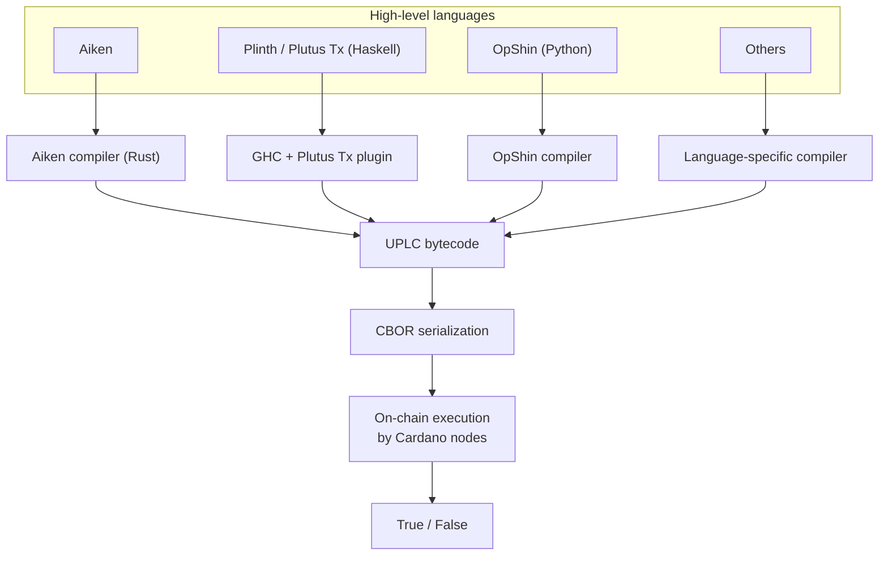

You write a validator in a high-level language, and it compiles down to **UPLC** (Untyped Plutus Lambda Calculus), the one bytecode every Cardano node executes. Because the on-chain target is the same regardless of source language, choosing a language is mostly about **ergonomics**: which one lets your team write correct, efficient validators fastest.

This page helps you pick. For most people starting today, the answer is **Aiken**.

## Everything compiles to UPLC



UPLC is a minimalist, lambda-calculus-based language: variables, functions, function application, constants, a fixed set of built-ins, and an `error` term. No loops, no mutable variables, no objects. That extreme simplicity is intentional: it makes on-chain execution deterministic and the node's evaluator small and auditable. The trade-off is that nobody writes UPLC by hand; you write something higher-level and let a compiler emit it. (If you want the low-level detail, see the [UPLC reference](/docs/developers/curriculum/smart-contracts/advanced/uplc).)

The practical consequence: **your language choice does not change what's possible on-chain, only how pleasant it is to get there.**

## Recommended: Aiken

[Aiken](https://aiken-lang.org) is a language purpose-built for Cardano validators, with syntax borrowed from Rust, Elm, and Gleam. It has become the most popular choice for new development, and it's where we point newcomers.

Why Aiken:

- **Lower barrier to entry**: developers from Rust, TypeScript, or any ML-family language become productive quickly.
- **Fast iteration**: the Rust-based compiler builds in seconds, not minutes.
- **Smaller scripts**: optimized UPLC output means lower fees for your users.
- **Built-in testing**: a test runner ships with the toolchain, so you write and run unit tests without extra tooling. (See [Testing](/docs/developers/curriculum/smart-contracts/testing).)
- **Clean separation**: Aiken is on-chain only. Off-chain code stays in whatever language your app uses (TypeScript, Python, Rust), which reinforces the on-chain/off-chain split Cardano's architecture wants.
- **Strong static typing**: full algebraic data types, pattern matching, generics, and inference, modern type safety with no runtime or garbage collector.

If you have no strong reason to pick something else, start with Aiken.

## Getting started with Aiken

Install Aiken with `aikup`, its official version manager:

```bash
npm install -g @aiken-lang/aikup   # or: brew install aiken-lang/tap/aikup
aikup                              # installs the latest Aiken
```

See [other install methods](https://aiken-lang.org/installation-instructions) for Homebrew and the standalone script. Aiken ships a single toolchain: Language Server support across the major editors, a built-in test runner that reports CPU and memory costs (see [Testing](/docs/developers/curriculum/smart-contracts/testing)), and a compiler that emits a CIP-57 Plutus blueprint on every build.

To go deeper:

- [aiken-lang.org](https://aiken-lang.org) for the language tour, guides, and standard library
- [I Can Aiken](https://book.io/book/i-can-aiken/), an open book from the Cardano Foundation Academy
- [Aiken video course](https://www.youtube.com/playlist?list=PLCuyQuWCJVQ1Zz9ySRMH_J6EymxhnZ0Hu), a multi-part walkthrough
- [Awesome Aiken](https://github.com/aiken-lang/awesome-aiken) for community projects and reusable libraries

## When to choose something else

Cardano's language diversity is a strength: because UPLC is a clean compilation target, many languages can target it (much as Rust, Go, and C++ all target WebAssembly). Pick by your team's existing expertise.

| Language | Best for | Notes |
|---|---|---|
| **[Aiken](https://aiken-lang.org)** | Most new projects | Purpose-built, fast, small output, built-in tests. The default recommendation. |
| **[Plinth](https://plutus.cardano.intersectmbo.org/docs/)** (Plutus Tx) | Haskell teams | The "canonical" language; full Haskell power, on- and off-chain code sharing, mature tooling. Steeper learning curve and larger scripts. |
| **[Plutarch](https://github.com/Plutonomicon/plutarch-plutus)** | Maximum performance | Fine-grained control close to writing UPLC by hand; almost always the highest performance. Not for the faint-hearted. |
| **[OpShin](https://opshin.dev)** | Python teams | Write validators in a subset of valid Python; pairs with PyCardano. |
| **[Scalus](https://scalus.org)** | JVM / Scala teams | Scala 3 for both on-chain and off-chain; works with the JVM and JavaScript. |
| **[Pebble](https://github.com/HarmonicLabs/pebble)** | TypeScript-familiar teams | Strongly-typed, TypeScript-like syntax that compiles to UPLC. |
| **[Marlowe](https://marlowe-lang.org)** | Financial contracts | A domain-specific language, intentionally **not** Turing-complete, guaranteeing termination; has a visual playground. |

### A note on Plutus Tx (Plinth)

Plutus Tx was the original framework: you write Haskell, annotate it, and a GHC plugin translates it to Plutus Core and then UPLC. Its strengths are real: the full Haskell type system, shared types between on-chain and off-chain code, and a path toward formal verification. Its costs are equally real: a steep learning curve (Haskell + blockchain + Template Haskell), long build times, cryptic errors, and relatively large scripts. It remains important for projects deeply embedded in the Haskell ecosystem; for everyone else, Aiken is the gentler path.

## What you pay for: execution costs

On-chain execution is metered in **ExUnits (Execution Units)**, across two dimensions:

- **CPU steps**: the number of computational steps the script performs. Each built-in has a defined cost; integer addition is cheap, cryptographic hashing is expensive.
- **Memory units**: the peak memory the script uses during evaluation.

Every script declares its budget up front, and there are per-transaction and per-block limits (protocol parameters that can change through governance). Two implications for your language choice:

1. **Feasibility**: a validator that exceeds the per-transaction limit simply can't be used; you must optimize or restructure.
2. **Cost**: higher ExUnits mean higher fees for your users, and a transaction that eats more of the per-block budget leaves room for fewer others.

This is the concrete reason "smaller, faster scripts" matters, and why Aiken's efficient output is a practical advantage. For tuning your own validator, see [Optimization](/docs/developers/curriculum/smart-contracts/advanced/optimization); to compare how different compilers' UPLC output actually performs on shared benchmarks, see [UPLC-CAPE](https://github.com/IntersectMBO/UPLC-CAPE), an IntersectMBO framework that measures CPU units, memory units, and script size across compilers and publishes [live reports](https://intersectmbo.github.io/UPLC-CAPE/).

## Blueprints: the contract's interface

Whatever language you choose, the compiled output is described by a **[CIP-57](https://cips.cardano.org/cip/CIP-57) Plutus Blueprint**: a machine-readable JSON document listing the validators, their datum/redeemer schemas, the type definitions, and the compiled code. Think of it as the ABI for a Cardano contract.

Blueprints are what let your off-chain code interact with a contract without reading its source: tools can generate TypeScript, Python, or Rust types directly from the blueprint, and different off-chain frameworks can all consume the same format. Aiken generates a blueprint automatically as part of its build. To turn one into type-safe off-chain code, see [Write a validator › from validator to blueprint](/docs/developers/curriculum/smart-contracts/write-a-validator#from-validator-to-blueprint); to read one field by field yourself, see [Reading a blueprint by hand](/docs/developers/curriculum/smart-contracts/write-a-validator#reading-a-blueprint-by-hand).

## Next steps

- [Lock and spend](/docs/developers/curriculum/smart-contracts/lock-and-spend): write the off-chain transactions that interact with your validator
- [Testing](/docs/developers/curriculum/smart-contracts/testing): test Aiken validators with mock transactions
- [Contract library](/templates/contracts): real validators to read and learn from
