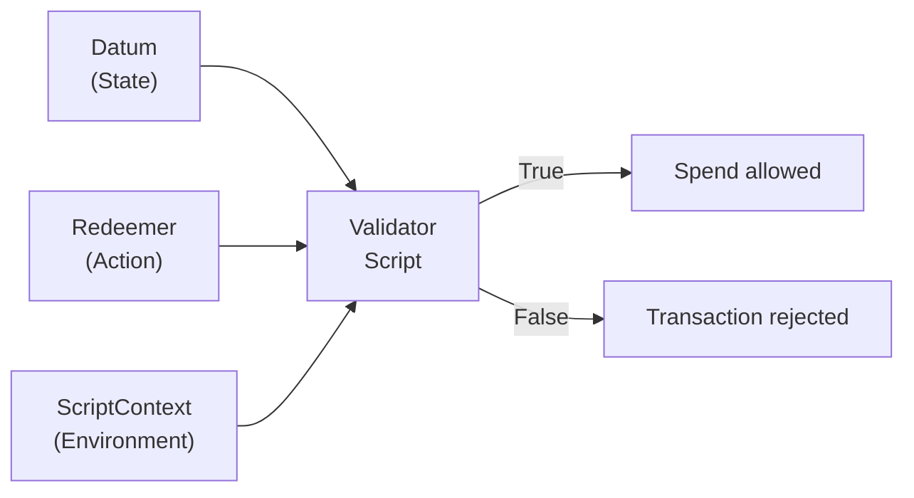
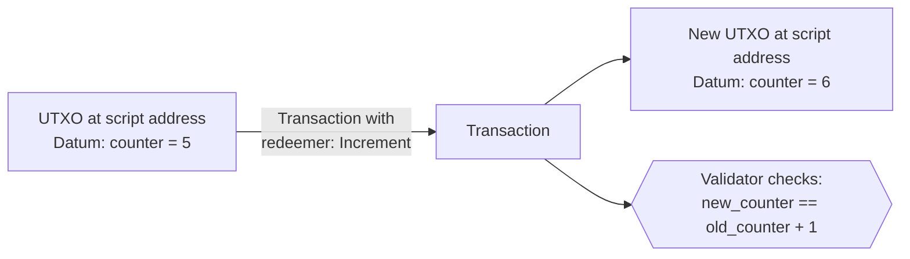

import Tabs from '@theme/Tabs';
import TabItem from '@theme/TabItem';

Every Cardano validator receives exactly three arguments: the **datum** (state locked at a script address), the **redeemer** (action submitted by the spender), and the **ScriptContext** (a complete snapshot of the transaction being validated). Together these three give a validator everything it needs to decide whether a UTXO can be spent.

If the [overview](/docs/developers/curriculum/smart-contracts/overview) gave you the mental model (validators validate, they don't act), this page is the data model that makes it work. We dissect each argument, look at how datums are stored on-chain, see what reference scripts buy you, and survey the design patterns that fall out of this three-argument architecture.

If you build web back-ends, the moving parts map cleanly onto things you already know:

- **Datum is a database row.** It holds structured state for a specific record (the UTXO). Updating state is like DELETE-then-INSERT (consume the old UTXO, create a new one). The validator is the constraint or trigger that checks the update is valid.
- **Redeemer is an API request body.** Like the JSON body of a POST/PUT, it says what action the client wants and carries the data to do it. `{ "action": "bid", "amount": 500 }` is exactly a `Bid { amount: 500 }` redeemer.
- **ScriptContext is the request context / middleware.** Like the full HTTP request available to Express or Django middleware: headers (signatures), body (redeemer, inputs), the response being built (outputs), auth (signatories), timing (validity interval). A validator can inspect any aspect of the transaction to decide.
- **Inline datums are embedded documents (MongoDB).** Moving from datum hashes to inline datums is like moving from a foreign key to embedding the full document. The data is right there, self-contained.
- **Reference scripts are a shared library on a CDN.** Instead of every transaction bundling the validator, they all reference the same on-chain copy: smaller payloads, single-source updates.
- **State machines are workflow engines.** Each state (datum) has valid transitions (redeemers), and the engine (validator) enforces the rules, like AWS Step Functions or a Redux reducer.

## What are the three arguments?

When a transaction tries to spend a UTXO sitting at a script address, the node invokes the validator with three arguments and reads back a single boolean:

```text
validator(datum, redeemer, scriptContext) -> Bool
```



1. **Datum**: data associated with the UTXO being spent. It is the "state" locked at the script address.
2. **Redeemer**: data supplied by whoever is trying to spend the UTXO. It is the "action" they want to take.
3. **ScriptContext**: a comprehensive snapshot of the entire transaction: all inputs, outputs, signatures, minting, and more. It is the "environment" the validation happens in.

Let's take each in turn.

## How does the datum represent state?

The datum is structured data attached to a UTXO when it is created, encoding whatever the validator needs to know about that specific UTXO. Because Cardano has **no persistent contract storage**, state lives in datums attached to UTXOs; "updating" state means consuming the old UTXO and creating a new one with an updated datum.

### What can a datum contain?

A datum can be any structured data that serializes to Cardano's on-chain format (`PlutusData`). Common examples:

- **Ownership information**: a public key hash identifying who may claim the UTXO.
- **Deadlines**: a POSIX timestamp or slot after which certain actions are allowed or prohibited.
- **State values**: counters, balances, configuration parameters, or any application-specific state.
- **Hashes or identifiers**: references to off-chain data, other UTXOs, or policy IDs.

```text
-- Example: Escrow datum
EscrowDatum {
  beneficiary: PubKeyHash,       -- who can claim
  deadline: POSIXTime,           -- when the deadline expires
  refund_address: PubKeyHash     -- who gets a refund after deadline
}

-- Example: Auction datum
AuctionDatum {
  seller: PubKeyHash,
  highest_bid: Integer,
  highest_bidder: PubKeyHash,
  lot_asset: AssetClass,
  min_bid_increment: Integer,
  auction_end: POSIXTime
}
```

### The continuing-output pattern

In account-based systems like Ethereum, contract state lives in persistent storage variables. On Cardano there is no persistent storage. Instead, **state is encoded in datums attached to UTXOs**.

When a validator wants to "update" its state, the transaction consumes the old UTXO (with the old datum) and creates a new UTXO at the same script address (with an updated datum). The validator checks that the state transition is legal.



This pattern, consume a UTXO and recreate it with updated state, is the fundamental mechanism for state management on Cardano. It is called the **continuing-output pattern**, because the script address continues to hold a UTXO, just with new data.

### Datum hash vs inline datum

Cardano historically stored datums in two ways, and the evolution matters:

**Datum hash (pre-Vasil)**: the UTXO only contained a *hash* of the datum. The actual datum data had to be supplied separately in the transaction that created or spent the UTXO. This meant:

- To spend a UTXO, you needed to know the full datum, not just its hash.
- The datum had to be included in the spending transaction, increasing its size and fees.
- If you lost track of the datum, the UTXO became effectively unspendable, funds locked forever.

**Inline datum (post-Vasil, [CIP-32](https://cips.cardano.org/cip/CIP-32))**: datums can be stored directly ("inline") in the UTXO. This means:

- Anyone can read the datum by inspecting the UTXO on-chain.
- The spending transaction does not need to include the datum separately.
- There is no risk of losing the datum data.
- Other transactions can read this datum via reference inputs ([CIP-31](https://cips.cardano.org/cip/CIP-31)).

```text
Pre-Vasil UTXO:                    Post-Vasil UTXO:
+---------------------+            +---------------------+
| Address             |            | Address             |
| Value               |            | Value               |
| Datum Hash: 0xabc.. |            | Inline Datum:       |
+---------------------+            |   { counter: 5,     |
                                   |     owner: 0x123 }  |
Full datum must be                 +---------------------+
stored and provided
separately                         Datum is right there,
                                   readable by anyone
```

:::tip Best practice
Use inline datums for virtually all new development. Datum hashes still work for backward compatibility, but inline datums are superior in almost every scenario.
:::

## How does the redeemer represent actions?

The redeemer is data provided by the transaction attempting to spend a UTXO, telling the validator what action the spender wants to perform. Its structure is entirely defined by the validator (the protocol imposes no requirements) and it commonly takes the form of tagged action constructors so a single validator can support multiple distinct operations.

### What can a redeemer contain?

Any `PlutusData` value. Common patterns:

**Simple values**, a password, a secret, a number:

```text
Redeemer = ByteString   -- the secret that hashes to the datum
```

**Action tags**, an enumeration of which action the spender wants:

```text
Redeemer =
  | Bid { amount: Integer }
  | Close
  | Cancel
  | Update { new_price: Integer }
```

**Proof data**, evidence that the spender is authorized:

```text
Redeemer = MerkleProof {
  leaf_index: Integer,
  proof_hashes: List<ByteString>
}
```

### Multi-action validators

The redeemer tells the validator *what kind of operation* is being attempted, which lets a single validator support many operations. The validator pattern-matches on the redeemer to decide which rules to apply:

```text
validator multi_action(datum: State, redeemer: Action, ctx: ScriptContext) -> Bool {
  when redeemer is {
    Bid { amount } ->
      validate_bid(datum, amount, ctx)     -- bid higher than current, signed by bidder

    Close ->
      validate_close(datum, ctx)           -- auction ended; winner gets lot, seller gets payment

    Cancel ->
      validate_cancel(datum, ctx)          -- only seller, only before any bids
  }
}
```

This pattern is ubiquitous. Almost every non-trivial validator uses a redeemer with multiple constructors to represent different operations.

:::note Keep redeemers small
The redeemer is included in the transaction body, so its size affects the fee. If your redeemer carries a large Merkle proof or other bulky data, that increases cost.
:::

## How on-chain data is encoded (Plutus Data)

Datums, redeemers, and script parameters are all the same thing under the hood: **Plutus Data**, Cardano's on-chain data format. Everything reduces to five types:

| Type | Represents | Used for |
|---|---|---|
| **Integer** | `bigint` | amounts, indices, timestamps, deadlines |
| **ByteArray** | bytes | hashes, addresses, policy IDs, asset names |
| **Constructor** | a tag (`index`) + ordered fields | variants / tagged unions, the shape of most datums and redeemers |
| **Map** | key → value pairs | metadata, key-value state |
| **List** | ordered values | arrays |

A **Constructor** is the workhorse: index `0` with fields models a record (a vesting datum is "constr 0 with `[beneficiary, deadline]`"); different indices model an enum (a redeemer that's `Claim` = constr 0, `Cancel` = constr 1):

<Tabs groupId="sdk">
<TabItem value="evolution" label="Evolution" default>

```typescript
import { Bytes, Data } from "@evolution-sdk/evolution"

// A vesting datum: constructor 0 with { beneficiary, deadline }
const datum = Data.constr(0n, [
  Bytes.fromHex("abc1...23de"),   // beneficiary key hash (ByteArray)
  1735689600000n,                 // deadline (Integer)
])

// A redeemer enum: Claim / Cancel
const claim = Data.constr(0n, [])
const cancel = Data.constr(1n, [])
```

</TabItem>
<TabItem value="mesh" label="Mesh">

```typescript
import { mConStr0, mConStr1 } from "@meshsdk/core"

// A vesting datum: constructor 0 with { beneficiary, deadline }
const datum = mConStr0([
  "abc1...23de",     // beneficiary key hash (ByteString, hex)
  1735689600000n,    // deadline (Integer)
])

// A redeemer enum: Claim / Cancel (index picks the constructor)
const claim = mConStr0([])
const cancel = mConStr1([])
```

</TabItem>
</Tabs>

Writing raw `Data.constr` is error-prone for real contracts. Evolution's **`TSchema`** defines the shape once and gives a type-safe codec, so the off-chain types match the on-chain definitions in your validator:

```typescript
import { Data, TSchema, Bytes } from "@evolution-sdk/evolution"

const VestingDatum = TSchema.Struct({ beneficiary: TSchema.ByteArray, deadline: TSchema.Integer })
const Codec = Data.withSchema(VestingDatum)

const datum = Codec.toData({ beneficiary: Bytes.fromHex("abc1...23de"), deadline: 1735689600000n })
// Codec.toCBORHex(...) / Codec.fromData(...) round-trip too
```

Mesh has no equivalent typed codec: you build the same datum with the raw `mConStr` constructors shown above, keeping field order and types aligned with your validator by hand.

### Sum-type redeemers (Claim / Cancel / Update)

The multi-action validator above pattern-matches on a redeemer with several constructors. Off-chain you build that sum type the same way: a `TSchema.Variant` in Evolution, or the constructor-index shorthands in Mesh. Each variant maps to a constructor index, and the index must match the order in your validator's type.

<Tabs groupId="sdk">
<TabItem value="evolution" label="Evolution" default>

```typescript
import { Data, TSchema, Bytes } from "@evolution-sdk/evolution"

// Claim = constr 0, Cancel = constr 1, Update = constr 2
const Redeemer = TSchema.Variant({
  Claim: {},
  Cancel: {},
  Update: { new_beneficiary: TSchema.ByteArray, new_deadline: TSchema.Integer },
})
const Codec = Data.withSchema(Redeemer)

const claim = Codec.toData({ Claim: {} })
const update = Codec.toData({ Update: { new_beneficiary: Bytes.fromHex("def4...56ab"), new_deadline: 1735776000000n } })
```

`TSchema` also gives you `Map`, `Array`, `Tuple`, and `NullOr`/`UndefinedOr` for the rest of a datum's shape. For the structures you reach for constantly, the `@evolution-sdk/evolution/plutus` barrel ships pre-built, validator-matching schemas: `Address`, `Credential`, `Value`, `OutputReference`, and `CIP68Metadata`. Import and compose them rather than hand-rolling the encoding.

</TabItem>
<TabItem value="mesh" label="Mesh">

```typescript
import { mConStr0, mConStr1, mConStr2 } from "@meshsdk/core"

// The constructor index picks the action (must match the validator's enum order)
const claim = mConStr0([])                                  // Claim
const cancel = mConStr1([])                                 // Cancel
const update = mConStr2(["def4...56ab", 1735776000000n])    // Update(new_beneficiary, new_deadline)
```

</TabItem>
</Tabs>

### Datums and redeemers that carry a Value

When a datum or redeemer holds a multi-asset value (a DEX order, locked escrow funds), both SDKs give you value helpers so you don't assemble nested asset maps by hand. In Mesh, `MeshValue` does the arithmetic:

```typescript
import { MeshValue } from "@meshsdk/core"

// Build, add, and merge values
const offered = MeshValue.fromAssets([{ unit: "lovelace", quantity: "5000000" }])
offered.addAsset({ unit: "policyId...assetName", quantity: "100" })

const required = MeshValue.fromAssets([{ unit: "lovelace", quantity: "3000000" }])
offered.geq(required)          // true: covers what the swap needs
offered.merge(required)        // combine two values
const datumValue = offered.toData()   // → Mesh Data (nested Maps) for the datum field
```

Evolution's equivalent is the `Value` schema from `@evolution-sdk/evolution/plutus`, a `Map` of policy → asset name → quantity that you drop straight into a `TSchema.Struct`.

### Serialization round-trip

Every Plutus Data value serializes to **CBOR**, the binary format the ledger stores. When you need the raw hex (a `cardano-cli` datum file, a value read back from the chain), round-trip through these:

<Tabs groupId="sdk">
<TabItem value="evolution" label="Evolution" default>

```typescript
import { Bytes, Data, Address } from "@evolution-sdk/evolution"

const hex = Data.toCBORHex(datum)     // PlutusData → CBOR hex
const back = Data.fromCBORHex(hex)    // CBOR hex → PlutusData

const bytes = Bytes.fromHex(hex)      // hex string ↔ Uint8Array
const asHex = Bytes.toHex(bytes)

Address.fromBech32("addr1...")        // bech32 ↔ Address (addr_test1.../addr1...)
Address.toBech32(addr)
```

</TabItem>
<TabItem value="mesh" label="Mesh">

```typescript
import { deserializeDatum } from "@meshsdk/core"

// CBOR hex (read off-chain or from a UTXO) → { constructor, fields }
const datum = deserializeDatum(cborHex)
// On the encode side, the tx builder serializes a JSON/Mesh datum for you:
//   txBuilder.txOutInlineDatumValue(mConStr0([...]), "Mesh")
```

</TabItem>
</Tabs>

The [CIP-57 blueprint](/docs/developers/curriculum/smart-contracts/write-a-validator#from-validator-to-blueprint) your validator compiles to describes these schemas so tools can generate the codecs for you.

## What does the ScriptContext provide?

The ScriptContext is the richest of the three arguments: a comprehensive data structure the node hands the validator, describing the whole transaction. It contains a `TxInfo` (all inputs, outputs, signatures, minting, fees, validity range, and more) plus a `ScriptPurpose` indicating *why* the validator is running.

### The transaction, as the validator sees it

These are the properties a validator can inspect through the context. This is a representation of the transaction *as seen by on-chain scripts*, not a 1:1 copy of the ledger transaction.

| Property | Description |
| --- | --- |
| **inputs** | The transaction inputs being spent. Every transaction produces outputs, which become inputs for future transactions. |
| **reference_inputs** | Inputs used for reading only, not spent. |
| **outputs** | The new UTXOs created by the transaction. |
| **fee** | Transaction fee in lovelace. Predictable, and depends on transaction size. |
| **mint** | The value of tokens being minted or burned. |
| **certificates** | Certificates for delegation, pool operations, governance roles, etc. |
| **withdrawals** | Stake reward withdrawals as credential-lovelace pairs. |
| **validity_range** | The time range in which the transaction is valid. |
| **signatories** | Hashes representing who signed the transaction. |
| **redeemers** | Script-purpose and redeemer pairs for the scripts executed in the transaction. |
| **datums** | Map from datum hashes to datum data. |
| **id** | The transaction hash, unique per transaction. |
| **votes** / **proposal_procedures** | Governance votes and proposals (Conway era). |

:::note Transaction context representation
The underlying ledger uses a different structure with numeric field keys, defined in the [Conway CDDL specification](https://github.com/IntersectMBO/cardano-ledger/blob/master/eras/conway/impl/cddl/data/conway.cddl). In particular, on-chain scripts can't see inputs locked by bootstrap addresses, outputs to bootstrap addresses, or transaction metadata.
:::

### The ScriptPurpose

The `ScriptPurpose` tells the validator *why* it is being invoked:

```text
ScriptPurpose =
  | Spending TxOutRef      -- spending a UTXO at a script address
  | Minting PolicyId       -- minting/burning tokens under this policy
  | Certifying DCert       -- issuing a stake certificate
  | Rewarding StakeCred    -- withdrawing staking rewards
  | Voting Voter           -- governance voting (Plutus V3)
  | Proposing              -- governance proposals (Plutus V3)
```

### What validators typically check

The ScriptContext is where most of the interesting logic happens. The most common checks:

**Signature verification**: "Is the transaction signed by the expected key?"

```text
list.has(ctx.transaction.signatories, datum.owner)
```

**Output inspection**: "Does the transaction create the correct outputs?"

```text
expect Some(output) = find_output_to(ctx.transaction.outputs, beneficiary_address)
output.value >= expected_amount
```

**Time-range checking**: "Is the transaction within the allowed window?"

```text
valid_range_start(ctx.transaction.valid_range) > datum.deadline
```

**Minting inspection**: "Are the correct tokens being minted?"

```text
quantity_of(ctx.transaction.mint, own_policy_id, token_name) == 1
```

**Input counting**: "Are the right UTXOs being consumed or referenced?"

```text
list.any(ctx.transaction.reference_inputs, fn(input) {
  input.output.address == oracle_address
})
```

### Why the ScriptContext is so powerful

The ScriptContext is what makes Cardano validators expressive despite being "just" boolean functions. A validator can enforce conditions about the *entire transaction*, not only the single UTXO it guards. That enables patterns impossible if a validator could see only its own input:

- **Multi-validator coordination**: two validators in the same transaction can each check conditions the other enforces, cooperating without direct communication.
- **Atomic swaps**: a validator can verify that a specific output exists in the transaction, enabling trustless exchange in a single transaction.
- **Forwarder patterns**: a validator can delegate its decision to another by checking that another script input is present.

## Common design patterns

Several patterns emerge from the datum-redeemer-context architecture. (The [Design Patterns](/docs/developers/curriculum/smart-contracts/advanced/design-patterns/overview) reference covers production-grade implementations.)

### State machine

Encode a finite set of states in the datum and a set of transitions in the redeemer. The validator checks each transition is valid given the current state.

```text
Datum (State):          Redeemer (Transition):
  | Collecting          | Contribute { amount }
  | Funded              | Dispute
  | Disputed            | Resolve { ruling }
  | Completed           | Complete

Validator checks:
  Collecting + Contribute -> is amount sufficient? -> Collecting or Funded
  Funded + Dispute -> is disputer authorized? -> Disputed
  Disputed + Resolve -> is resolver the arbiter? -> Completed
```

The transaction consumes the UTXO with the old state and creates a new UTXO with the new state; the validator verifies the transition is legal.

### Multi-validator (validator linking)

Complex applications use multiple validators that cooperate within a single transaction. A DEX might have a liquidity-pool validator, an LP-token minting policy, and an order validator. All three run in one transaction. They do not call each other; they independently verify conditions about the same transaction through ScriptContext.

```text
Single transaction:
  Inputs:  Pool UTXO (pool validator), Order UTXO (order validator)
  Mint:    LP tokens (minting policy)
  Outputs: Updated pool UTXO, LP tokens to provider, swapped tokens to trader

Each validator checks its own rules against ScriptContext:
  Pool validator:  "Are reserves correctly updated? Are LP tokens minted?"
  Order validator: "Is the swap executed at the correct price?"
  Minting policy:  "Is the pool UTXO consumed? Is the amount correct?"
```

### One-shot pattern

Use a specific UTXO as input to guarantee uniqueness. Since each UTXO can be spent only once, a validator or minting policy that requires a specific UTXO can only ever succeed once. Common uses: minting a unique NFT, or ensuring a contract's initial state can only be created once.

### Withdraw-zero trick

A spending validator delegates its logic to a staking validator by requiring a zero-ADA withdrawal from a staking script. The staking validator runs **once** for the whole transaction, while a spending validator runs **once per input**, so this is more efficient when a transaction spends many UTXOs from the same script. See [Stake Validator](/docs/developers/curriculum/smart-contracts/advanced/design-patterns/stake-validator) for the full pattern.

### Beacon / pointer token

A beacon token is a unique native token held at a script address alongside a datum. It acts as a pointer that makes the UTXO easy to find: query the chain for the token, and you immediately locate the right UTXO among potentially thousands at the same address.

## How reference scripts (CIP-33) reduce costs

Reference scripts let a compiled validator be stored once in a UTXO and referenced by all future transactions that need it, instead of including the full script bytes every time. This shrinks transactions (lowering fees), relaxes the practical limit on validator size, and turns deployment into a one-time cost shared by all users.

```text
Step 1: Store the script in a UTXO
  Transaction creates:
    UTXO_Script at some_address
      Value: min ADA
      Reference Script: [compiled validator bytecode]

Step 2: Use the script via reference
  Transaction spends from script_address:
    Reference Input: UTXO_Script (not consumed, just referenced)
    Input: UTXO at script_address (being spent)
    Redeemer: { action data }
```

The reference-script UTXO must remain unspent for as long as you want it available; if it is consumed, transactions referencing it will fail. For the SDK mechanics, see [Reference scripts](/docs/developers/curriculum/smart-contracts/lock-and-spend#reference-scripts).

## Putting it together: a vesting example

Consider a simple vesting contract: Alice locks 1000 ADA for Bob, who can claim it after a specific date.

**1. Lock funds.** Alice creates an output at the vesting script address:

```text
Output:
  Address: vesting_script_address
  Value: 1000 ADA
  Inline Datum: {
    beneficiary: Bob's PubKeyHash,
    deadline: 1735689600  (January 1, 2025, as POSIX time)
  }
```

**2. Bob claims (after the deadline).** Bob builds a spending transaction:

```text
Input: the UTXO Alice created
Redeemer: Claim
Output: 999.8 ADA to Bob's wallet
Validity interval: invalid_before = slot for Jan 2, 2025
Signatures: Bob's signature
```

**3. The validator executes** with `datum = { beneficiary, deadline }`, `redeemer = Claim`, and a ScriptContext showing the signatories, validity range, and outputs. It checks:

1. Is the transaction signed by `datum.beneficiary` (Bob)? Check `signatories`.
2. Has the deadline passed? Check that `datum.deadline` is before the start of `valid_range`.

Both hold, so the validator returns `True` and the transaction is included. If Eve tries to claim early with a validity interval starting before the deadline, the time check returns `False`, the transaction is rejected, and Eve pays nothing. It never made it on-chain.

You can build exactly this flow with an SDK on the [Lock and Spend](/docs/developers/curriculum/smart-contracts/lock-and-spend) page.

## Key takeaways

- **Datum is state**: the data locked at a script address. Use inline datums for all new development.
- **Redeemer is action**: what the spender wants to do, usually tagged constructors for multiple operations in one validator.
- **ScriptContext is environment**: a complete view of the transaction, letting validators enforce rules about inputs, outputs, signatures, time, and minting.
- **State is managed by consuming and recreating UTXOs** (the continuing-output pattern), not by mutating storage.
- **Reference scripts and inline datums** cut transaction sizes, lower fees, and simplify off-chain code.

## Next steps

- [Choose a language](/docs/developers/curriculum/smart-contracts/choose-a-language) to write your validator
- [Lock and spend](/docs/developers/curriculum/smart-contracts/lock-and-spend): build the off-chain transactions with an SDK
- [Design Patterns](/docs/developers/curriculum/smart-contracts/advanced/design-patterns/overview): production-grade implementations of the patterns above
