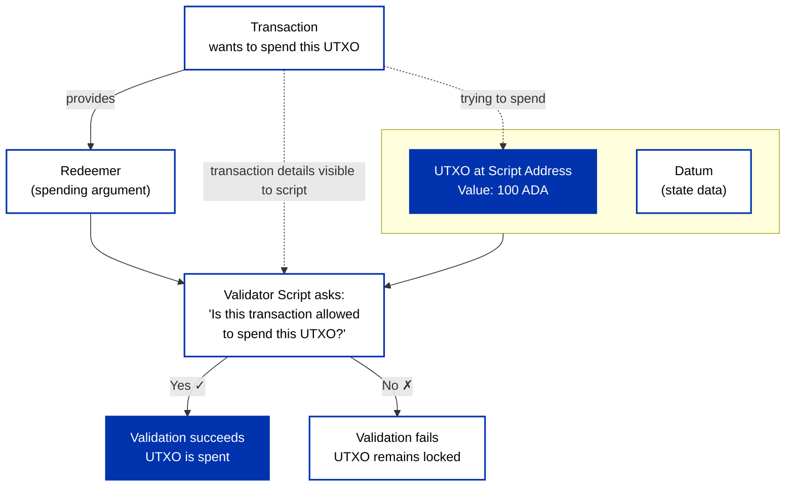
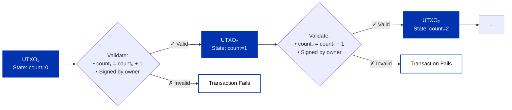

## What are smart contracts?

Smart contracts are agreements defined in code that enforce their terms automatically, without intermediaries. On Cardano they work differently from account-based chains, and the key to understanding them is the [eUTXO](/docs/developers/curriculum/fundamentals/core-concepts/eutxo) model: a smart contract is a **validator script** that guards UTXOs locked at its address. You lock a UTXO at the script's address, and from then on it can only be spent by a transaction the script approves.

## Smart contracts are validators, not actors

:::tip Mental model shift
The most important shift when coming from other blockchains: **a smart contract cannot take actions**. It can only approve or reject a proposed transaction.
:::

A Cardano validator cannot send tokens, call another contract imperatively, initiate anything on its own, make network requests, read external data directly, generate random numbers, or loop forever (execution budgets enforce termination). Instead it **validates**: users propose a transaction, and the validator approves or rejects it against the logic you wrote. These limits are features. They make validators **deterministic** (the same inputs always produce the same result), which is the foundation of Cardano's predictability.

## On-chain and off-chain

A contract has two halves:

- **On-chain (the validator)**: the immutable logic that runs on every node and approves or rejects spends from the contract address. It runs once per script input in a transaction.
- **Off-chain**: the application that finds the locked UTXOs and builds transactions the validator will approve. It can be written in any language and handles the UI, data fetching, and transaction building.

:::tip The lawyer and the judge
Think of off-chain code as the **lawyer drafting a contract** and on-chain code as the **judge reviewing it**. The lawyer does the creative work of figuring out what the agreement should look like; the judge only checks whether it complies with the rules. This is why on-chain execution stays cheap, off-chain code can be in any language, and you can test the two halves independently.
:::

Sending a UTXO to the script address initialises a contract instance. Anyone can send a UTXO there (with any datum, or none); the validator decides what can leave.

## The validator's inputs

A validator is a function of three arguments:

```text title="Validator function signature"
f(datum, redeemer, context) = success | failure
```



- **Datum**: state attached to the locked UTXO, set when it is created (the "e" in eUTXO).
- **Redeemer**: the argument the spender supplies to unlock it, naming the action they want.
- **Context**: the transaction the validator is judging, its inputs, outputs, signatures, mint, and validity range, so the script can assert facts about the whole transaction, not just the one UTXO it guards.

:::tip Deep dive
This is the quick tour. The full reference, the complete transaction context, the `ScriptPurpose`, inline-vs-hash datums, and the patterns they enable, is **[Datum, redeemer & context](/docs/developers/curriculum/smart-contracts/datum-redeemer-context)**.
:::

## Script addresses and purposes

A **script address** is derived from the hash of the validator, so the rules are bound to the address. UTXOs sent there can only be spent when the script approves the spending transaction. The hash includes a language tag (`0x01` PlutusV1, `0x02` PlutusV2, `0x03` PlutusV3), so identical code under different versions yields different addresses.

:::caution Address collision
The same contract code always produces the same address within the same Plutus version. If you deploy code someone else already deployed, you get the same address, and there may already be history there.
:::

Unlike key-controlled addresses, a script address is governed by code: anyone can send funds to it, but only a transaction that satisfies the validator can spend them.

A script also has a **purpose**, the kind of action it guards:

| Script purpose | Validates |
| --- | --- |
| **Spend** | Consuming a UTXO. The most common, and the only purpose that receives a datum. |
| **Mint** | Token creation and destruction (minting policies). |
| **Publish** | Certificates: stake delegation, pool and DRep registration, committee changes. |
| **Withdraw** | Stake reward withdrawals. |
| **Vote** | Governance votes (Conway). |
| **Propose** | Governance proposals (Conway). |
| **Native** | The pre-Plutus scripting language for simple multisig and time-locks (all-of, any-of, before/after). |

## How scripts execute

A transaction that includes scripts is validated in two phases:

- **Phase 1** checks the transaction structure: inputs exist, signatures are valid, the transaction balances.
- **Phase 2** runs the scripts. Each gets a budget of execution units (ExUnits), priced into the fee.

Because phase-2 work is real, a script transaction also carries **collateral**: ADA-only UTXOs the node consumes only if a script fails phase 2. Honest transactions that succeed never lose it, while flooding the network with failing scripts becomes expensive. Setting collateral in practice is covered in [Lock and spend](/docs/developers/curriculum/smart-contracts/lock-and-spend#collateral); the SDKs select it for you.

### Deterministic validation

Validation depends only on the transaction and its context, never on live network state. That determinism lets you compute a transaction's outcome and its exact cost before you submit it, unlike chains where gas and ordering shift under load.

## The contract lifecycle

In practice a stateful contract moves through three steps, shown here with a counter that only increments:

1. **Write the validator**: it approves a spend only when the new datum is a valid transition from the old one (here `count + 1`) and the right party signed.
2. **Lock**: send a UTXO to the script address with the initial datum (`count: 0`).
3. **Unlock and update**: spend that UTXO with a redeemer (`increment`); the validator checks the transition, and a new UTXO carries the updated datum (`count: 1`) while the old one is consumed.



The hands-on version, with Evolution, Mesh, and cardano-cli, is in [Lock and spend](/docs/developers/curriculum/smart-contracts/lock-and-spend).

## What makes Cardano contracts different

A few ledger features shape how you design contracts:

- **Reference inputs ([CIP-31](https://cips.cardano.org/cip/CIP-31))**: read a UTXO's data without spending it, so many contracts can read one oracle feed at once.
- **Inline datums ([CIP-32](https://cips.cardano.org/cip/CIP-32))**: store the datum in the output itself instead of a hash. See [Datum, redeemer & context](/docs/developers/curriculum/smart-contracts/datum-redeemer-context#datum-hash-vs-inline-datum).
- **Reference scripts ([CIP-33](https://cips.cardano.org/cip/CIP-33))**: deploy a script once and reference it from later transactions, for smaller transactions and lower fees. See [Lock and spend](/docs/developers/curriculum/smart-contracts/lock-and-spend#reference-scripts).
- **Collateral output ([CIP-40](https://cips.cardano.org/cip/CIP-40))**: return excess collateral to an address you choose.

A validator's rules cannot be changed after deployment, and the compiled code cannot be turned back into source.

## Choose a language

Validators can be written in several languages that all compile to the same on-chain bytecode (UPLC). For most new projects, **[Aiken](https://aiken-lang.org)** is the recommended starting point. See **[Choose a language](/docs/developers/curriculum/smart-contracts/choose-a-language)** for the full comparison (Aiken, Plinth, Plutarch, OpShin, Scalus, Pebble, Marlowe).

## Key takeaways

- **Smart contracts are validators, not programs.** They check whether a transaction is allowed; they do not perform its logic.
- **On-chain validates; off-chain constructs.** This keeps on-chain execution cheap and lets you write and test the two halves independently.
- **Determinism is the superpower.** You know a transaction's outcome and cost before submitting it, which removes wasted fees, front-running, and MEV.
- **Script addresses lock UTXOs under code,** replacing key-based authorization with arbitrary rules.
- **The eUTXO model extends UTXOs** with datums, redeemers, and context, enabling full contract logic while preserving determinism and parallelism.

## Next steps
This module builds up from here:

1. **[Datum, redeemer & context](/docs/developers/curriculum/smart-contracts/datum-redeemer-context)**: the three arguments every validator receives, in depth.
2. **[Choose a language](/docs/developers/curriculum/smart-contracts/choose-a-language)**: pick how you'll write validators (Aiken-first).
3. **[Lock and spend](/docs/developers/curriculum/smart-contracts/lock-and-spend)**: build the off-chain transactions that interact with a contract.
4. **[Testing](/docs/developers/curriculum/smart-contracts/testing)**: verify validators with mock transactions before you deploy.
5. **[Security](/docs/developers/curriculum/smart-contracts/security)**: the attack classes to defend against.
