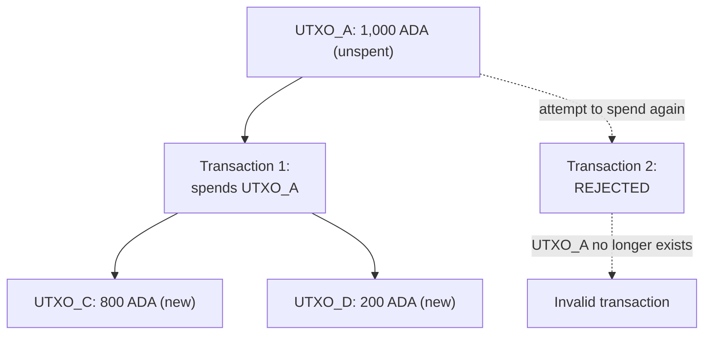

Smart contract bugs are uniquely dangerous: deployed validators are immutable (or very hard to change) and they often guard significant value, so a single vulnerability can mean irreversible loss of funds. For web2 developers, the shift is stark: a bug here isn't an embarrassing hotfix, it's a permanent financial loss in an adversarial environment where anyone in the world can attempt the exploit.

The good news: Cardano's [eUTXO model](/docs/developers/curriculum/fundamentals/core-concepts/eutxo) eliminates several of the worst attack classes by design. The rest you handle with careful validator logic and established patterns. This page covers what the platform protects you from, what it doesn't, and how to write validators that hold up.

> Network-level threats (51%, long-range, eclipse attacks) target consensus, not your contract. Cardano's Ouroboros protocol defends against those. See [Consensus & Ouroboros](/docs/developers/curriculum/fundamentals/consensus-and-ouroboros). The rest of this page is about application-level security.

Your security instincts transfer directly:

- **Reentrancy is like CSRF**: an action triggered at an unexpected point because origin/state wasn't verified. Cardano eliminates it structurally, the way `SameSite` cookies and CSRF tokens address it on the web.
- **Datum hijacking is like SQL injection**: manipulated input data changes the meaning of an operation. Both are prevented by validating all data at the boundary; never trust that it's well-formed or authorized.
- **Double satisfaction is like IDOR (insecure direct object reference)**: referencing someone else's resource to satisfy your own check. Prevention requires ensuring the resource you validate actually belongs to you.
- **Audits are like penetration testing**: you'd pen-test a web app before launch; you audit a contract before mainnet. The irreversibility makes it even more critical.
- **Formal verification is type systems on steroids**: not just "is this a number?" but "can this balance ever go negative?", proven for all inputs.

## What the eUTXO model protects you from

### Reentrancy is impossible

The **reentrancy attack** is the most famous smart contract vulnerability, responsible for the 2016 DAO hack that drained tens of millions of dollars in ETH. In Ethereum's account model, a contract can call another contract, which can call back into the original before the first call finishes, exploiting state that hasn't been updated yet.

**Cardano is structurally immune.** In the eUTXO model a transaction is a complete, atomic unit. A validator runs once per input, deciding whether that UTXO can be spent under the given conditions. There is no notion of a contract "calling" another contract mid-execution. The whole transaction, all inputs, outputs, and script runs, is validated as one unit: everything succeeds or everything fails. There is no mid-execution state for a reentrant call to exploit.

### Double-spending is prevented at the protocol level

The ledger tracks every unspent output and removes it the instant it's consumed, so any second attempt to spend the same output is structurally invalid.



This is simpler and more robust than the account model, where double-spend prevention relies on nonce tracking and careful state management. Here it's structural, not procedural.

### Determinism eliminates MEV

On Ethereum a transaction's outcome depends on global state at execution time, which can differ from construction time: the root of **MEV** (Maximal Extractable Value), where block producers profit by reordering, inserting, or censoring transactions.

On Cardano, transaction outcomes are [fully deterministic](/docs/developers/curriculum/smart-contracts/overview#deterministic-validation). A transaction names its exact inputs and outputs; if those inputs still exist when it reaches the chain, it executes exactly as built, otherwise it simply fails: no partial execution, no surprise. This removes entire categories of front-running and MEV attacks.

### Native assets share the ledger's security

On Ethereum, tokens are smart contracts (ERC-20), and every token contract is its own attack surface. On Cardano, [native assets](/docs/developers/curriculum/native-tokens/overview) are handled by the ledger itself and share ADA's guarantees. The minting policy controls creation, but once tokens exist there is no token contract to exploit.

## Vulnerabilities you still have to guard against

The platform removes some attacks; the rest are your responsibility. These are the big ones, each has a deep-dive in the [vulnerability reference](/docs/developers/curriculum/smart-contracts/advanced/security/vulnerabilities/overview).

### Datum hijacking

Occurs when a script output doesn't properly validate the datum attached to it, letting an attacker substitute a malicious datum that changes ownership or another critical field in the continuing UTXO.

```text
Normal flow:
  Input UTXO:  [Script Address, Datum: {owner: "Alice", amount: 100}]
  Output UTXO: [Script Address, Datum: {owner: "Alice", amount: 80}]   (Alice withdrew 20)

Attack:
  Input UTXO:  [Script Address, Datum: {owner: "Alice", amount: 100}]
  Output UTXO: [Script Address, Datum: {owner: "Attacker", amount: 100}]  (owner changed!)
```

**Prevention**: explicitly check that the output datum meets all expected constraints: immutable fields (like ownership) unchanged, mutable fields (like balances) changed only per the allowed rules, and the datum structure matching the expected schema. See [arbitrary datum](/docs/developers/curriculum/smart-contracts/advanced/security/vulnerabilities/arbitrary-datum).

### Double satisfaction

Occurs when a single output satisfies the conditions of *multiple* validators in the same transaction, letting an attacker fulfill two scripts' requirements with one output instead of two.

```text
Script A (DEX pool):  "valid if an output contains 100 USDx"
Script B (lending):   "valid if an output contains 100 USDx"

Attacker's transaction:
  Inputs:  DEX pool UTXO (A), lending pool UTXO (B)
  Outputs: ONE output with 100 USDx

  Both A and B see the 100 USDx output and consider themselves satisfied,
  but only one output exists. The attacker pays once for two obligations.
```

**Prevention**: tag outputs with a unique identifier (a state/beacon token) and validate that *your specific* output exists, rather than that "some output" meets the condition. See [double satisfaction](/docs/developers/curriculum/smart-contracts/advanced/security/vulnerabilities/double-satisfaction).

### Token forgery

A carelessly written minting policy can let an attacker mint unauthorized tokens: missing authorization checks, a "one-time" NFT policy that can actually run twice, or unvalidated policy parameters. The correct one-shot pattern ties minting to consuming a specific UTXO, which can never exist again:

```text
Policy: "minting allowed ONLY if this specific UTXO is consumed as input"

  Tx 1 (mint):     Inputs: [UTXO_Unique_123]   Mints: [1 MyNFT]   <- UTXO consumed
  Tx 2 (re-mint):  Inputs: [???]               Mints: [1 MyNFT]   <- FAILS, UTXO gone
```

See [token security](/docs/developers/curriculum/smart-contracts/advanced/security/vulnerabilities/token-security) and [other token name](/docs/developers/curriculum/smart-contracts/advanced/security/vulnerabilities/other-token-name).

### Resource exhaustion

Validators have [ExUnits budgets](/docs/developers/curriculum/smart-contracts/choose-a-language#what-you-pay-for-execution-costs). An attacker can craft transactions that approach the limits, creating denial-of-service conditions for a protocol. Be conscious of worst-case execution cost; use parameterized scripts, bound loop iterations, and pre-compute expensive work off-chain. See [unbounded inputs](/docs/developers/curriculum/smart-contracts/advanced/security/vulnerabilities/unbounded-inputs) and related entries.

## Common security patterns

Experienced Cardano developers reach for the same defensive patterns:

- **State / beacon token**: require a unique NFT (minted with a one-time policy) in every UTXO at a script address. This prevents rogue UTXOs at the address and solves double satisfaction.
- **Value-preservation check**: explicitly verify that total value in script outputs equals the expected value (inputs minus authorized withdrawals plus authorized deposits). Never rely on implicit preservation.
- **Datum-continuity validation**: when a script UTXO continues (is consumed and recreated with updated state), validate *every* field of the output datum against the transition rules. Never assume the datum is correct just because it's present.
- **Deadline enforcement**: use the transaction's [validity range](/docs/developers/curriculum/smart-contracts/advanced/security/vulnerabilities/time-handling) for time-based conditions; it's checked at the protocol level, giving reliable time bounds.
- **Minimal on-chain logic**: every line of on-chain code is potential attack surface. Keep validators small and focused; move complex logic off-chain and check only the critical invariants.

## Practice on a real target: the CTF

The best way to internalize these is to attack them. The [Smart Contract CTF](/docs/developers/curriculum/smart-contracts/advanced/security/ctf) is an interactive Capture-the-Flag where you exploit deliberately vulnerable validators: the fastest way to develop an attacker's eye for your own code.

## Verification: testing, PBT, and audits

Defense in depth, from cheapest to strongest:

- **Unit tests** find the bugs you thought of. See [Testing](/docs/developers/curriculum/smart-contracts/testing).
- **Property-based testing** generates thousands of random inputs against invariants like "no transaction can extract more value than was deposited" or "only the owner can withdraw", catching edge cases you'd never enumerate by hand.
- **Audits** by specialized firms (line-by-line review, attack-surface analysis, testnet penetration testing) are standard practice before mainnet for any contract holding real value. The major Cardano protocols all undergo multiple audit rounds before launch.
- **Formal verification** uses mathematical proof that a property holds for *all* inputs. Cardano's own ledger specification is formalized in Agda, and the Haskell/Aiken ecosystem is well-suited to these rigorous techniques.

## Key takeaways

- **Cardano removes whole attack classes by design**: reentrancy is impossible, double-spends are structurally prevented, determinism kills MEV, and native assets share the ledger's security.
- **What remains is yours to handle**: datum hijacking, double satisfaction, token forgery, and resource exhaustion all come down to validating the whole transaction carefully.
- **Use established patterns**, state tokens, value preservation, datum continuity, deadline enforcement, minimal logic, rather than inventing your own.
- **Verify in layers**: unit tests, property-based testing, and an audit for anything holding real value.

## Next steps

- [Vulnerability reference](/docs/developers/curriculum/smart-contracts/advanced/security/vulnerabilities/overview): the full catalog with deep-dives
- [Smart Contract CTF](/docs/developers/curriculum/smart-contracts/advanced/security/ctf): practice exploiting and fixing vulnerable validators
- [Testing](/docs/developers/curriculum/smart-contracts/testing): build the test suite that catches these before deployment
