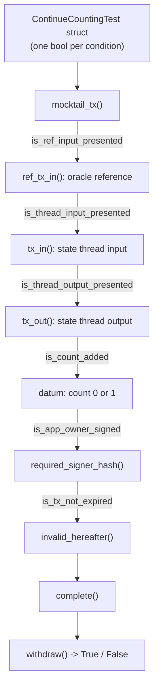

Because a Cardano validator is a [pure function](/docs/developers/curriculum/smart-contracts/overview#smart-contracts-are-validators-not-actors), `f(datum, redeemer, context) -> Bool`, it is unusually easy to test. There is no network, no global state, no deployment required: you hand the function some mock data and assert the result. And because deployed validators are immutable and guard real value, testing is not optional.

This page covers on-chain testing in [Aiken](/docs/developers/curriculum/smart-contracts/choose-a-language), which ships a test runner in the toolchain. The same ideas apply to other languages.

> Runnable source for this page: [examples/bootcamp/04-contract-testing](https://github.com/cardano-foundation/developer-portal/tree/staging/examples/bootcamp/04-contract-testing)

## The test runner

Define test functions with the `test` keyword, then run `aiken check` from the project root to execute every test it finds. A test passes when it returns `True`:

```aiken
test always_true() {
  True
}
```

`aiken check` is the Aiken equivalent of `npm test`: it discovers and runs all `test` functions in the project.

Three keywords do most of the work:

- **`expect`** enforces an exact pattern match on a value and crashes if the shape doesn't match, like a runtime schema check. For example, if `inputs_with_policy(reference_inputs, oracle_nft)` returns a list that should contain exactly one item, `expect [oracle_ref_input] = ...` safely destructures it.
- **The `?` operator** is a tracing operator: when a validator fails, it reports which condition was `False`. Writing `is_app_owner_signed?` means a failure prints `is_app_owner_signed?`, pointing you straight at the broken check.
- **`test ... fail`** marks a test as *expected to fail*. It passes only if the validator crashes or returns `False`, the equivalent of `expect(...).toThrow()`.

## A contract to test

Take a withdrawal validator with two user actions, `ContinueCounting` (verify the owner signed, the app hasn't expired, and the count incremented by one) and `StopCounting` (verify the owner signed and the state-thread token is burned):

```aiken
use aiken/crypto.{VerificationKeyHash}
use cardano/address.{Address, Credential}
use cardano/assets.{PolicyId, without_lovelace}
use cardano/certificate.{Certificate}
use cardano/transaction.{Transaction}
use cocktail.{
  input_inline_datum, inputs_at_with_policy, inputs_with_policy, key_signed,
  output_inline_datum, outputs_at_with_policy, valid_before,
}

pub type OracleDatum {
  app_owner: VerificationKeyHash,
  app_expiry: Int,
  spending_validator_address: Address,
  state_thread_token_policy_id: PolicyId,
}

pub type SpendingValidatorDatum {
  count: Int,
}

pub type MyRedeemer {
  ContinueCounting
  StopCounting
}

validator complex_withdrawal_contract(oracle_nft: PolicyId) {
  withdraw(redeemer: MyRedeemer, _credential: Credential, tx: Transaction) {
    let Transaction {
      reference_inputs, inputs, outputs, mint, extra_signatories, validity_range, ..
    } = tx

    expect [oracle_ref_input] = inputs_with_policy(reference_inputs, oracle_nft)
    expect OracleDatum { app_owner, app_expiry, spending_validator_address, state_thread_token_policy_id } =
      input_inline_datum(oracle_ref_input)

    expect [state_thread_input] =
      inputs_at_with_policy(inputs, spending_validator_address, state_thread_token_policy_id)

    let is_app_owner_signed = key_signed(extra_signatories, app_owner)

    when redeemer is {
      ContinueCounting -> {
        expect [state_thread_output] =
          outputs_at_with_policy(outputs, spending_validator_address, state_thread_token_policy_id)
        expect input_datum: SpendingValidatorDatum = input_inline_datum(state_thread_input)
        expect output_datum: SpendingValidatorDatum = output_inline_datum(state_thread_output)

        let is_app_not_expired = valid_before(validity_range, app_expiry)
        let is_count_added = input_datum.count + 1 == output_datum.count
        let is_nothing_minted = mint == assets.zero

        is_app_owner_signed? && is_app_not_expired? && is_count_added && is_nothing_minted?
      }
      StopCounting -> {
        let state_thread_value = state_thread_input.output.value |> without_lovelace()
        let is_thread_token_burned = mint == assets.negate(state_thread_value)
        is_app_owner_signed? && is_thread_token_burned?
      }
    }
  }
}
```

The validator reads the oracle config from a reference input, finds the state-thread token's input and output, and checks the state transition. To test it, we need to construct realistic mock transactions.

## Building mock transactions with mocktail

Building all the required Aiken types by hand is tedious. The `mocktail` module (from the `vodka` library) provides builders: start with `mocktail_tx()` for an empty transaction, chain modifier functions to add the pieces your test needs, and finish with `complete()`.

```aiken
fn mock_continue_counting_tx() -> Transaction {
  mocktail_tx()
    |> ref_tx_in(True, mock_tx_hash(0), 0, mock_oracle_value, mock_oracle_address)
    |> ref_tx_in_inline_datum(True, mock_oracle_datum)
    |> tx_in(True, mock_tx_hash(1), 0, mock_state_thread_value, mock_spending_validator_address)
    |> tx_in_inline_datum(True, mock_datum(0))
    |> tx_out(True, mock_spending_validator_address, mock_state_thread_value)
    |> tx_out_inline_datum(True, mock_datum(1))
    |> required_signer_hash(True, mock_app_owner)
    |> invalid_hereafter(True, 999)
    |> complete()
}

test success_continue_counting() {
  complex_withdrawal_contract.withdraw(
    mock_oracle_nft,
    ContinueCounting,
    Credential.Script(#""),
    mock_continue_counting_tx(),
  )
}
```

This is a test fixture factory: you build a fake transaction the same way you'd build a mock HTTP request with headers, body, and auth.

## The boolean-toggle pattern

The real power comes from the boolean parameter on each builder method, which includes or excludes a piece of the transaction. Define a struct of booleans, one per validation condition, and the success test sets them all `True`, while each failure test flips exactly one to `False`. This isolates a single failure mode per test, the way you'd write one web2 test each for "missing auth header", "expired token", "malformed body".



```aiken
type ContinueCountingTest {
  is_ref_input_presented: Bool,
  is_thread_input_presented: Bool,
  is_thread_output_presented: Bool,
  is_count_added: Bool,
  is_app_owner_signed: Bool,
  is_tx_not_expired: Bool,
}

fn mock_continue_counting_tx(test_case: ContinueCountingTest) -> Transaction {
  let ContinueCountingTest { is_ref_input_presented, is_thread_input_presented,
    is_thread_output_presented, is_count_added, is_app_owner_signed, is_tx_not_expired } = test_case

  let output_datum = if is_count_added { mock_datum(1) } else { mock_datum(0) }
  mocktail_tx()
    |> ref_tx_in(is_ref_input_presented, mock_tx_hash(0), 0, mock_oracle_value, mock_oracle_address)
    |> ref_tx_in_inline_datum(is_ref_input_presented, mock_oracle_datum)
    |> tx_in(is_thread_input_presented, mock_tx_hash(1), 0, mock_state_thread_value, mock_spending_validator_address)
    |> tx_in_inline_datum(is_thread_input_presented, mock_datum(0))
    |> tx_out(is_thread_output_presented, mock_spending_validator_address, mock_state_thread_value)
    |> tx_out_inline_datum(is_thread_output_presented, output_datum)
    |> required_signer_hash(is_app_owner_signed, mock_app_owner)
    |> invalid_hereafter(is_tx_not_expired, 999)
    |> complete()
}
```

The success test sets every field `True`. Each failure test flips one:

```aiken
test fail_continue_counting_no_ref_input() fail {
  let test_case = ContinueCountingTest {
    is_ref_input_presented: False,   // the only difference
    is_thread_input_presented: True, is_thread_output_presented: True,
    is_count_added: True, is_app_owner_signed: True, is_tx_not_expired: True,
  }
  complex_withdrawal_contract.withdraw(
    mock_oracle_nft, ContinueCounting, Credential.Script(#""), mock_continue_counting_tx(test_case),
  )
}
```

The pattern scales cleanly: when you add a validation condition to the contract, you add one boolean to the struct, set it `True` in the success test, and write one new failure test with it `False`.

If you have written web2 tests, the workflow is familiar. `aiken check` discovers and runs every `test` function the way `npm test` or `bun test` does. You build a fake transaction with `mocktail_tx()` and a builder chain, much like assembling a request from a fixture factory. A `test ... fail` marks a test you expect to fail, like `expect(...).toThrow()`, and the boolean-toggle struct shown above plays the role of `test.each()` or table-driven tests, flipping one condition at a time so each test isolates a single failure.

## Testing your off-chain code

Your validator isn't the only thing that needs tests. The transaction-building code that locks, spends, and mints deserves them too, and it splits into two kinds of test. **Unit tests** exercise the pure parts (datum and schema encoding, address parsing, the shape of the tx you build) with no chain at all. **Integration tests** drive the whole build → sign → submit → confirm lifecycle against a [local development network](/docs/developers/curriculum/production/development-networks): you spin a programmatic devnet up inside the test suite, fund a wallet from genesis, submit, and assert on confirmation, with millisecond confirmations and fresh isolated state per run, all offline and with no faucet.

Both live with the local-environment tooling rather than here: see [Testing without a chain](/docs/developers/curriculum/production/development-networks#testing-without-a-chain) for the in-memory tools (`OfflineFetcher`, `OfflineEvaluator`, `TxTester`) that build, evaluate, and assert on a transaction with no node, and [Programmatic devnets](/docs/developers/curriculum/production/development-networks#programmatic-devnets) for the integration-test setup against a real local chain.

## Beyond unit tests

- **Property-based testing.** Instead of fixed cases, define properties that must always hold ("no transaction can extract more value than was deposited", "only the owner can withdraw") and let the framework generate thousands of random inputs to find violations. Aiken's fuzzer supports this; it catches edge cases manual tests miss. See [Optimization](/docs/developers/curriculum/smart-contracts/advanced/optimization) for fuzzer-driven fixtures and benchmarking.
- **Audits.** For any contract holding significant value, a professional audit is standard practice. Testing finds the bugs you thought of; audits find the ones you didn't.

## Next steps

- [Security](/docs/developers/curriculum/smart-contracts/advanced/security/vulnerabilities/overview): the vulnerability classes your tests should target
- [Lock and spend](/docs/developers/curriculum/smart-contracts/lock-and-spend): exercise the validator end to end
- [Contract library](/templates/contracts): read tested, production-grade validators
