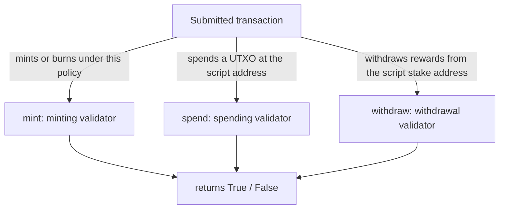

import Tabs from '@theme/Tabs';
import TabItem from '@theme/TabItem';

You've [picked a language](/docs/developers/curriculum/smart-contracts/choose-a-language) (Aiken, for most people). Now you write the on-chain code: the validator. Remember the mental model: a validator is a **gatekeeper** that receives a transaction and returns `True` or `False`. It never moves funds or mutates state; it only decides whether a transaction is allowed.

This page covers writing validators in Aiken, the simpler native-script alternative for multisig and time-locks, and the blueprint that connects your validator to off-chain code. The deep treatment of the three arguments a validator receives is in [Datum, redeemer & context](/docs/developers/curriculum/smart-contracts/datum-redeemer-context); here we focus on authoring.

If you have written web middleware, this is familiar: a validator is like route middleware or an auth guard, a pure function that returns allow or deny without mutating state. The redeemer is the request body it branches on (`MintToken` vs `BurnToken`), and the blueprint (`plutus.json`) is the contract's OpenAPI spec that tools read to generate a typed client.

> Runnable source: [examples/bootcamp/03-aiken-contracts](https://github.com/cardano-foundation/developer-portal/tree/staging/examples/bootcamp/03-aiken-contracts). Install Aiken from [aiken-lang.org](https://aiken-lang.org/installation-instructions); scaffold a project with `npx meshjs <name>` and pick the Aiken template.

## What a validator sees

Building validators means reasoning about transactions. A validator can inspect the whole `Transaction` it's validating (the full type is in the [Aiken stdlib](https://aiken-lang.github.io/stdlib/cardano/transaction.html)): its `inputs` and `outputs`, `reference_inputs`, `mint`, `extra_signatories`, and `validity_range`. For what each field means, see the [field breakdown in Datum, redeemer & context](/docs/developers/curriculum/smart-contracts/datum-redeemer-context#the-transaction-as-the-validator-sees-it); the examples below show how you read them in Aiken.

## The three validator types

Most validators are one of three types, distinguished by what triggers them:



### Minting validator

Runs when a transaction mints or burns tokens under the validator's policy. The simplest possible one:

```aiken
use cardano/assets.{PolicyId}
use cardano/transaction.{Transaction, placeholder}

validator always_succeed {
  mint(_redeemer: Data, _policy_id: PolicyId, _tx: Transaction) {
    True
  }

  else(_) {
    fail @"unsupported purpose"
  }
}

test test_always_succeed_minting_policy() {
  always_succeed.mint(Void, #"", placeholder)
}
```

The validator's hash is the **policy ID** of the tokens it controls. Make it useful by adding a parameter (the owner's key) and a redeemer (which action), so minting requires the owner's signature before a deadline, and burning is always allowed:

```aiken
pub type MyRedeemer {
  MintToken
  BurnToken
}

validator minting_policy(owner_vkey: VerificationKeyHash, minting_deadline: Int) {
  mint(redeemer: MyRedeemer, policy_id: PolicyId, tx: Transaction) {
    when redeemer is {
      MintToken -> {
        let before_deadline = valid_before(tx.validity_range, minting_deadline)
        let is_owner_signed = key_signed(tx.extra_signatories, owner_vkey)
        before_deadline? && is_owner_signed?
      }
      BurnToken -> check_policy_only_burn(tx.mint, policy_id)
    }
  }

  else(_) {
    fail @"unsupported purpose"
  }
}
```

Helpers like `key_signed`, `valid_before`, and `check_policy_only_burn` come from the [vodka](https://github.com/sidan-lab/vodka) library. Minting policies are also covered, with off-chain minting, in [Native tokens > Minting policies](/docs/developers/curriculum/native-tokens/minting-policies).

#### One-shot policies

The owner-signature policy above can mint repeatedly. For a true NFT you want a policy that can succeed **exactly once in history**. The trick is to parameterize the policy by a specific UTXO and require that UTXO to be spent when minting. Because a UTXO can be consumed only once, the policy can fire only once:

```aiken
use aiken/collection/list
use cardano/assets.{PolicyId}
use cardano/transaction.{Input, OutputReference, Transaction}

validator one_shot(utxo_ref: OutputReference) {
  mint(_redeemer: Data, _policy_id: PolicyId, tx: Transaction) {
    // Succeeds only if the parameter UTXO is spent in this transaction.
    // That UTXO can be consumed once, so this policy can mint once.
    list.any(tx.inputs, fn(input: Input) { input.output_reference == utxo_ref })
  }

  else(_) {
    fail @"unsupported purpose"
  }
}
```

Off-chain you pick any UTXO from your wallet, apply it as the parameter (which bakes in a unique policy ID, see [parameterized scripts](/docs/developers/curriculum/smart-contracts/lock-and-spend#parameterized-scripts)), and spend that same UTXO in the minting transaction. This is the protocol-guaranteed uniqueness that native time-locks cannot give you, and the foundation of the multi-validator [NFT minting machine](/templates/contracts) that auto-increments token names from on-chain state.

### Spending validator

Runs when a transaction spends a UTXO sitting at the validator's script address. It receives the UTXO's **datum**, a **redeemer**, the output reference, and the transaction. This one only allows a spend when a specific oracle token is present in the reference inputs (the state-thread / beacon-token pattern):

```aiken
pub type Datum {
  oracle_nft: PolicyId,
}

validator hello_world {
  spend(datum_opt: Option<Datum>, _redeemer: Data, _input: OutputReference, tx: Transaction) {
    when datum_opt is {
      Some(datum) ->
        when inputs_with_policy(tx.reference_inputs, datum.oracle_nft) is {
          [_ref_input] -> True
          _ -> False
        }
      None -> False
    }
  }

  else(_) {
    fail @"unsupported purpose"
  }
}
```

### Withdrawal validator

Runs when a transaction withdraws from the script's reward account. Withdrawal validators must be **registered** on-chain first (the `publish` handler validates registration/deregistration). Their main use isn't staking. It's the **withdraw-zero trick**, where a spending validator delegates its logic to a withdrawal validator that runs once for the whole transaction instead of once per input. That is the principle of [avoiding redundant validation](/docs/developers/curriculum/smart-contracts/advanced/design-patterns/overview#avoid-redundant-validation), implemented as the [Stake Validator](/docs/developers/curriculum/smart-contracts/advanced/design-patterns/stake-validator) pattern.

```aiken
validator always_succeed(_key_hash: VerificationKeyHash) {
  withdraw(_redeemer: Data, _credential: Credential, _tx: Transaction) {
    True
  }

  publish(_redeemer: Data, _certificate: Certificate, _tx: Transaction) {
    True
  }

  else(_) {
    fail @"unsupported purpose"
  }
}
```

## Native scripts: multisig and time-locks without Plutus

Not every rule needs a Plutus validator. **Native scripts** are Cardano's simpler, non-Turing-complete scripting, perfect for **multi-signature** and **time-locks**, and they cost no script-execution fees. They combine a few primitives: `sig` (a required key), `before` / `after` (slot bounds), and `all` / `any` / `atLeast` (logical combinations). A multisig native script makes a **shared treasury**: anyone can send funds *to* its address, but moving them *out* requires the k-of-n signatures the script encodes.

A native script that requires the owner's signature and only allows minting before a slot:

<Tabs groupId="sdk">
<TabItem value="evolution" label="Evolution" default>

```ts
import { NativeScripts, Bytes } from "@evolution-sdk/evolution"

// Owner must sign AND the transaction must be before slot 99999999
const nativeScript = NativeScripts.makeScriptAll([
  NativeScripts.makeScriptPubKey(Bytes.fromHex(keyHash)),
  NativeScripts.makeInvalidHereafter(99999999n),
])

// Wrap for the builder, then attach with .attachScript({ script })
const script = new NativeScripts.NativeScript({ script: nativeScript })
```

For **multisig**, swap the combinator: `makeScriptAll([...])` (everyone signs), `makeScriptAny([...])` (any one), or `makeScriptNOfK(2n, [...])` (k-of-n). A 2-of-3 treasury, then spend through it:

```ts
import { NativeScripts, Bytes } from "@evolution-sdk/evolution"

// 2-of-3: any two of the three keys must sign
const treasuryScript = NativeScripts.makeScriptNOfK(2n, [
  NativeScripts.makeScriptPubKey(Bytes.fromHex(h1)),
  NativeScripts.makeScriptPubKey(Bytes.fromHex(h2)),
  NativeScripts.makeScriptPubKey(Bytes.fromHex(h3)),
])

// Spend: attach the script, add the two approving signers, build
const tx = await client
  .newTx()
  .collectFrom({ inputs: treasuryUtxos })
  .attachScript({ script: treasuryScript })
  .addSigner({ keyHash: new KeyHash.KeyHash({ hash: Bytes.fromHex(h1) }) })
  .addSigner({ keyHash: new KeyHash.KeyHash({ hash: Bytes.fromHex(h2) }) })
  .build()
```

In a real flow the unsigned CBOR is shared between signers, each partial-signs, and the combined transaction is submitted. No redeemer or collateral needed.

</TabItem>
<TabItem value="mesh" label="Mesh">

```ts
import { ForgeScript, NativeScript } from "@meshsdk/core"

const nativeScript: NativeScript = {
  type: "all",
  scripts: [
    { type: "before", slot: "99999999" },
    { type: "sig", keyHash },
  ],
}
const forgingScript = ForgeScript.fromNativeScript(nativeScript)
```

**Multisig** is just a native script with multiple `sig` entries under `all` (everyone must sign) or `atLeast` (k-of-n). Each required party signs the *same* transaction with a **partial signature** (`wallet.signTx(tx, true)`); once all required signatures are attached, the transaction is valid. A common shape: a backend wallet partially signs, then the user's browser wallet partially signs, then it's submitted.

</TabItem>
<TabItem value="cardano-cli" label="cardano-cli">

The script is the same JSON, `{"type":"all","scripts":[{"type":"sig","keyHash":"..."},{"type":"after","slot":1000}]}`, supporting `sig`, `before`, `after`, `all`, `any`, and `atLeast`. Build its address with `cardano-cli address build --payment-script-file policy.json`, then spend by collecting one witness per signer plus the script witness and assembling them:

```bash
cardano-cli latest transaction witness --tx-body-file tx.body --script-file policy.json --out-file script.wit
cardano-cli latest transaction witness --tx-body-file tx.body --signing-key-file key1.skey --out-file key1.wit
cardano-cli latest transaction assemble --tx-body-file tx.body --witness-file script.wit --witness-file key1.wit --out-file tx.signed
```

</TabItem>
</Tabs>

A time-locked script must be paired with a matching validity interval: an `after: N` script needs `--invalid-before` ≥ N, a `before: N` script needs `--invalid-hereafter` ≤ N (funds left past a `before` slot are locked forever).

For attaching native scripts off-chain, see [Lock and spend](/docs/developers/curriculum/smart-contracts/lock-and-spend) and the [Mesh smart contracts guide](https://meshjs.dev/apis/txbuilder/smart-contract).

## From validator to blueprint

When you run `aiken build`, the compiler produces a **[CIP-57](https://cips.cardano.org/cip/CIP-57) blueprint** at `plutus.json`, the bridge between your on-chain code and off-chain applications. Think of it as the OpenAPI spec for your contract. It has three parts:

- **`preamble`**: metadata, including the `plutusVersion` (e.g. `v3`) that off-chain libraries must target.
- **`validators`**: each validator's `title`, datum/redeemer/parameter schemas, `compiledCode` (hex CBOR), and `hash` (its on-chain address identifier).
- **`definitions`**: reusable type schemas referenced by validators (via `$ref`, exactly like JSON Schema).

```json
{
  "preamble": { "title": "my/contract", "plutusVersion": "v3", "compiler": { "name": "Aiken" } },
  "validators": [
    { "title": "mint.minting_policy.mint",
      "redeemer": { "schema": { "$ref": "#/definitions/MyRedeemer" } },
      "compiledCode": "59...", "hash": "9c9666..." }
  ],
  "definitions": { "MyRedeemer": { "anyOf": [ { "title": "MintToken", "index": 0, "fields": [] } ] } }
}
```

From the blueprint, tools generate type-safe off-chain code, the same way you'd generate an API client from an OpenAPI spec. Evolution's blueprint codegen and Mesh both read `plutus.json` to produce a typed client:

<Tabs groupId="sdk">
<TabItem value="evolution" label="Evolution" default>

Evolution's codegen emits a `.ts` file of `TSchema` definitions plus validator metadata (hashes, parameter schemas) you import and use with `Data.withSchema`:

```ts
import { Blueprint, Data } from "@evolution-sdk/evolution"
import * as fs from "fs"

// Build step: turn plutus.json into typed schemas
const blueprint = JSON.parse(fs.readFileSync("plutus.json", "utf-8"))
const code = Blueprint.Codegen.generateTypeScript(blueprint, {
  optionStyle: "NullOr",   // "NullOr" | "UndefinedOr" | "Union"
  unionStyle: "Variant",   // "Variant" | "Struct" | "TaggedStruct"
})
fs.writeFileSync("src/contract-types.ts", code)

// In your app: import the generated schema, wrap it in a codec
import { MyRedeemer } from "./contract-types"
const RedeemerCodec = Data.withSchema(MyRedeemer)
const redeemer = RedeemerCodec.toData({ MintToken: {} }) // type error if the shape is wrong
```

</TabItem>
<TabItem value="mesh" label="Mesh">

Mesh ships blueprint helper classes (`SpendingBlueprint`, `MintingBlueprint`, `WithdrawalBlueprint` from `@meshsdk/core`) that take the `compiledCode` and hand back the script hash, CBOR, and address:

```ts
import { SpendingBlueprint } from "@meshsdk/core"
import blueprint from "./plutus.json"

const compiledCode = blueprint.validators[0].compiledCode

// V3 script, networkId 0 (testnet)
const spending = new SpendingBlueprint("V3", 0)
spending.paramScript(compiledCode, [], "Mesh") // or .noParamScript(compiledCode) when there are no params

const scriptHash = spending.hash
const scriptCbor = spending.cbor
const scriptAddress = spending.address
```

`MintingBlueprint("V3")` exposes the policy ID as `.hash`; `WithdrawalBlueprint("V3", networkId)` gives the reward address. Pass parameters as the second arg of `paramScript` (Mesh data types like `mPubKeyAddress` when the third arg is `"Mesh"`).

</TabItem>
</Tabs>

See the blueprint section of [Choose a language](/docs/developers/curriculum/smart-contracts/choose-a-language#blueprints-the-contracts-interface).

### Reading a blueprint by hand

Codegen covers the common case, but you should be able to read a `plutus.json` directly: when you adopt a language with no generator, debug a type mismatch, or just want to understand what a tool handed you. Trace it top-down:

- **`preamble.plutusVersion`** is the script version (`v3` here). Off-chain you must build the script as that exact version (`"V3"` in your SDK); it fixes the cost model and the available builtins.
- **Each `validators[]` entry** is named `<module>.<validator>.<purpose>` (here `mint.minting_policy.mint`). Its `hash` is the on-chain identifier: the **policy ID** for a `mint` validator, the script-address payment credential for a `spend` one. The `compiledCode` is the CBOR you wrap to get that address.
- **A `$ref` is a pointer.** A `redeemer.schema` of `{ "$ref": "#/definitions/MyRedeemer" }` means "resolve `MyRedeemer` under `definitions`." Follow it; refs nest, so a field can itself be a `$ref`.
- **A sum type is an `anyOf`.** Each entry is one constructor, with an `index` (its on-chain tag) and positional `fields`. So `MyRedeemer` with `MintToken` at `index: 0` and `BurnToken` at `index: 1` tells you exactly how to build the redeemer by hand: `MintToken` is constructor 0 with no fields, `BurnToken` is constructor 1. That is precisely what you pass as `mConStr0([])` (Mesh) or `Constr 0 []` (raw) when no generated codec is doing it for you.

Read it that way (preamble, then a validator, then the schemas it names, then the definitions those point at) and a blueprint is a complete, language-agnostic description of how to talk to the contract.

## Key takeaways
Every validator is a **pure function**: it receives transaction context and returns `True` or `False`. No side effects, no storage writes, no network calls. The runtime only applies state changes if the validator approves, fundamentally different from a web2 backend that both validates and mutates.

## Next steps

- [Lock and spend](/docs/developers/curriculum/smart-contracts/lock-and-spend): interact with your validator from off-chain code
- [Testing](/docs/developers/curriculum/smart-contracts/testing): test validators with mock transactions before deploying
- [Security](/docs/developers/curriculum/smart-contracts/security): the vulnerability classes to guard against
- [Contract library](/templates/contracts): full validators to read, including the oracle-NFT minting machine
