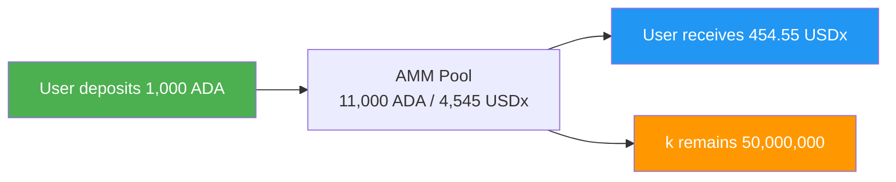
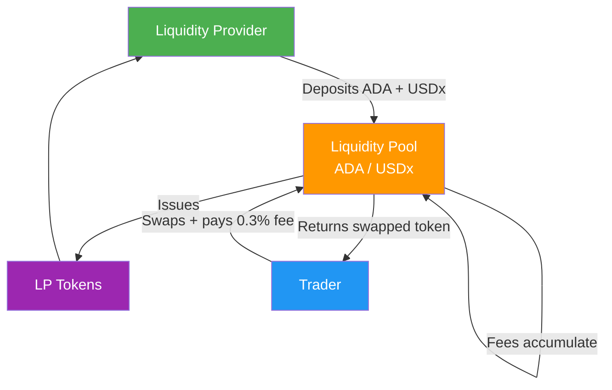
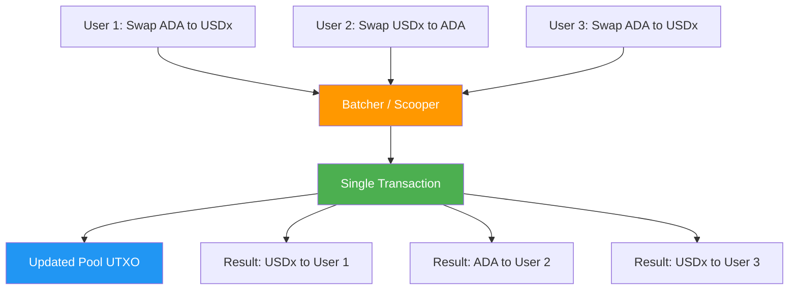

Decentralized finance (DeFi) replaces traditional financial intermediaries with smart contract protocols, enabling permissionless trading, lending, and yield generation directly on-chain. For web2 developers, DeFi introduces a paradigm where financial logic lives on-chain, composable like microservices but trustless and permissionless.

This page covers the core DeFi primitives and, more importantly, the specific design challenges and solutions that arise when you build them on Cardano's [eUTXO model](/docs/developers/curriculum/fundamentals/core-concepts/eutxo). The mechanics differ enough from Ethereum that copying an EVM design rarely works directly. To see what is already running, browse Cardano's live DeFi apps at [cardano.org/apps](https://cardano.org/apps).

If you build web services, the primitives map onto familiar ones:

- **DEXes are stock-exchange matching engines**, except the matching logic is public, anyone can be a market maker, and there's no broker between you and the market.
- **Liquidity pools are connection pools.** A connection pool keeps pre-established DB connections many requests share; a liquidity pool keeps reserves many traders swap against. Size it wrong and you get congestion (high slippage) or underutilization (low LP returns).
- **Oracles are API aggregators.** Like querying five price APIs, discarding outliers, and taking the median, but solved for trustlessness.
- **Order batching is batch processing in a message queue.** A consumer (batcher) collects messages (orders), processes them in bulk, and writes results back: SQS + Lambda, with atomicity.
- **Impermanent loss is the cost of a cache under write-heavy load.** You pre-allocate liquidity to serve trades efficiently, but if prices move fast, rebalancing costs exceed the benefit.
- **Composability is Unix pipes**: `grep | sort | uniq`, except every stage either fully succeeds or fully rolls back.

## The DeFi landscape

DeFi protocols replace intermediaries (banks, brokerages, clearinghouses) with deterministic smart contracts. Each intermediary removed eliminates a fee, reduces latency, and removes a trust requirement. The ecosystem spans several categories:

- **Decentralized exchanges (DEXes)**: trade tokens without a centralized order book
- **Lending and borrowing**: supply assets to earn yield; borrow against collateral
- **Stablecoins**: tokens pegged to fiat through algorithmic or collateral-backed mechanisms
- **Yield aggregators**: automatically optimize returns across protocols
- **Synthetic assets**: on-chain representations of real-world assets
- **Insurance**: decentralized coverage against smart contract failures

On Cardano this spans DEXes, lending and borrowing protocols, stablecoins, and yield optimizers. Each works within the constraints and advantages of eUTXO, which leads to distinctive architectural patterns.

:::tip Where Cardano DeFi stands
For a snapshot of which primitives Cardano already has, partly has, and is still missing, see the [Cardano DeFi map](https://cardanodefi.space/). DeFi composes, so the gaps are open opportunities: ship a missing piece and it snaps into everything already there.
:::

## Decentralized exchanges (DEXes)

A DEX lets users swap one token for another through smart contracts, without a centralized intermediary holding custody. Unlike Coinbase or Binance, you never lose custody during a trade.

### Order books vs AMMs

Traditional exchanges use an **order book**: a structure that matches buy and sell orders at specific prices.

```text
Traditional Order Book:
+------------------------------------------+
|  SELL ORDERS (Asks)                      |
|  Sell 100 ADA @ 0.52                     |
|  Sell 250 ADA @ 0.51                     |
|-------------- SPREAD --------------------|
|  Buy 300 ADA @ 0.50                      |
|  Buy 150 ADA @ 0.49                      |
|  BUY ORDERS (Bids)                       |
+------------------------------------------+
```

On-chain order books are expensive because every placement, cancellation, and modification is a transaction. Some Cardano DEXes do implement on-chain order books, representing each order as a distinct UTXO. But the dominant model in DeFi is the **Automated Market Maker (AMM)**.

### How AMMs work

An AMM replaces the order book with a formula that prices assets from the ratio of reserves in a **liquidity pool**. Instead of matching individual buyers and sellers, everyone trades against the pool. The most common formula is the **constant product formula**:

```text
x * y = k

  x = quantity of Token A in the pool
  y = quantity of Token B in the pool
  k = a constant (must remain the same after every trade)
```

A concrete example. A pool holds 10,000 ADA and 5,000 USDx, so `k = 50,000,000`. A trader buys USDx with 1,000 ADA:

```text
New ADA in pool:   10,000 + 1,000 = 11,000
New USDx in pool:  k / new_x = 50,000,000 / 11,000 = 4,545.45
USDx received:     5,000 - 4,545.45 = 454.55 USDx
Effective price:   1,000 ADA / 454.55 USDx = 2.20 ADA per USDx
```

The trader received ~454.55 USDx instead of the 500 expected at the initial 2 ADA/USDx rate. This difference is **slippage**, and it grows with larger trades relative to pool size: the curve moves the price more dramatically as you drain one side.



### Other AMM formulas

The constant product formula is not the only option:

- **Constant sum (x + y = k)**: zero slippage, but can be fully drained of one asset. Rare in practice.
- **StableSwap (Curve)**: a hybrid optimized for assets that trade near 1:1 (stablecoin pairs); low slippage for balanced trades.
- **Concentrated liquidity**: LPs specify price ranges, concentrating capital where it's most useful. High capital efficiency, more complexity.

On Cardano, DEXes typically use a constant product AMM, often with a stableswap variant for stable pairs.

## Liquidity pools and providers

Liquidity pools hold paired token reserves that traders swap against. **Liquidity providers (LPs)** deposit equal values of both tokens and receive **LP tokens** representing their share. Trading fees accrue to the pool, increasing each LP token's value over time.



When an LP withdraws, they burn their LP tokens for a proportional share of the pool, which now includes accumulated fees. That fee accrual is how LPs earn yield. (LP tokens are ordinary [native tokens](/docs/developers/curriculum/native-tokens/overview), minted by the pool's policy.)

### Impermanent loss

Impermanent loss (IL) is the difference in value between holding tokens in an AMM pool versus simply holding them in a wallet. When the price ratio of pooled assets diverges from the deposit ratio, the AMM's constant rebalancing leaves LPs holding less of the appreciating asset than they would have by holding outright.

```text
Initial deposit:  1,000 ADA + 500 USDx (at 2 ADA per USDx)
If held (no LP):  1,000 ADA (now worth 2x) + 500 USDx = 3,000 equivalent
As LP after ADA doubles: ~707 ADA + ~707 USDx = ~2,828 equivalent

Impermanent loss: ~5.7%
```

It's "impermanent" because if the price returns to the original ratio, the loss disappears; it only becomes permanent when the LP withdraws at a different ratio. Trading fees can offset IL, but in volatile periods IL can exceed fee income. Think of it as a "rebalancing cost": the AMM constantly sells the appreciating asset and buys the depreciating one.

## Oracles: DeFi's data dependency

DeFi protocols need real-world data: prices for swaps and liquidations, rates for lending. Smart contracts can't query APIs, so **oracles** post verified data on-chain as datums that contracts read via reference inputs. A compromised oracle can make a lending protocol liquidate incorrectly or a stablecoin lose its peg, which makes oracles one of DeFi's most critical and most vulnerable components.

Cardano's reference inputs ([CIP-31](https://cips.cardano.org/cip/CIP-31)) let many transactions read the same oracle UTXO in parallel without contention, a structural advantage for DeFi. The full picture (the oracle problem, multi-oracle validation, and integrating Pyth, the recommended oracle) is on the **[Oracles](/docs/developers/curriculum/dapps/oracles/overview)** page.

## The eUTXO design challenge

Cardano's eUTXO model requires DeFi protocols to solve concurrency differently than Ethereum's account model, because a single UTXO can be consumed by only one transaction per block.

### The concurrency problem

In an account model, a contract holds a single mutable state and the chain resolves the ordering of many users in a block. In eUTXO, a UTXO can be spent once. If a liquidity pool is one UTXO, only one user can interact with it per block.

```text
Block N:
  User A wants to swap ADA to USDx  --+
  User B wants to swap ADA to USDx  --+--> Only ONE can spend the pool UTXO
  User C wants to swap USDx to ADA  --+

  Result: two transactions fail with "UTXO already spent"
```

This is not a bug; it's a fundamental property of the model. Two patterns address it.

### Order batching

The most common pattern. Instead of interacting with the pool directly, users submit **order UTXOs** expressing intent ("swap 100 ADA for USDx, max 2% slippage"). A **batcher** (or scooper) collects many orders and executes them against the pool in a single transaction.



Orders process atomically, contention drops, and the batcher can optimize execution order. The trade-offs: latency (users wait for the batcher) and trust in the batcher (though the validator enforces correctness). Most Cardano DEXes decentralize the role by letting anyone run a batcher for fees. Batchers lean on the [UTXO indexer pattern](/docs/developers/curriculum/smart-contracts/advanced/design-patterns/utxo-indexers) to map many order inputs to outputs cheaply on-chain.

### Pool sharding

Another approach splits the pool across multiple UTXOs, each holding a portion of the liquidity, so several transactions execute concurrently against different shards.

```text
Instead of one pool UTXO with 100,000 ADA / 50,000 USDx:

+----------------+  +----------------+  +----------------+
| Pool Shard 1   |  | Pool Shard 2   |  | Pool Shard 3   |
| 33,333 ADA     |  | 33,333 ADA     |  | 33,334 ADA     |
| 16,667 USDx    |  | 16,667 USDx    |  | 16,666 USDx    |
+----------------+  +----------------+  +----------------+

Three users can now swap concurrently against different shards.
```

The trade-off is keeping pricing consistent across shards and higher slippage per shard (each holds less liquidity). The flip side of contention is covered as a vulnerability in [UTXO contention](/docs/developers/curriculum/smart-contracts/advanced/security/vulnerabilities/utxo-contention).

### Determinism: the compensating advantage

Concurrency is a challenge, but eUTXO's [determinism](/docs/developers/curriculum/smart-contracts/overview#deterministic-validation) is a powerful advantage for DeFi. On Ethereum a transaction can pass local simulation but fail on-chain because another transaction changed state first (the basis of MEV). On Cardano, if a transaction validates locally it produces the exact same result on-chain, assuming its inputs haven't been spent. This also makes Cardano structurally resistant to **front-running**: validators can't insert their own transactions ahead of yours to manipulate price, because every transaction specifies its exact inputs and outputs.

## Composability: money Legos

Composability lets you combine multiple DeFi protocols in a single atomic transaction. On Cardano this works by referencing multiple script inputs and outputs in one transaction. A single transaction could:

1. Withdraw collateral from a lending protocol
2. Swap that collateral on a DEX
3. Provide liquidity to a different pool
4. Mint an NFT receipt

All atomically: if any step fails, the entire transaction is invalid and no state changes. This is what makes DeFi protocols behave like stackable building blocks.

### DeFi Kernel: a shared standard

Composability works best when protocols agree on a common substrate. [DeFi Kernel](https://defikernel.org/) is an open community standard for exactly that: a single order book the size of the whole chain, where any participant can write an order and any participant can fill it, with no batcher, administrator, or permission required. It is not a DEX or a lending protocol but the neutral layer those can sit on, the way the Linux kernel is for operating systems, so they share one liquidity pool instead of each bootstrapping their own.

A contract is DeFi-Kernel-compatible if it satisfies three properties, with no committee, whitelist, or token gate:

- **Permissionless.** Users sign and submit their own transactions directly to a node. No off-chain operator sits between intent and settlement, so no one can censor a fill or front-run a maker.
- **Composable.** Every compatible contract publishes its datum schema in the open, so any other contract or wallet can read it and chain transactions across protocols in one signature.
- **Discoverable.** Orders must be findable by anyone running a node, through beacon tokens, deterministic addresses, or another on-chain tagging mechanism. The UTxO set itself is the order book, with no central indexer to trust.

Conform to the rules and your contract inherits the ecosystem's liquidity, users, and tooling on day one instead of starting from zero. The standard, the brief, and a live registry of compatible contracts (DEX, lending, options, and synthetics) live at [defikernel.org](https://defikernel.org/); to make a contract discoverable, open a pull request against the [DeFi Kernel Registry](https://github.com/DeFiKernel-Cardano/DeFi-Kernel-Registry-for-Cardano) with your script hashes and datum schema.

## Why flash loans are absent

Flash loans on Ethereum let users borrow with no collateral as long as they repay within the same transaction. Cardano's eUTXO model prevents this because each transaction must balance its inputs and outputs **at construction time**. You cannot "borrow" assets mid-transaction. The EVM can check repayment at the end of sequential execution; a Cardano transaction must be fully defined before submission.

This is a security advantage: flash loans have been used to manipulate prices and drain DeFi protocols in a single Ethereum transaction. Cardano's model makes those attack vectors much harder.

## Yield farming and liquidity mining

Yield farming strategically deploys capital across protocols to maximize returns; liquidity mining specifically distributes governance tokens to LPs as extra incentive beyond trading fees. On Cardano this includes providing DEX liquidity (earning fees plus extra protocol tokens), lending on lending platforms, staking LP tokens in farms, and liquidity bootstrapping events. Yields are not magic: they come from trading fees (real activity), token emissions (inflationary, may not hold value), and protocol revenue. Understanding the source of a yield is essential to evaluating its risk.

## DeFi application patterns

The primitives above (AMMs, oracles, order batching, composability) combine into the common building blocks of a DeFi app. Each of these is language-agnostic and composes the on-chain techniques from [Design Patterns](/docs/developers/curriculum/smart-contracts/advanced/design-patterns/overview):

- **Reward accrual and claiming.** Distribute rewards proportionally to stake or LP share. Snapshots or time-locks stop last-minute gaming, and many claims are settled in batches using the [linked-list fold](/docs/developers/curriculum/smart-contracts/advanced/design-patterns/linked-list) and a [stake validator](/docs/developers/curriculum/smart-contracts/advanced/design-patterns/stake-validator) for transaction-level checks.
- **Token vesting.** Lock tokens and release them on a datum-defined schedule (a cliff, then linear release). Unlock conditions are enforced against the transaction's [validity interval](/docs/developers/curriculum/fundamentals/core-concepts/transactions#validity-intervals-and-time), and each partial claim updates the remaining balance in the datum. Guard the claim against [double satisfaction](/docs/developers/curriculum/smart-contracts/advanced/security/vulnerabilities/double-satisfaction).
- **P2P offers and atomic swaps.** Represent each offer as its own UTXO carrying the maker's terms (offered asset, asked asset, expiry). A taker spends it directly, or an off-chain matcher fills many offers in one transaction, pairing inputs to outputs with [UTXO indexers](/docs/developers/curriculum/smart-contracts/advanced/design-patterns/utxo-indexers).
- **Routing and aggregation.** Off-chain routers compute the best path across pools and submit a single transaction the validators check atomically. The on-chain side leans on the same order-batching and indexing patterns, so no centralized frontend has to be trusted.
- **Cross-chain bridges.** Lock assets on the source chain and mint wrapped equivalents on the target (burn-to-unlock in reverse), with a multisig guardian set attesting to each transfer. Bridges depend on off-chain infrastructure and trust assumptions beyond a single chain, so treat them as their own design problem.

For production-grade, open-source references of these patterns, see [Anastasia Labs' dApp repositories](https://github.com/Anastasia-Labs/production-grade-dapps).

## Key takeaways

- **AMMs replace order books** with formulas (like constant product) that price assets from pool reserves, enabling permissionless trading.
- **LPs earn fees but face impermanent loss**: a hidden cost when the pooled price ratio diverges from the deposit ratio.
- **Oracles bridge the on-chain/off-chain gap** but introduce trust assumptions; reference inputs let many transactions read them in parallel.
- **eUTXO requires DeFi-specific patterns** (order batching, pool sharding) for concurrency, but pays you back with determinism and front-running resistance.
- **Composability makes protocols interoperable building blocks**, enabling complex operations in single atomic transactions.

## Next steps

- [Connect a wallet](/docs/developers/curriculum/dapps/connect-a-wallet): let users interact with your protocol from the browser
- [Oracles](/docs/developers/curriculum/dapps/oracles/overview): the price-feed infrastructure DeFi depends on
- [Smart contract security](/docs/developers/curriculum/smart-contracts/security): the attack classes (double satisfaction, contention) that hit DeFi hardest
- [Contract library](/templates/contracts): escrow, swap, and production-grade dApp implementations
