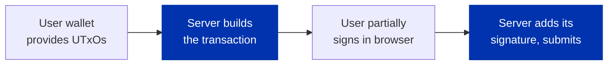

import Tabs from '@theme/Tabs';
import TabItem from '@theme/TabItem';

Most transactions are built, signed, and paid for by one wallet. But those are three separable roles, and pulling them apart unlocks two patterns that matter for real applications: letting your **server build and co-sign** a transaction the user only adds their signature to, and **sponsoring fees** so a user can transact before they hold any ADA.

The mechanism underneath both is the same. A Cardano transaction is built once, then carries a set of **witnesses** (signatures); the ledger accepts it once every required witness is present. [CIP-30](https://cips.cardano.org/cip/CIP-0030) **partial signing** is what makes this practical in a browser: a wallet can add just its own signature to a transaction it did not build, without finalizing it. So one party can construct a transaction and another can authorize it, in any combination.

## Co-signed (multi-party) transactions

The canonical case is a service where the **user pays but your application is in control of something**. An NFT minting service is the clearest example: the user provides the inputs that cover the cost, but the minting policy belongs to your app, so the transaction needs both signatures. You never hand the user your policy key, and the user never hands you the right to move their funds; you each sign the same transaction.

The flow is always the same four steps:



The server builds the transaction with the user's UTXOs as inputs (so the user pays) and the app's own action (here, a mint under the app's policy). The unsigned transaction goes to the browser, the user's wallet **partial-signs** it, and the result comes back to the server, which adds its own signature and submits.

<Tabs groupId="sdk">
<TabItem value="evolution" label="Evolution" default>

```typescript
import { Transaction, type UTxO } from "@evolution-sdk/evolution"

// appClient: backend wallet that owns the policy. userClient: the browser CIP-30 wallet.
declare const userUtxos: UTxO.UTxO[]   // selected by the browser, sent to the server
declare const appPolicy: any           // app's native signature policy (requires the app's signature)
declare const mintedNft: any
declare const userAddress: any

// 1. SERVER builds: the user's inputs pay, the app's policy mints
const tx = await appClient
  .newTx()
  .collectFrom({ inputs: userUtxos })
  .mintAssets({ assets: mintedNft })
  .attachScript({ script: appPolicy })
  .payToAddress({ address: userAddress, assets: mintedNft })
  .build()
const unsignedCbor = Transaction.toCBORHex(await tx.toTransaction())

// 2. USER partial-signs in the browser (CIP-30): returns a witness, not a final tx
const userWitness = await userClient.signTx(unsignedCbor)

// 3. SERVER adds the app wallet's witness, assembles both, and submits
const appWitness = await tx.partialSign()
const submit = await tx.assemble([appWitness, userWitness])
const txHash = await submit.submit()
```

</TabItem>
<TabItem value="mesh" label="Mesh">

```typescript
import { MeshTxBuilder } from "@meshsdk/core"

// appWallet: backend wallet that owns the policy. wallet: the browser CIP-30 wallet.
// userUtxo, policyId, tokenNameHex, forgingScript, userAddress come from the request / app config.

// 1. SERVER builds: the user's input pays, the app's policy mints
const unsignedTx = await new MeshTxBuilder({ fetcher: provider })
  .txIn(userUtxo.input.txHash, userUtxo.input.outputIndex, userUtxo.output.amount, userUtxo.output.address)
  .mint("1", policyId, tokenNameHex)
  .mintingScript(forgingScript)
  .txOut(userAddress, [{ unit: policyId + tokenNameHex, quantity: "1" }])
  .changeAddress(userAddress)
  .complete()

// 2. USER partial-signs in the browser (the `true` means partial)
const userSignedTx = await wallet.signTx(unsignedTx, true)

// 3. SERVER partial-signs with the app wallet and submits
const fullySignedTx = await appWallet.signTx(userSignedTx, true)
const txHash = await appWallet.submitTx(fullySignedTx)
```

</TabItem>
</Tabs>

The same shape covers any shared-control transaction: a 2-of-3 treasury where each signer adds a witness in turn, an escrow that needs both buyer and arbiter, or a backend that countersigns to enforce a business rule. For the on-chain side of native-script multisig, see [Write a validator](/docs/developers/curriculum/smart-contracts/write-a-validator#native-scripts-multisig-and-time-locks-without-plutus).

## Fee sponsorship

Sponsorship is the same mechanism with one change: the **inputs that cover the fee come from a sponsor, not the user**. A new user who holds zero ADA can still act, because your sponsor wallet supplies the fee (and any collateral), while the user only signs for the part that genuinely needs their key, authorizing a required-signer check, say, or spending a token they already hold. Both parties partial-sign; the sponsor's wallet provides the fee inputs and the change address.

This removes the hardest step in onboarding, "go buy ADA before you can do anything," and is why sponsorship usually pairs with a wallet the user did not have to install. Hosted wallet services take it further: they create a non-custodial wallet through social login and sponsor the user's first transactions, so there is no extension and no seed phrase to start. See the note on hosted sign-in and sponsorship in [Wallet authentication](/docs/developers/curriculum/dapps/wallet-authentication#hosted-sign-in-as-a-service).

## Security

Co-signing means the user authorizes a transaction your server built, so the trust rules are strict:

- **Never modify a transaction after the user signs it.** Any change invalidates their witness, and a flow that silently rebuilds is indistinguishable from an attempt to get the user to sign something they didn't see. Build the complete transaction, then collect signatures.
- **The user must be able to inspect what they sign.** Show the amounts, recipients, and assets before prompting. A wallet displays the transaction, but your UI sets the expectation.
- **Protect the server key.** The application wallet's mnemonic stays server-side and never reaches the client; treat a leak as a full compromise of whatever that key controls.
- **Validate the user's inputs** before building, and assume their UTXOs may be spent by the time you submit. Show a clear retry rather than a cryptic failure.

## Next steps

- [Connect a wallet](/docs/developers/curriculum/dapps/connect-a-wallet): get the user's address and UTXOs in the browser
- [Wallet authentication](/docs/developers/curriculum/dapps/wallet-authentication): prove ownership without a transaction, and hosted sign-in with sponsored fees
- [Lock and spend](/docs/developers/curriculum/smart-contracts/lock-and-spend): the contract interactions a co-signed transaction often wraps
