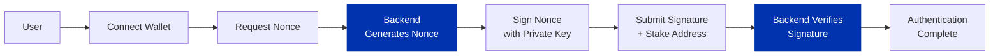

import Tabs from '@theme/Tabs';
import TabItem from '@theme/TabItem';

Wallet-based authentication lets users prove they own a Cardano wallet by cryptographically signing a message. This is passwordless authentication backed by blockchain identity, more secure than password-based systems and with nothing for you to store but a public address.

It is distinct from [connecting a wallet](/docs/developers/curriculum/dapps/connect-a-wallet): connecting reads the user's addresses and UTXOs and lets them sign transactions, whereas authentication only has them sign a nonce to prove ownership, with no transaction and nothing transferred.

## How it works

The authentication process uses message signing as described in [CIP-8](https://cips.cardano.org/cip/CIP-0008) with [CIP-30](https://cips.cardano.org/cip/CIP-0030)-compatible wallets:

1. **User connects wallet** - the application requests access to the user's wallet
2. **Backend generates nonce** - a unique random string is created for this authentication attempt
3. **User signs nonce** - the wallet prompts the user to sign the nonce with their private key
4. **Backend verifies signature** - the signature is cryptographically verified to prove wallet ownership



The **nonce** ("number used once") is a unique random string the backend generates for each attempt. It prevents replay attacks: because the user signs that specific nonce with their private key, an old signature cannot be reused. Only the private key holder can produce a valid signature, and any tampering with the message invalidates it. CIP-8 wraps that signature in the COSE (CBOR Object Signing and Encryption) format, which CIP-30 wallets and the SDKs all produce and verify.

Use the **staking address** (reward address) as the user's identifier. Unlike payment addresses, which change frequently, the staking address stays constant for a wallet, so you can track users across sessions reliably. It can be derived from any payment address in the wallet.

:::warning
Never accept the same nonce twice. After each verification attempt, rotate the nonce to maintain security.
:::

## Implement it yourself

In the browser, the user's CIP-30 wallet signs the backend-issued nonce with `signData` after you [connect the wallet](/docs/developers/curriculum/dapps/connect-a-wallet); your backend then verifies it. Both SDKs implement CIP-8 message signing, so pick whichever your stack already uses.

<Tabs groupId="sdk">
<TabItem value="evolution" label="Evolution">

```typescript
import { COSE, PrivateKey, Address } from "@evolution-sdk/evolution"

declare const privateKey: PrivateKey.PrivateKey
declare const myAddress: Address.Address

// Sign a payload (e.g. the nonce) when you hold the key, such as a backend-held
// wallet or in tests; in a dApp the user's CIP-30 wallet does this step.
const payload = COSE.Utils.fromText("login-nonce-abc123")
const signedMessage = COSE.SignData.signData(Address.toHex(myAddress), payload, privateKey)
```

```typescript
import { COSE, Address, KeyHash } from "@evolution-sdk/evolution"

declare const expectedAddress: Address.Address
declare const expectedKeyHash: KeyHash.KeyHash
declare const signedMessage: COSE.SignData.SignedMessage

// Backend: verify the signature against the nonce and the expected signer
const payload = COSE.Utils.fromText("login-nonce-abc123")
const isValid = COSE.SignData.verifyData(
  Address.toHex(expectedAddress),
  KeyHash.toHex(expectedKeyHash),
  payload,
  signedMessage
)
```

Verification confirms the payload matches, the signer address and key hash are as expected, and the Ed25519 signature is valid. `COSE.Utils` converts payloads to and from text and hex (`fromText`/`toText`/`fromHex`/`toHex`), and the SDK exposes the low-level `COSE.Sign1` / `COSE.Key` / `COSE.Header` structures for advanced use.

</TabItem>
<TabItem value="mesh" label="Mesh">

Mesh wraps the same flow in high-level helpers. Install it:

```bash
npm install @meshsdk/core @meshsdk/react
```

On the client, get the staking address, request a nonce, sign it, and send the signature back:

```tsx
import { useWallet } from "@meshsdk/react";

const { wallet } = useWallet();
const userAddress = (await wallet.getUsedAddresses())[0];
const nonce = await backendGetNonce(userAddress);        // your REST call
const signature = await wallet.signData(nonce, userAddress);
await backendVerifySignature(userAddress, signature);    // your REST call
```

On the backend, issue a nonce with `generateNonce`, then verify with `checkSignature`:

```ts
import { generateNonce, checkSignature } from "@meshsdk/core";

function backendGetNonce(userAddress) {
  const nonce = generateNonce("Sign in to our app: ");
  // store the nonce against userAddress, then return it
  return nonce;
}

function backendVerifySignature(userAddress, signature) {
  // load the stored nonce for userAddress
  const ok = checkSignature(nonce, signature, userAddress);
  // rotate the nonce, then issue a session or JWT if ok
}
```

Mesh's `<CardanoWallet label="Sign In with Cardano" onConnected={...} />` React component gives you a ready-made connect-and-sign button.

</TabItem>
</Tabs>

## Hosted sign-in as a service

Not every user has a browser wallet installed. [UTXOS](https://utxos.dev) offers sign-in as a hosted service: users create a non-custodial wallet through social login, so onboarding needs no extension or seed phrase. Keys are split with Shamir's Secret Sharing and reconstructed only on the user's device at signing time, so neither UTXOS nor your app can access them. The same platform can also sponsor transaction fees, letting users transact before they hold any ADA. See the [UTXOS documentation](https://docs.utxos.dev) to integrate it.

## Zero-knowledge login

:::info In active development
[zkLogin for Cardano](https://github.com/eryxcoop/zklogin-aiken) lets users authenticate with an existing account (such as Google) and control funds through zero-knowledge proofs, without exposing their identity on-chain. It pairs Aiken validators that gate spending from a zkLogin address with Circom circuits that verify the proof. It runs on the preprod testnet today, with known limitations (for example, no oracle yet for rotating the identity provider's public keys). Track progress at the [zklogin-aiken repository](https://github.com/eryxcoop/zklogin-aiken).
:::

## Use cases

Wallet-based authentication fits many scenarios: passwordless login where wallet ownership is the identity, whitelist verification (confirming a user controls a specific wallet or stake address), token-gated content (access for holders of a given native token or NFT), authenticating reward claims, and verifying approval for off-chain actions like in-game trading.
