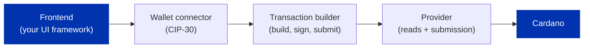

import Tabs from '@theme/Tabs';
import TabItem from '@theme/TabItem';

You have met the pieces separately: [wallets](/docs/developers/curriculum/dapps/connect-a-wallet), [transactions](/docs/developers/curriculum/start-building/your-first-transaction), and [providers](/docs/developers/curriculum/production/api-providers/overview). A dApp is those pieces assembled into one running application. This page builds the smallest complete one, connect a wallet, show its balance, send ADA, and points you at a runnable template for each SDK so you start from working code, not a blank directory.

## What a dApp is made of

Whatever framework or SDK you use, a browser dApp is the same handful of building blocks:



- **A frontend**, your UI framework (React here), which renders the app and holds state.
- **A wallet connector** ([CIP-30](https://cips.cardano.org/cip/CIP-0030)): how the user links their wallet and authorizes actions. This is the one piece every dApp needs and the standard every wallet implements.
- **A provider**: reads chain data (balances, UTXOs, parameters) and submits transactions.
- **A transaction builder**: assembles a transaction; the wallet signs it; the provider or wallet submits it.

On-chain logic (a validator) is an optional fifth block you layer on later. The minimal dApp below uses only the first four.

## Start from a template

Each SDK has a runnable starter, browsable in the [templates gallery](/templates): [Evolution + Vite + React](/templates/evolution-vite-react) and [Mesh + Next.js](/templates/mesh-nextjs). Scaffold one with [giget](https://github.com/unjs/giget) (it copies a single template folder into a new project), then install and run.

<Tabs groupId="sdk">
<TabItem value="evolution" label="Evolution" default>

```bash
npx giget@latest gh:cardano-foundation/developer-portal/examples/templates/evolution-vite-react my-app
cd my-app
npm install
cp .env.example .env   # set VITE_BLOCKFROST_PROJECT_ID and VITE_NETWORK
npm run dev            # http://localhost:5173
```

[Browse the template on GitHub](https://github.com/cardano-foundation/developer-portal/tree/staging/examples/templates/evolution-vite-react). It is Vite + React. Evolution ships no wallet UI, so the template pairs it with the framework-agnostic [`@cardano-foundation/cardano-connect-with-wallet`](https://github.com/cardano-foundation/cardano-connect-with-wallet) for the connect button.

</TabItem>
<TabItem value="mesh" label="Mesh">

```bash
npx giget@latest gh:cardano-foundation/developer-portal/examples/templates/mesh-nextjs my-app
cd my-app
npm install
cp .env.example .env.local   # set NEXT_PUBLIC_BLOCKFROST_API_KEY
npm run dev                  # http://localhost:3000
```

[Browse the template on GitHub](https://github.com/cardano-foundation/developer-portal/tree/staging/examples/templates/mesh-nextjs). It is Next.js. Mesh ships React components and hooks, so the connect button and wallet state come built in.

</TabItem>
</Tabs>

The rest of this page walks the building blocks the template wires together.

## Connect a wallet

The connector finds the CIP-30 wallets installed in the browser, the user picks one and grants access, and you get a wallet handle to read state and request signatures. The two SDKs differ here in the obvious way: Mesh ships a UI component and hooks; Evolution leaves the UI to a connector library. Both speak CIP-30 underneath, so the connector is pluggable.

<Tabs groupId="sdk">
<TabItem value="evolution" label="Evolution" default>

```tsx
import { useCardano } from "@cardano-foundation/cardano-connect-with-wallet"

const { isConnected, enabledWallet, connect, disconnect, installedExtensions } = useCardano()
// render a button per installedExtensions entry; connect(name) opens the wallet
```

</TabItem>
<TabItem value="mesh" label="Mesh">

```tsx
import { CardanoWallet, useWallet } from "@meshsdk/react"

const { connected, wallet } = useWallet()
// <CardanoWallet /> renders the connect button and wallet picker for you
```

</TabItem>
</Tabs>

The connection mechanics (discovery, enabling, the frontend-signs rule) are covered in [Connect a wallet](/docs/developers/curriculum/dapps/connect-a-wallet).

## Read the balance

Once connected, read the wallet's balance from its state.

<Tabs groupId="sdk">
<TabItem value="evolution" label="Evolution" default>

```tsx
const { accountBalance } = useCardano()   // ADA balance of the connected wallet
```

</TabItem>
<TabItem value="mesh" label="Mesh">

```tsx
import { useLovelace } from "@meshsdk/react"

const lovelace = useLovelace()            // string of lovelace; divide by 1_000_000 for ADA
```

</TabItem>
</Tabs>

## Send a payment

The climax: build a transfer to a recipient, have the wallet sign it, and submit. This is the [requesting a payment](/docs/developers/curriculum/dapps/listen-for-payments#requesting-a-payment) flow, assembled into the app.

<Tabs groupId="sdk">
<TabItem value="evolution" label="Evolution" default>

```tsx
import { Address, Assets, Client, preprod } from "@evolution-sdk/evolution"

const api = await window.cardano[enabledWallet].enable()
const client = Client.make(preprod)
  .withBlockfrost({ baseUrl: "https://cardano-preprod.blockfrost.io/api/v0", projectId: import.meta.env.VITE_BLOCKFROST_PROJECT_ID })
  .withCip30(api)

const tx = await client
  .newTx()
  .payToAddress({ address: Address.fromBech32(recipient), assets: Assets.fromLovelace(amount) })
  .build()
const txHash = await (await tx.sign()).submit()
```

</TabItem>
<TabItem value="mesh" label="Mesh">

```tsx
import { BlockfrostProvider, MeshTxBuilder } from "@meshsdk/core"

const provider = new BlockfrostProvider(process.env.NEXT_PUBLIC_BLOCKFROST_API_KEY!)
const unsignedTx = await new MeshTxBuilder({ fetcher: provider, submitter: provider })
  .txOut(recipient, [{ unit: "lovelace", quantity: lovelaceAmount }])
  .changeAddress(await wallet.getChangeAddress())
  .selectUtxosFrom(await wallet.getUtxos())
  .complete()
const txHash = await wallet.submitTx(await wallet.signTx(unsignedTx))
```

</TabItem>
</Tabs>

Each template wraps this in a form with input handling and error states; see `src/components/TransactionBuilder.tsx` (Evolution) or `src/pages/index.tsx` (Mesh).

## Run it

Start the dev server, open the app, connect a wallet on a testnet, and send some test ADA from the [faucet](/docs/developers/curriculum/start-building/networks-and-test-ada#get-test-ada). You have a working dApp: it reads the chain, builds a transaction, and submits one through a real wallet.

The templates ship the bundler configuration each SDK needs. If you build a Mesh app from scratch instead, see [Building for the browser](/docs/developers/curriculum/dapps/connect-a-wallet#building-for-the-browser) for the polyfill and `libsodium` setup that a production build requires.

## Next steps
- **On-chain logic.** Lock funds at a validator and spend them: [Lock and spend](/docs/developers/curriculum/smart-contracts/lock-and-spend), and the runnable [bootcamp examples](https://github.com/cardano-foundation/developer-portal/tree/staging/examples/bootcamp).
- **Detect payments.** The receiver side of the loop: [Listen for payments](/docs/developers/curriculum/dapps/listen-for-payments).
- **Toward autonomous dApps.** These same building blocks, wallet, provider, transaction builder, are what an [autonomous agent](/docs/developers/curriculum/dapps/ai-agents/overview) drives when it holds a wallet and acts without a human in the loop. The agent economy adds identity, discovery, and payments on top ([Masumi](/docs/developers/curriculum/dapps/ai-agents/masumi); machine-payment rails like x402 are emerging). A clean, composable dApp is the foundation an agent builds on.

## Key takeaways

- A dApp is four building blocks: a frontend, a CIP-30 wallet connector, a provider, and a transaction builder. On-chain logic is an optional fifth.
- The blocks are SDK-agnostic; what differs is ergonomics. Mesh ships React components and hooks; Evolution is framework-agnostic and pairs with a connector library.
- Start from a runnable template, then replace its single payment with your own logic.
