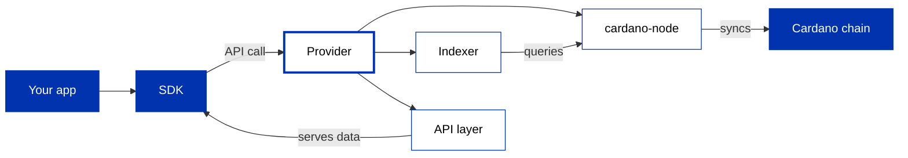

Your SDK does not talk to the chain directly. It talks to a **provider**: a service that runs a cardano-node and an indexer and exposes them through an API, so your app can read data and submit transactions without operating any infrastructure. You met providers when you [chose your tools](/docs/developers/curriculum/start-building/choose-your-tools#get-a-provider) and used one to [query the chain](/docs/developers/curriculum/start-building/query-the-chain). This section is the reference for the providers themselves: what each offers and how to run it.

## How a provider works

A provider runs the node (which syncs the chain), an indexer (which makes the node's data queryable), and an API layer that serves it to your SDK over HTTP or WebSocket. A **managed** provider runs all of this for you; **self-hosting** means running it yourself.

## A provider is an interface, not just a service

The diagram above is the *service* side. Inside your SDK a provider is also an **interface**: a small contract the SDK calls, with two halves.

- A **read** side: fetch a UTXO set, protocol parameters, and account or asset info (Mesh names this `IFetcher`; Evolution exposes the same reads through its provider).
- A **write** side: submit a signed transaction (Mesh's `ISubmitter`).

Because the SDK only depends on that contract, anything that implements it is a valid provider. The three below are hosted or self-hosted implementations, but you can implement the contract yourself to point at a private indexer, your own node, a GraphQL source, or even an in-memory fixture for tests. Two pages already do exactly this: the [failover and cache wrapper](/docs/developers/curriculum/production/going-to-production) that composes several providers behind one interface, and the [offline fetcher](/docs/developers/curriculum/production/development-networks) that serves fixed UTXOs to a test suite with no network at all.

## The providers

To **choose** a provider for your SDK, see [Choosing a provider](/docs/developers/curriculum/start-building/query-the-chain#choosing-a-provider). For the wider **managed-versus-self-hosted** decision, including Maestro, see [production infrastructure](/docs/developers/curriculum/production/infrastructure). The three documented here:

| Provider | API | Access |
| --- | --- | --- |
| **[Blockfrost](/docs/developers/curriculum/production/api-providers/blockfrost)** | REST | Managed, API key (free tier) |
| **[Koios](/docs/developers/curriculum/production/api-providers/koios)** | REST, GraphQL | Community-run or self-hosted, key optional |
| **[Ogmios](/docs/developers/curriculum/production/api-providers/ogmios)** | WebSocket, JSON-RPC | Self-hosted against your own node (paired with Kupo as the "Kupmios" stack), or hosted via [Demeter](/docs/developers/curriculum/production/demeter) |

## Next steps

- [Blockfrost](/docs/developers/curriculum/production/api-providers/blockfrost): the quickest hosted start, with a free tier
- [Koios](/docs/developers/curriculum/production/api-providers/koios): community-run, no key required for basic use
- [Ogmios](/docs/developers/curriculum/production/api-providers/ogmios): low-level WebSocket access to a node you run
