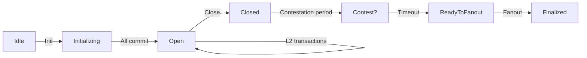

import Tabs from '@theme/Tabs';
import TabItem from '@theme/TabItem';

Hydra is a Layer 2 scaling solution for Cardano that enables near-instant, low-cost transactions between participants. It operates as a **state channel**: a temporary off-chain ledger where a known set of parties transact thousands of times per second while keeping the security guarantees of the Cardano main chain (Layer 1).

Inside a Hydra Head, transactions use the same format as Cardano Layer 1. **Fees are zero**, confirmation is instant (limited only by network latency between participants), and all parties must agree on every state transition.

If you have put a Redis cache in front of a Postgres database, the model is familiar: Layer 1 is the durable source of record, and the Head is the fast, temporary layer shared by a known set of participants. Committing funds loads state into that fast layer, the participants transact there with no per-operation cost, and fanout flushes the agreed final state back to Layer 1, with the contestation period acting as a grace window to catch a disagreement before it finalizes. The trade-off is the same as a cache cluster: you pay a Layer 1 cost to open and close the Head, but everything inside is fast and free.

> Runnable end-to-end example (two participants on preprod): [examples/bootcamp/09-hydra](https://github.com/cardano-foundation/developer-portal/tree/staging/examples/bootcamp/09-hydra).

## How a Hydra Head works

A Hydra Head is a state channel with a defined lifecycle:

1. **Initialize**: participants agree to open a Head on Layer 1.
2. **Commit**: each participant locks funds from Layer 1 into the Head.
3. **Transact**: process unlimited transactions instantly off-chain.
4. **Close**: submit the final agreed-upon state back to Layer 1.
5. **Fanout**: distribute funds on Layer 1 according to the final state.



Every participant must agree on each transition, similar to a consensus protocol within a small group. Each confirmed L2 transaction creates a new **snapshot** signed by all parties.

## When to use Hydra

Hydra is ideal for:

- **High-frequency transactions**: gaming, micropayments, real-time applications.
- **Cost-sensitive applications**: batch many transactions off-chain; only pay L1 fees to open and close.
- **Private transactions**: keep details off-chain until settlement.
- **Interactive multi-party protocols**: rapid state updates among a known group.

It is not a fit for open, anonymous, low-frequency interactions: a Head is among a **fixed, known set of participants**, and every participant must sign every snapshot.

## End-to-end flow with MeshJS

The off-chain flow uses `@meshsdk/hydra`. The condensed happy path is below; the [bootcamp example](https://github.com/cardano-foundation/developer-portal/tree/staging/examples/bootcamp/09-hydra) has the full runnable version plus the node-setup shell scripts.

### Prerequisites

- A synced `cardano-node` with `cardano-cli` (preprod), and the `hydra-node` binary ([install](https://hydra.family/head-protocol/docs/getting-started/installation)).
- Test ADA per participant ([faucet](/docs/developers/curriculum/start-building/networks-and-test-ada#get-test-ada)), for L1 node fees and funds to commit.
- Each participant generates **Cardano keys** (L1 identity/fees) and **Hydra keys** (snapshot signing), then starts a `hydra-node` peered with the others. Inside the Head, protocol parameters set all fee fields to zero.

### Connect, initialize, commit

<Tabs groupId="sdk">
<TabItem value="mesh" label="Mesh" default>

```ts
import { HydraProvider, HydraInstance } from "@meshsdk/hydra";
import { BlockfrostProvider } from "@meshsdk/core";

const blockfrost = new BlockfrostProvider("YOUR_BLOCKFROST_KEY");
const hydraProvider = new HydraProvider({ httpUrl: "http://localhost:4001" });
const instance = new HydraInstance({ provider: hydraProvider, fetcher: blockfrost, submitter: blockfrost });

await hydraProvider.connect();
await hydraProvider.init();   // any participant opens the Head -> "HeadIsInitializing"

// during Initializing, each participant commits a UTxO (or commitEmpty())
const commitTx = await instance.commitFunds(utxo.input.txHash, utxo.input.outputIndex);
const signedCommit = await wallet.signTx(commitTx, true, false); // partial sign
await wallet.submitTx(signedCommit);                              // -> "HeadIsOpen" once all commit
```

</TabItem>
</Tabs>

### Transact on Layer 2

Once the Head is open, build with `MeshTxBuilder` using `isHydra: true` and the Head's (zero-fee) protocol parameters. `submitTx` goes to the Head, not Layer 1:

<Tabs groupId="sdk">
<TabItem value="mesh" label="Mesh" default>

```ts
import { MeshTxBuilder } from "@meshsdk/core";

const pp = await hydraProvider.fetchProtocolParameters();
const l2Utxos = await hydraProvider.fetchAddressUTxOs(aliceAddress);

const txBuilder = new MeshTxBuilder({ fetcher: hydraProvider, submitter: hydraProvider, isHydra: true, params: pp });
const unsignedTx = await txBuilder
  .txOut(bobAddress, [{ unit: "lovelace", quantity: "5000000" }])
  .changeAddress(aliceAddress)
  .selectUtxosFrom(l2Utxos)
  .setNetwork("preprod")
  .complete();

const signedTx = await wallet.signTx(unsignedTx, false);
await hydraProvider.submitTx(signedTx);   // instant, zero-fee; emits "TxValid" / "SnapshotConfirmed"
```

</TabItem>
</Tabs>

Submit as many transactions as you need; each confirmed one updates the shared state via a new signed snapshot.

### Close and fanout

<Tabs groupId="sdk">
<TabItem value="mesh" label="Mesh" default>

```ts
await hydraProvider.close();   // posts the latest snapshot to L1, starts the contestation period
// on "ReadyToFanout":
await hydraProvider.fanout();  // distributes final balances back to L1 -> "HeadIsFinalized"
```

</TabItem>
</Tabs>

`close()` posts the final state on-chain and opens a contestation window (any participant can dispute with a newer snapshot). After it passes, `fanout()` returns funds to their Layer 1 addresses.

## Next steps

- [Going to production](/docs/developers/curriculum/production/going-to-production): reliability and security before mainnet
- [Hydra protocol docs](https://hydra.family/head-protocol/) and [MeshJS Hydra](https://meshjs.dev/hydra): the full protocol and SDK reference
