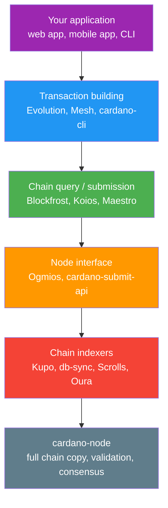
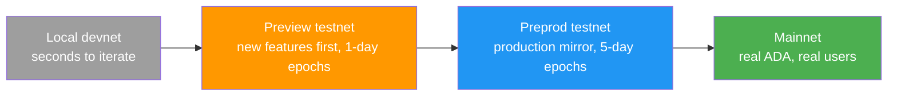
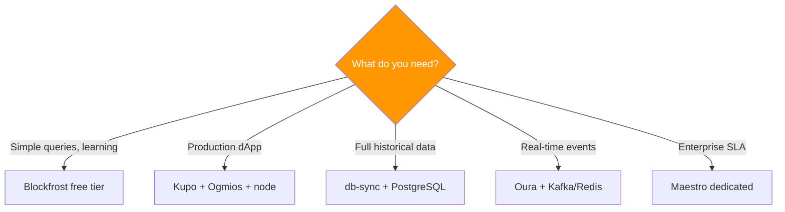

Every application needs more than business logic: databases, APIs, hosting, monitoring, and staging environments. Cardano is no different. This page maps the developer infrastructure stack, from running your own full node to using managed API services, and helps you choose based on your needs for decentralization, performance, cost, and convenience.

If you have run web infrastructure, the stack maps onto things you know:

- **cardano-node is running your own database server**: full control, full operational commitment (backups, updates, monitoring).
- **Blockfrost / Koios / Maestro are managed database services**: the Cardano equivalent of RDS, PlanetScale, or Supabase. Trade some control for operational simplicity.
- **Ogmios is a database driver**: it translates the node's wire protocol into a developer-friendly interface, like `pg` for PostgreSQL.
- **Indexers are materialized views / read replicas**: db-sync is a full materialized view of the chain; Kupo is a targeted one for the UTXOs you care about.
- **Testnets are staging environments**, and the **faucet is Stripe test mode**: valueless ADA to exercise your flows.

## The stack

The Cardano developer stack has five layers. Each serves a distinct purpose, and you pick your stack per layer.



## Run your own node, or use a managed API?

The **cardano-node** is the official full node: it validates every block and transaction, maintains the UTXO set, and is the most trustless way to access the chain. Running it yourself means you verify everything (no third party) but it carries real operational overhead:

```text
cardano-node (mainnet), rough requirements:
  Storage:   ~180 GB (growing ~15 GB/year)
  RAM:       16+ GB (24 GB recommended)
  CPU:       4+ cores
  Sync:      hours to days from genesis (minutes with a Mithril snapshot)
  Uptime:    must stay running to serve queries
```

Run your own node when you can't afford to trust a third party (high-security apps), when you operate an indexer, or when you're a stake pool operator. Speed up the initial sync with a certified [Mithril](/docs/operators/operator-tools/mithril) snapshot. See [Run your own node](/docs/developers/curriculum/production/run-your-own-node) for the developer quick-path (install, run, query) and the handoff to the operator curriculum.

For most application developers, a **managed API** removes that overhead. The full comparison lives in the [API providers reference](/docs/developers/curriculum/production/api-providers/overview); in short:

- **Blockfrost**: the most widely used service: comprehensive REST API, excellent docs, wide SDK support, free and paid tiers (rate-limited free tier). Centralized; not for real-time event streaming.
- **Koios**: community-run and decentralized, with a powerful PostgREST query syntax and no API key for basic use. Fewer SDK wrappers; response times vary by instance.
- **Maestro**: a commercial platform adding transaction management (auto-resubmission, monitoring), DEX data aggregation, and dedicated infrastructure for enterprise.

**Demeter.run** offers these components (db-sync, Kupo, Ogmios, submit API) as managed cloud services if you want self-hosted-style control without the ops. See [Demeter](/docs/developers/curriculum/production/demeter).

## The node interface layer

Between the raw node and high-level APIs sit two translators:

- **Ogmios**: exposes the node's binary mini-protocols as WebSocket JSON: chain-sync (stream blocks), transaction submission, state queries, and mempool monitoring. Ideal for custom indexers and real-time chain following.
- **cardano-submit-api**: a minimal HTTP service that accepts a serialized transaction and submits it to a local node.

```text
Transaction submission options:
  cardano-cli           local, CLI:        cardano-cli transaction submit --tx-file signed.tx
  cardano-submit-api    local, HTTP:       POST /api/submit/tx  (application/cbor)
  Ogmios                local, WebSocket:  { "method": "submitTransaction", ... }
  Blockfrost/Koios/...  remote, HTTP:      POST /tx/submit  (application/cbor)
```

## Chain indexers

Indexers follow the chain and store it in formats your app can query, something the raw node doesn't do:

- **cardano-db-sync**: the comprehensive IOG indexer; populates PostgreSQL (40+ tables) for full historical SQL. Heavy: ~150+ GB and a 2-3 day initial sync. Best for explorers and analytics.
- **Kupo**: a lightweight indexer that tracks only UTXOs matching patterns you configure (by address, policy ID, etc.). Fast sync (hours), low resources, datum resolution. Ideal for dApp backends.
- **Scrolls / Oura** (TxPipe): event pipelines: Scrolls reduces chain data into stores like Redis or Elasticsearch; Oura streams on-chain events to Kafka, webhooks, or files for reactive, event-driven systems.

## Testnets are your staging environments

Mirror the staging progression you already use in web2:



**Preview** receives protocol upgrades first (1-day epochs), best for testing new features. **Preprod** mirrors mainnet (5-day epochs, same parameters), the final rehearsal before mainnet. For the fastest loop, run a **local devnet** (Yaci DevKit or cardano-testnet, see [local development networks](/docs/developers/curriculum/production/development-networks)). Get test ADA and explorer links from [Networks & test ADA](/docs/developers/curriculum/start-building/networks-and-test-ada).

## Choosing your stack

Common patterns:

| Use case | Stack | Why |
|---|---|---|
| Hobby / learning | Blockfrost free tier + Preview | Zero infra to manage, fast iteration |
| Production dApp backend | Kupo + Ogmios + cardano-node (self-hosted), or Maestro (managed) + Preprod staging | Fast UTXO queries at your script addresses, full control or managed reliability |
| Block explorer / analytics | db-sync + PostgreSQL + node | Comprehensive historical SQL |
| Event-driven app | Oura + Kafka/Redis + Blockfrost | React to on-chain events in near real-time |
| Enterprise / high-throughput | Maestro dedicated + multiple nodes + Scrolls | SLAs, dedicated infra, custom indexing |



## Key takeaways

- **Running your own node is the sovereign, trustless option** but carries real ops overhead, unnecessary for most app developers, and a Mithril snapshot makes the sync fast when you do.
- **Managed APIs (Blockfrost, Koios, Maestro) trade control for convenience**, like managed databases.
- **Indexers turn raw chain data into queryable formats**: db-sync for full SQL, Kupo for lightweight UTXO tracking, Scrolls/Oura for event pipelines.
- **Use testnets as staging**: Preview to iterate, Preprod to rehearse, local devnets for the fastest loop.
- **Choose per layer, by your needs**: most teams combine approaches (managed APIs in dev, self-hosted or dedicated in production).

## Next steps

- [Going to production](/docs/developers/curriculum/production/going-to-production): the full pre-mainnet checklist
- [API providers reference](/docs/developers/curriculum/production/api-providers/overview): deep dive on Blockfrost, Koios, and Ogmios
