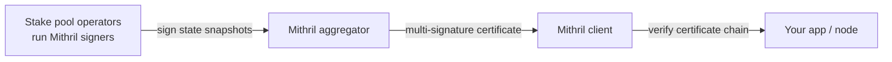

Mithril is a **stake-based multi-signature protocol** that provides lightweight certification of Cardano blockchain data. Stake pool operators collectively sign snapshots of the chain state, and an aggregator combines those signatures into a certificate that anyone can verify cryptographically. The result: you can trust certified data backed by a large fraction of total stake **without running and syncing a full node yourself**.

This unlocks two things that matter for scaling and production.

## Fast node bootstrap

Syncing a `cardano-node` from genesis takes many hours to days. With Mithril, a node can **download and verify a certified database snapshot** and be ready in minutes instead. The verification is what makes this safe: the snapshot is only accepted if it matches a certificate signed by enough stake. This is the recommended way to stand up a node, see [installing cardano-node](/docs/operators/node/installing-cardano-node) and [production infrastructure](/docs/developers/curriculum/production/infrastructure).

## Trustless light clients

Applications can verify chain data, **transactions** and **stake distributions**, with cryptographic proofs, instead of trusting an API to tell them the truth. The TypeScript client runs in the browser via WebAssembly, so even a web app can verify a transaction against a Mithril certificate without a backend node.

```javascript
import initMithrilClient, { MithrilClient } from "@mithril-dev/mithril-client-wasm";

await initMithrilClient();
const client = new MithrilClient(AGGREGATOR_ENDPOINT, GENESIS_VERIFICATION_KEY, { unstable: true });

// fetch the latest certified stake distribution and verify its certificate chain
const [latest] = await client.list_mithril_stake_distributions();
const distribution = await client.get_mithril_stake_distribution(latest.hash);
const certificate = await client.get_mithril_certificate(distribution.certificate_hash);
const verified = await client.verify_certificate_chain(certificate.hash);

const message = await client.compute_mithril_stake_distribution_message(distribution);
console.log("Verified:", await client.verify_message_match_certificate(message, verified));
```

The same capabilities exist in Rust (with snapshot download for node bootstrap):

```rust
let client = ClientBuilder::aggregator(AGGREGATOR_ENDPOINT, GENESIS_VERIFICATION_KEY).build()?;
let proof = client.cardano_transaction().get_proofs(&[tx_hash]).await?;
let verified = proof.verify()?;
let certificate = client.certificate().verify_chain(&proof.certificate_hash).await?;
```

Full references: [Mithril TypeScript client](https://mithril.network/doc) and [Mithril Rust client](https://mithril.network/doc).

## How it works



Signers run alongside block producers, signing snapshots roughly every few minutes; the aggregator combines enough signatures (by stake) into a certificate; clients verify the certificate chain before trusting the data. Because the threshold is stake-weighted, forging a certificate would require controlling a large fraction of total stake.

## Run a signer (stake pool operators)

If you operate a stake pool, running a Mithril signer contributes to the certification network. The signer is lightweight (under ~5% CPU, under ~200 MB RAM) and, in production, must route all traffic through a Mithril relay rather than connecting directly to the internet. See [Mithril signer configuration](/docs/operators/block-producer/mithril-signer-configuration).

## Next steps

- [Production infrastructure](/docs/developers/curriculum/production/infrastructure): where fast bootstrap fits in your stack
- [Mithril documentation](https://mithril.network/doc/): the full protocol, networks, and node references
